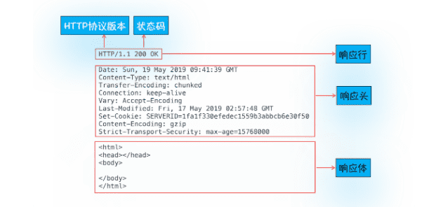

> 为什么很多站点第二次打开速度会很快？

### 1.浏览器端发起HTTP请求流程

#### 1.构建请求

首先，浏览器构建请求行信息，构建好后，浏览器准备发起网络请求

#### 2.查找缓存

发起真正网络请求之前，浏览器会先在浏览器缓存中查询是否有要请求的文件。其中，浏览器缓存是一种在本地保存资源副本，以共下次请求时直接使用的技术

#### 3.准备IP地址和端口

第一步浏览器会请求 DNS 返回域名对应的 IP

> 当然浏览器还提供了 DNS 数据缓存服务，如果某个域名已经解析过了，那么浏览器会缓存解析的结果，以供下次查询时直接使用，这样也会减少一次网络请求。

URL不指明端口号，HTTP默认80端口

#### 4.等待TCP队列

Chrome有机制，同一域名最多只能建立6个TCP链接，超过的则会排队等待。

#### 5.建立TCP链接

#### 6.发送HTTP请求

### 2.服务器端处理HTTP请求流程

#### 1.返回请求

#### 2.断开链接

通常情况下，一旦服务器向客户端返回了请求数据，它就要关闭 TCP 连接。不过如果浏览器或者服务器在其头信息中加入了：`Connection:Keep-Alive`

那么 TCP 连接在发送后将仍然保持打开状态，这样浏览器就可以继续通过同一个 TCP 连接发送请求。保持 TCP 连接可以省去下次请求时需要建立连接的时间，提升资源加载速度。

#### 3.重定向

从图中你可以看到，响应行返回的状态码是 301，状态 301 就是告诉浏览器，我需要重定向到另外一个网址，而需要重定向的网址正是包含在响应头的 Location 字段中，接下来，浏览器获取 Location 字段中的地址，并使用该地址重新导航，这就是一个完整重定向的执行流程。这也就解释了为什么输入的是 geekbang.org，最终打开的却是 https://www.geekbang.org 了。

### 3.为什么很多站点第二次打开速度会很快？

1. #### DNS缓存

   DNS 缓存比较简单，它主要就是在浏览器本地把对应的 IP 和域名关联起来

2. #### 页面资源缓存

   

   当服务器返回 HTTP 响应头给浏览器时，浏览器是通过响应头中的 Cache-Control 字段来设置是否缓存该资源.

   通常会给资源设置缓存过期时长，通过`Cache-Control: max-age=3600` 控制。

   但如果缓存过期了，浏览器则会继续发起网络请求，并且在 HTTP 请求头中带上：

   服务器收到请求头后，会根据 If-None-Match 的值来判断请求的资源是否有更新。

   1. 如果没有更新，就返回 304 状态码，相当于服务器告诉浏览器：“这个缓存可以继续使用，这次就不重复发送数据给你了。
   2. 如果资源有更新，服务器就直接返回最新资源给浏览器。

> 很多网站第二次访问能够秒开，是因为这些网站把很多资源都缓存在了本地，浏览器缓存直接使用本地副本来回应请求，而不会产生真实的网络请求，从而节省了时间。同时，DNS 数据也被浏览器缓存了，这又省去了 DNS 查询环节。

### 4.登陆状态是如何保持的？

通过cookie

### 5.总结

浏览器中的 HTTP 请求从发起到结束一共经历了如下八个阶段：构建请求、查找缓存、准备 IP 和端口、等待 TCP 队列、建立 TCP 连接、发起 HTTP 请求、服务器处理请求、服务器返回请求和断开连接。