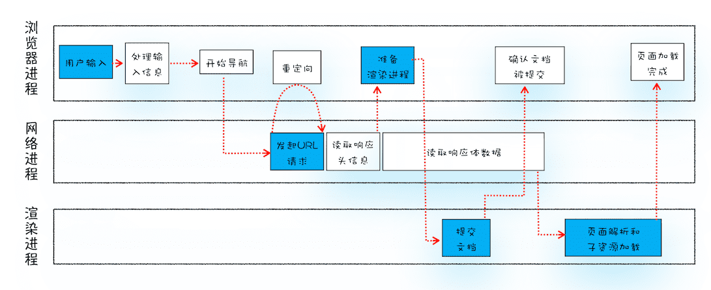
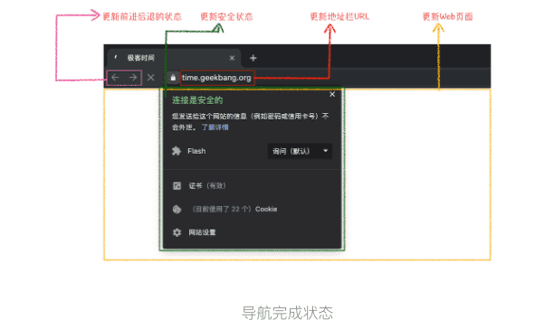

从输入URL到页面展示完整流程示意图

- 首先，浏览器进程接收到用户输入的 URL 请求，浏览器进程便将该 URL 转发给网络进程。

- 然后，在网络进程中发起真正的 URL 请求。

- 接着网络进程接收到了响应头数据，便解析响应头数据，并将数据转发给浏览器进程。

- 浏览器进程接收到网络进程的响应头数据之后，发送“提交导航 (CommitNavigation)”消息到渲染进程；渲染进程接收到“提交导航”的消息之后，便开始准备接收 HTML 数据，接收数据的方式是直接和网络进程建立数据管道；

- 最后渲染进程会向浏览器进程“确认提交”，这是告诉浏览器进程：“已经准备好接受和解析页面数据了”。

- 浏览器进程接收到渲染进程“提交文档”的消息之后，便开始移除之前旧的文档，然后更新浏览器进程中的页面状态。

  > 用户发出URL请求到页面开始解析的这个过程，就叫做导航

### 1.从输入URL到页面展示

#### 1.用户输入

当用户在地址栏中输入一个查询关键字时，地址栏会判断输入的关键字是搜索内容，还是请求的 URL。

- 如果是搜索内容，地址栏会使用浏览器默认的搜索引擎，来合成新的带搜索关键字的 URL。
- 如果判断输入内容符合 URL 规则，比如输入的是 wbbyouzi.com，那么地址栏会根据规则，把这段内容加上协议，合成为完整的 URL，如 https:/wbbyouzi.com。

> eforeunload 事件允许页面在退出之前执行一些数据清理操作，还可以询问用户是否要离开当前页面，比如当前页面可能有未提交完成的表单等情况，因此用户可以通过 beforeunload 事件来取消导航，让浏览器不再执行任何后续工作。
>
> 当浏览器刚开始加载一个地址之后，标签页上的图标便进入了加载状态。但此时图中页面显示的依然是之前打开的页面内容，并没立即替换为极客时间的页面。因为需要等待提交文档阶段，页面内容才会被替换。

#### 2.URL请求过程

1. 浏览器进程会通过进程间通信（IPC）把 URL 请求发送至网络进程
2. 网络进程会查找本地缓存是否缓存了该资源。如果有缓存资源，那么直接返回资源给浏览器进程；
3. 如果在缓存中没有查找到资源，那么直接进入网络请求流程。这请求前的第一步是要进行 DNS 解析，以获取请求域名的服务器 IP 地址。如果请求协议是 HTTPS，那么还需要建立 TLS 连接。
4. 接下来就是利用 IP 地址和服务器建立 TCP 连接。
5. 连接建立之后，浏览器端会构建请求行、请求头等信息，并把和该域名相关的 Cookie 等数据附加到请求头中，然后向服务器发送构建的请求信息。
6. 服务器接收到请求信息后，会根据请求信息生成响应数据（包括响应行、响应头和响应体等信息），并发给网络进程。等网络进程接收了响应行和响应头之后，就开始解析响应头的内容了。

##### 1.重定向

在导航过程中，如服务器响应行的状态码包含了301、302一类的跳转信息，网络进行会从响应头的`location`字段里面读取重定向的地址，然后发起新的http或https请求，一切重头开始。

##### 2.响应数据类型处理

Content-Type 是 HTTP 头中一个非常重要的字段， 它告诉浏览器服务器返回的响应体数据是什么类型。

##### 3.准备渲染进程

Chrome 的默认策略是，每个标签对应一个渲染进程。但如果从一个页面打开了另一个新页面，而新页面和当前页面属于同一站点的话，那么新页面会复用父页面的渲染进程。官方把这个默认策略叫 process-per-site-instance。

##### 4.提交文档

所谓提交文档，就是指浏览器进程将网络进程接收到的 HTML 数据提交给渲染进程，具体流程是这样的：

- 首先当浏览器进程接收到网络进程的响应头数据之后，便向渲染进程发起“提交文档”的消息；
- 渲染进程接收到“提交文档”的消息后，会和网络进程建立传输数据的“管道”；
- 等文档数据传输完成之后，渲染进程会返回“确认提交”的消息给浏览器进程；
- 浏览器进程在收到“确认提交”的消息后，会更新浏览器界面状态，包括了安全状态、地址栏的 URL、前进后退的历史状态，并更新 Web 页面。

##### 5.渲染阶段

一旦文档被提交，渲染进程便开始页面解析和子资源加载了。这里你只需要先了解一旦页面生成完成，渲染进程会发送一个消息给浏览器进程，浏览器接收到消息后，会停止标签图标上的加载动画。

#### 3.总结

1. 用户输入url并回车

2. 浏览器进程检查url，组装协议，构成完整的url

3. 浏览器进程通过进程间通信（IPC）把url请求发送给网络进程

4. 网络进程接收到url请求后检查本地缓存是否缓存了该请求资源，如果有则将该资源返回给浏览器进程

5. 如果没有，网络进程向web服务器发起http请求（网络请求），请求流程如下：

   1. 进行DNS解析，获取服务器ip地址，端口

      > 端口是在建立TCP连接的时候附加在报文段头部字段中的。头部字段包括了源端口和目的端口两个部分。服务器端在接收到TCP请求后就知道了其中的数据要往哪个端口发送。
      > (另：TCP协议属于运输层，HTTP协议属于应用层。)

   2. 利用ip地址和服务器建立tcp连接

   3.  构建请求头信息

   4.  发送请求头信息

   5. 服务器响应后，网络进程接收响应头和响应信息，并解析响应内容

6. 网络进程解析响应流程

   1.  检查状态码，如果是301/302，则需要重定向，从Location自动中读取地址，重新进行第4步
         ，如果是200，则继续处理请求。

      > 301 是永久重定向 第一次跳转后，浏览器会自己缓存 ，下次再访问老的地址就是走的是浏览器的缓存不会发请求
      > 302 是临时重定向 所以浏览器不会自作主张，每次都会向服务端询问

   2.  200响应处理：
            检查响应类型Content-Type，如果是字节流类型，则将该请求提交给下载管理器，该导航流程结束，不再进行 后续的渲染。如果是html则通知浏览器进程准备渲染进程准备进行渲染。

7. 准备渲染进程

   1. 浏览器进程检查当前url是否和之前打开的渲染进程根域名是否相同，如果相同，则复用原来的进程，如果不同，则开启新的渲染进程

8. 传输数据、更新状态

   1. 渲染进程准备好后，浏览器向渲染进程发起“提交文档”的消息，渲染进程接收到消息和网络进程建立传输数据的“管道”
   2.  渲染进程接收完数据后，向浏览器发送“确认提交”
   3.  浏览器进程接收到确认消息后更新浏览器界面状态：安全、地址栏url、前进后退的历史状态、更新web页面。

