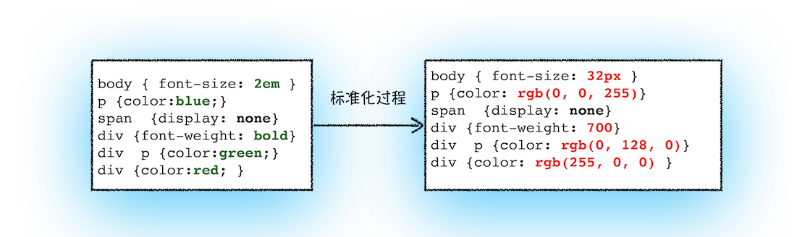

按照渲染的时间顺序，流水线可分为：

1. 构建DOM树
2. 样式计算
3. 布局阶段
4. 分层
5. 绘制
6. 分块
7. 光栅化
8. 合成

### 1.构建DOM树

因为浏览器无法直接理解和使用HTML，所以需要将HTML转换为浏览器能够理解的结构——DOM树

### 2.样式计算

#### 1.把css 转化为浏览器能够理ss解的结构

当渲染引擎接收到css文本时，会执行转化操作，将css文本装换为浏览器可以理解的结构——styleSheets

`document.styleSheets`

#### 2.转化样式表中的属性值，使其标准化

需要将所有值转换为渲染引擎容易理解的、标准化的计算值

#### 3.计算出DOM树中每个节点的具体样式

1. css 继承

   css继承就是每个节点都包含父节点的样式

2. css 层叠

   层叠是 CSS 的一个基本特征，它是一个定义了如何合并来自多个源的属性值的算法。它在 CSS 处于核心地位，CSS 的全称“层叠样式表”正是强调了这一点。

### 3 .布局树

1. 创建布局树
2. 布局计算

### 4.分层

因为页面中有很多复杂的效果，如一些复杂的 3D 变换、页面滚动，或者使用 z-indexing 做 z 轴排序等，为了更加方便地实现这些效果，**渲染引擎还需要为特定的节点生成专用的图层，并生成一棵对应的图层树（LayerTree）**

