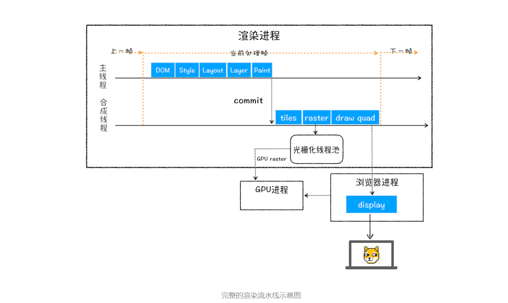

> HTML、CSS和JavaScript，是如何变成页面的？

按照渲染的时间顺序，流水线可分为：

1. 构建DOM树
2. 样式计算
3. 布局阶段
4. 分层
5. 绘制
6. 分块
7. 光栅化
8. 合成

### 1.构建DOM树

因为浏览器无法直接理解和使用HTML，所以需要将HTML转换为浏览器能够理解的结构——DOM树

### 2.样式计算

#### 1.把css 转化为浏览器能够理解的结构

当渲染引擎接收到css文本时，会执行转化操作，将css文本装换为浏览器可以理解的结构——styleSheets

`document.styleSheets`

#### 2.转化样式表中的属性值，使其标准化

需要将所有值转换为渲染引擎容易理解的、标准化的计算值

#### 3.计算出DOM树中每个节点的具体样式

1. css 继承

   css继承就是每个节点都包含父节点的样式

2. css 层叠

   层叠是 CSS 的一个基本特征，它是一个定义了如何合并来自多个源的属性值的算法。它在 CSS 处于核心地位，CSS 的全称“层叠样式表”正是强调了这一点。

### 3 .布局树

1. 创建布局树
2. 布局计算

### 4.分层

> [then stacking context](https://developer.mozilla.org/en-US/docs/Web/CSS/CSS_Positioning/Understanding_z_index/The_stacking_context) 

因为页面中有很多复杂的效果，如一些复杂的 3D 变换、页面滚动，或者使用 z-indexing 做 z 轴排序等，为了更加方便地实现这些效果，**渲染引擎还需要为特定的节点生成专用的图层，并生成一棵对应的图层树（LayerTree）**。并不是布局树的每个节点都包含一个图层，如果一个节点没有对应的层，那么这个节点就从属于父节点的图层。

区域1 就是document 的绘制列表，拖动区域2中的进度条可以重现列表的绘制过程。

### 5.栅格化(raster)操作

> 位图图像 bitmap，亦称为点阵图像或栅格图像，是由称作像素的单个点组成的。

绘制列表只是用来记录绘制顺序和绘制指令的列表，而实际上绘制操作是由渲染引擎中的合成线程来完成的。

> 在有些情况下，有的图层可以很大，比如有的页面你使用滚动条要滚动好久才能滚动到底部，但是通过视口，用户只能看到页面的很小一部分，所以在这种情况下，要绘制出所有图层内容的话，就会产生太大的开销，而且也没有必要。基于这个原因，合成线程会将图层划分为图块（tile），这些图块的大小通常是 256x256 或者 512x512.

**合成线程会按照视口附近的图块来优先生成位图，实际生成位图的操作是由栅格化来执行的。所谓栅格化，是指将图块转换为位图。**

而图块是栅格化执行的最小单位。渲染进程维护了一个栅格化的线程池，所有的图块栅格化都是在线程池内执行的，

栅格化过程都会使用 GPU 来加速生成，使用 GPU 生成位图的过程叫快速栅格化，或者 GPU 栅格化，生成的位图被保存在 GPU 内存中。GPU 操作是运行在 GPU 进程中，如果栅格化操作使用了 GPU，那么最终生成位图的操作是在 GPU 中完成的，这就涉及到了跨进程操作。，渲染进程把生成图块的指令发送给 GPU，然后在 GPU 中执行生成图块的位图，并保存在 GPU 的内存中。

### 6.合成和显示

一旦所有图块都被光栅化，合成线程就会生成一个绘制图块的命令——“DrawQuad”，然后将该命令提交给浏览器进程。

浏览器进程里面有一个叫 viz 的组件，用来接收合成线程发过来的 DrawQuad 命令，然后根据 DrawQuad 命令，将其页面内容绘制到内存中，最后再将内存显示在屏幕上。

到这里，经过这一系列的阶段，编写好的 HTML、CSS、JavaScript 等文件，经过浏览器就会显示出漂亮的页面了。

### 7.渲染流水线大总结

1. 渲染进程将 HTML 内容转换为能够读懂的 **DOM 树**结构。
2. 渲染引擎将 CSS 样式表转化为浏览器可以理解的 **styleSheets**，计算出 DOM 节点的样式。
3. 创建**布局树**，并计算元素的布局信息。
4. 对布局树进行分层，并生成**分层树**。
5. 为每个图层生成**绘制列表**，并将其提交到合成线程。
6. 合成线程将图层分成**图块**，并在**光栅化线程池**中将图块转换成位图。
7. 合成线程发送绘制图块命令 **DrawQuad** 给浏览器进程。
8. 浏览器进程根据 DrawQuad 消息**生成页面**，并**显示**到显示器上。

### 8.相关概念

#### 1.更新了元素的集合属性 重排

可以看出，如果你通过 JavaScript 或者 CSS 修改元素的几何位置属性，例如改变元素的宽度、高度等，那么浏览器会触发重新布局，解析之后的一系列子阶段，这个过程就叫重排。无疑，重排需要更新完整的渲染流水线，所以开销也是最大的。

#### 2.更新元素的绘制属性  重绘

从图中可以看出，如果修改了元素的背景颜色，那么布局阶段将不会被执行，因为并没有引起几何位置的变换，所以就直接进入了绘制阶段，然后执行之后的一系列子阶段，这个过程就叫重绘。相较于重排操作，重绘省去了布局和分层阶段，所以执行效率会比重排操作要高一些。

#### 3.直接合成阶段

渲染引擎将跳过布局和绘制，只执行后续的合成操作，我们把这个过程叫做合成。

在图中，我们使用了 CSS 的 transform 来实现动画效果，这可以避开重排和重绘阶段，直接在非主线程上执行合成动画操作。这样的效率是最高的，因为是在非主线程上合成，并没有占用主线程的资源，另外也避开了布局和绘制两个子阶段，所以相对于重绘和重排，合成能大大提升绘制效率。

