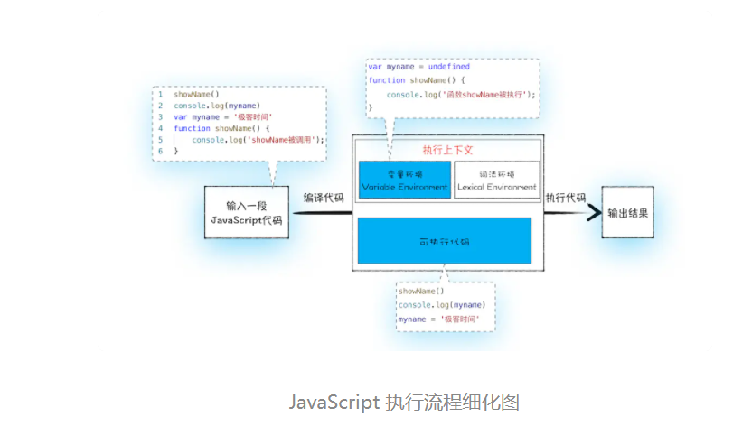

> Javascript代码是按顺序执行的吗?

### 1.变量提升 Hoisting

变量提升，是 js 代码执行过程中，js 引擎把变量、函数的声明部分提升到代码开头的“行为”。被提升的变量默认值为undefined。

JavaScript 代码的执行流程简单分为两个阶段：编译阶段、执行结果。

示例代码如下

```javascript
showName()
console.log(myname)
var myname = '小彬'
function showName() {
    console.log('execution')
}
```


#### 1.编译阶段



如何生成环境变量？

1. 第 1 行和第 2 行，这两行代码不是声明操作， js 引擎不会做任何处理；
2. 第 3 行， var 声明， js 引擎将在环境对象中创建一个名为 myname 的属性，并使用 undefined 对其初始化；
3. 第 4 行，js 引擎发现 function 定义的函数，将函数定义存储到堆 (HEAP）中，并在环境对象中创建一个 showName 的属性，然后将该属性值指向堆中函数的位置

这样就生成了变量环境对象。接下来 JavaScript 引擎会把声明以外的代码编译为字节码。

#### 2.执行阶段

1. 当执行到 showName 函数时，js 引擎会在变量环境对象中查找该函数，找到该函数执行，并输入结果。
2. 执行到`console.log(myname)`时，js 引擎继续在变量环境对象中查找该对象，由于变量环境存在 myname 变量，并且其值为 undefined，所以这时候就输出 undefined。
3. 接下来执行第 3 行，把“小彬”赋给 myname 变量，赋值后变量环境中的 myname 属性值改变为“小彬”

#### 3.代码中出现相同的变量或者函数怎么办？

**一段代码如果定义了两个相同名字的函数，那么最终生效的是最后一个函数。**

```javascript

showName()
var showName = function() {
    console.log(2)
}
function showName() {
    console.log(1)
}


```

