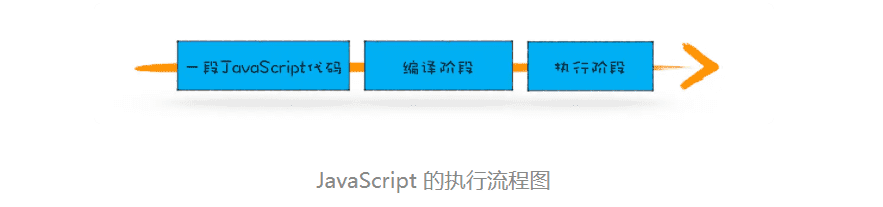

> Javascript代码是按顺序执行的吗?

### 1.变量提升 Hoisting

所谓的变量提升，是指在 JavaScript 代码执行过程中，JavaScript 引擎把变量的声明部分和函数的声明部分提升到代码开头的“行为”。变量被提升后，会给变量设置默认值，这个默认值就是我们熟悉的 undefined。

### 2.JavaScript 代码的执行流程

```javascript
showName()
console.log(myname)
var myname = '极客时间'
function showName() {
    console.log('函数showName被执行');
}
```




#### 1.编译阶段


如何生成环境变量？

1. 第 1 行和第 2 行，由于这两行代码不是声明操作，所以 JavaScript 引擎不会做任何处理；
2. 第 3 行，由于这行是经过 var 声明的，因此 JavaScript 引擎将在环境对象中创建一个名为 myname 的属性，并使用 undefined 对其初始化；
3. 第 4 行，JavaScript 引擎发现了一个通过 function 定义的函数，所以它将函数定义存储到堆 (HEAP）中，并在环境对象中创建一个 showName 的属性，然后将该属性值指向堆中函数的位置

这样就生成了变量环境对象。接下来 JavaScript 引擎会把声明以外的代码编译为字节码。

#### 2.执行阶段

1. 当执行到 showName 函数时，JavaScript 引擎便开始在变量环境对象中查找该函数，由于变量环境对象中存在该函数的引用，所以 JavaScript 引擎便开始执行该函数，并输出“函数 showName 被执行”结果。
2. 接下来打印“myname”信息，JavaScript 引擎继续在变量环境对象中查找该对象，由于变量环境存在 myname 变量，并且其值为 undefined，所以这时候就输出 undefined。
3. 接下来执行第 3 行，把“极客时间”赋给 myname 变量，赋值后变量环境中的 myname 属性值改变为“极客时间”

#### 3.代码中出现相同的变量或者函数怎么办？

**一段代码如果定义了两个相同名字的函数，那么最终生效的是最后一个函数。**

```javascript

showName()
var showName = function() {
    console.log(2)
}
function showName() {
    console.log(1)
}


```

输出1

编译阶段:
var showName
function showName(){console.log(1)}

执行阶段:
showName()//输出1
showName=function(){console.log(2)}
//如果后面再有showName执行的话，就输出2因为这时候函数引用已经变了