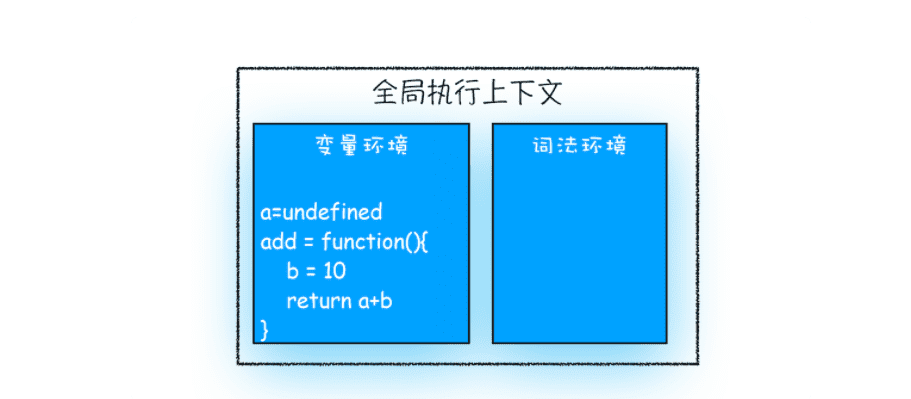

> 为什么Javascript代码会出现栈溢出？

哪些情况下代码才算是“一段”代码，才会在执行之前就进行编译并创建执行上下文?

1. 当 JavaScript 执行全局代码的时候，会编译全局代码并创建全局执行上下文，而且在整个页面的生存周期内，全局执行上下文只有一份。
2. 当调用一个函数的时候，函数体内的代码会被编译，并创建函数执行上下文，一般情况下，函数执行结束之后，创建的函数执行上下文会被销毁。
3. 当使用 eval 函数的时候，eval 的代码也会被编译，并创建执行上下文。

### 1.什么是函数调用

```javascript
var a = 2
function add(){
var b = 10
return  a+b
}
add()
```

在执行到函数 add() 之前，JavaScript 引擎会为上面这段代码创建全局执行上下文，包含了声明的函数和变量



执行上下文准备好之后，便开始执行全局代码，当执行到 add 这儿时，JavaScript 判断这是一个函数调用，那么将执行以下操作：


就这样，当执行到 add 函数的时候，我们就有了两个执行上下文了——全局执行上下文和 add 函数的执行上下文。

Javascript 引擎通过一种叫栈的数据结构来管理这些执行上下文。

### 2.什么是栈


### 3.什么是JavaScript的调用栈

JavaScript 引擎正是利用栈的这种结构来管理执行上下文的。在执行上下文创建好后，JavaScript 引擎会将执行上下文压入栈中，通常把这种用来管理执行上下文的栈称为执行上下文栈，又称调用栈。

```javascript
var a = 2
function add(b,c){
  return b+c
}
function addAll(b,c){
var d = 10
result = add(b,c)
return  a+result+d
}
addAll(3,6)
```


**调用栈是 JavaScript 引擎追踪函数执行的一个机制**，当一次有多个函数被调用时，通过调用栈就能够追踪到哪个函数正在被执行以及各函数之间的调用关系。

### 4.在开发中，如何利用好调用栈

#### 1.如何利用浏览器查看调用栈的信息

##### 1.chrome 开发者工具 -》Source 标签 打断点

##### 2.使用console.trace() 来输出当前的函数调用关系。


#### 2.栈溢出 Stack overflow

**调用栈是有大小的**，当入栈的执行上下文超过一定数目，JavaScript 引擎就会报错，我们把这种错误叫做**栈溢出**。


