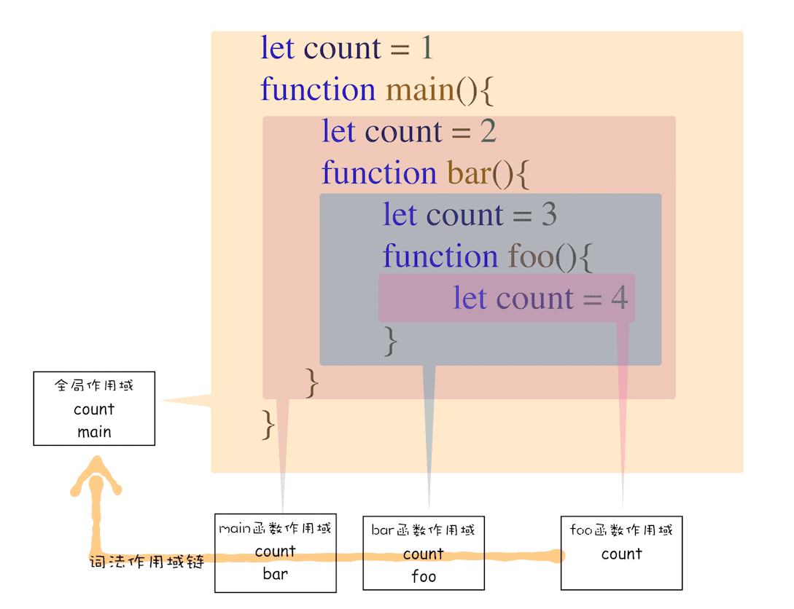
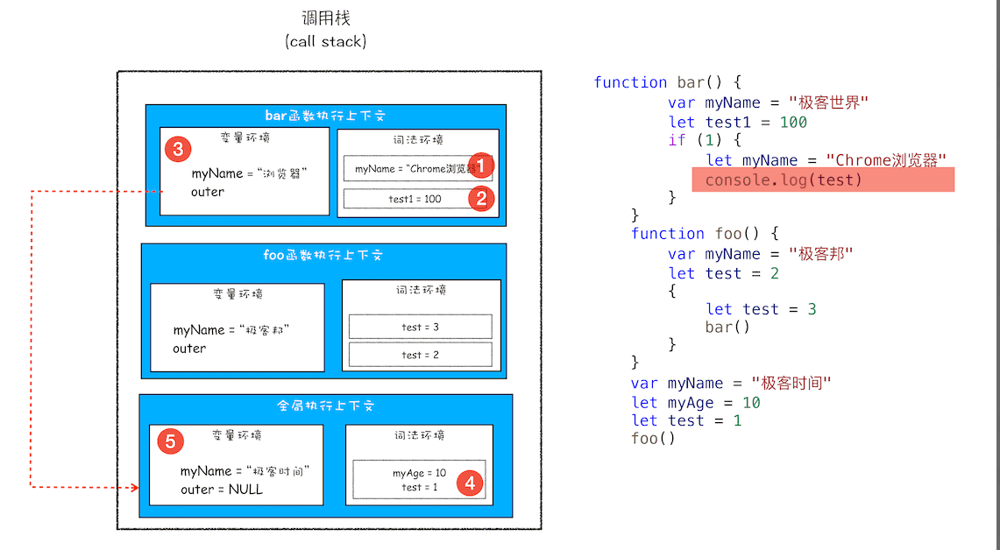
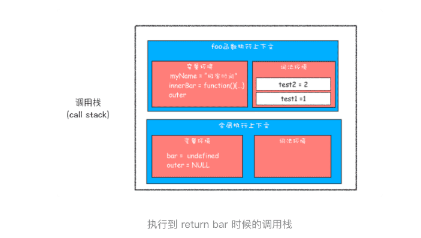
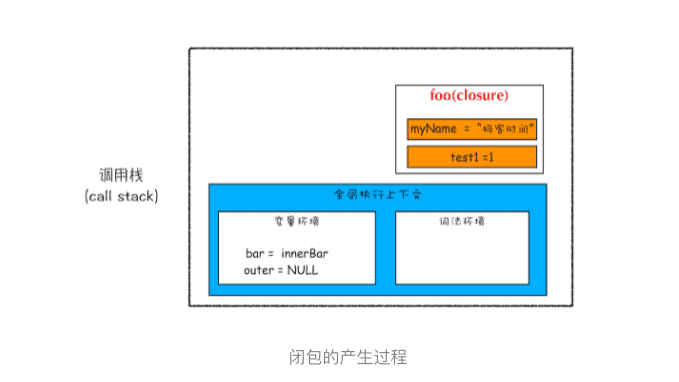
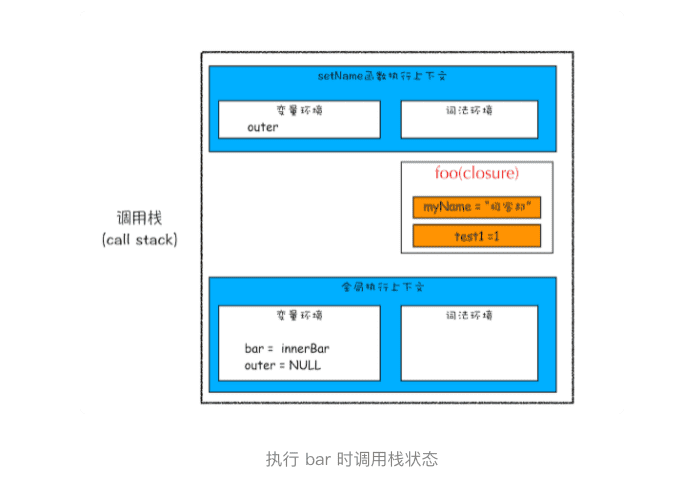
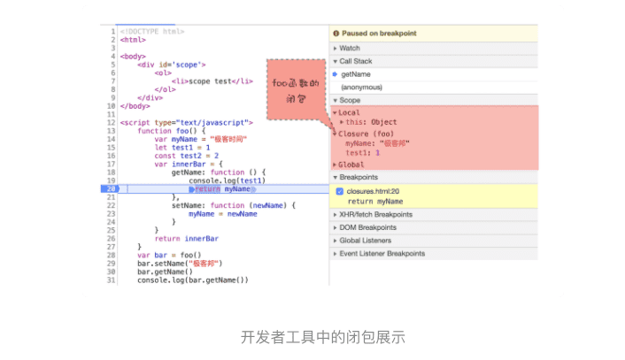

> 代码中出现相同的变量，javascript 引擎是如何选择的？

### 1.作用域链

```javascript
function bar() {
    console.log(myName)
}
function foo() {
    var myName = "极客邦"
    bar()
}
var myName = "极客时间"
foo()
```

其实在**每个执行上下文的变量环境中，都包含了一个外部引用，用来指向外部的执行上下文**，我们把这个外部引用称为 **outer**。

bar 函数和 foo 函数的 outer 都是指向全局上下文的，这也就意味着如果在 bar 函数或者 foo 函数中使用了外部变量，那么 JavaScript 引擎会去全局执行上下文中查找。我们把这个查找的链条就称为作用域链。

> 现在你知道变量是通过作用域链来查找的了，不过还有一个疑问没有解开，foo 函数调用的 bar 函数，那为什么 bar 函数的外部引用是全局执行上下文，而不是 foo 函数的执行上下文？要回答这个问题，你还需要知道什么是词法作用域。这是因为在 JavaScript 执行过程中，其作用域链是由词法作用域决定的。


### 2.词法作用域

**词法作用域就是指作用域是由代码中函数声明的位置来决定的，所以词法作用域是静态的作用域，通过它就能够预测代码在执行过程中如何查找标识符。**

**词法作用域是代码编译阶段就决定好的，和函数是怎么调用的没有关系。**

> 全局作用域和函数级作用域来分析了作用域链




### 3.块级作用域中的变量查找

```javascript
function bar() {
    var myName = "极客世界"
    let test1 = 100
    if (1) {
        let myName = "Chrome浏览器"
        console.log(test)
    }
}
function foo() {
    var myName = "极客邦"
    let test = 2
    {
        let test = 3
        bar()
    }
}
var myName = "极客时间"
let myAge = 10
let test = 1
foo()
```



> 首先是在 bar 函数的执行上下文中查找，但因为 bar 函数的执行上下文中没有定义 test 变量，所以根据词法作用域的规则，下一步就在 bar 函数的外部作用域中查找，也就是全局作用域。至于单个执行上下文中如何查找变量，上一篇文章中已经做了介绍。

### 4.闭包

```javascript
function foo() {
    var myName = "极客时间"
    let test1 = 1
    const test2 = 2
    var innerBar = {
        getName:function(){
            console.log(test1)
            return myName
        },
        setName:function(newName){
            myName = newName
        }
    }
    return innerBar
}
var bar = foo()
bar.setName("极客邦")
bar.getName()
console.log(bar.getName())
```

**在 JavaScript 中，根据词法作用域的规则，内部函数总是可以访问其外部函数中声明的变量，当通过调用一个外部函数返回一个内部函数后，即使该外部函数已经执行结束了，但是内部函数引用外部函数的变量依然保存在内存中，我们就把这些变量的集合称为闭包。比如外部函数是 foo，那么这些变量的集合就称为 foo 函数的闭包。**



> 从上面的代码可以看出，innerBar 是一个对象，包含了 getName 和 setName 的两个方法（通常我们把对象内部的函数称为方法）。你可以看到，这两个方法都是在 foo 函数内部定义的，并且这两个方法内部都使用了 myName 和 test1 两个变量。



> 从上图可以看出，foo 函数执行完成之后，其执行上下文从栈顶弹出了，但是由于返回的 setName 和 getName 方法中使用了 foo 函数内部的变量 myName 和 test1，所以这两个变量依然保存在内存中。**这像极了 setName 和 getName 方法背的一个专属背包，无论在哪里调用了 setName 和 getName 方法，它们都会背着这个 foo 函数的专属背包**。之所以是专属背包，是因为除了 setName 和 getName 函数之外，其他任何地方都是无法访问该背包的，我们就可以把这个背包称为 foo 函数的闭包。



> 从图中可以看出，setName 的执行上下文中没有 myName 变量，foo 函数的闭包中包含了变量 myName，所以调用 setName 时，会修改 foo 闭包中的 myName 变量的值。同样的流程，当调用 bar.getName 的时候，所访问的变量 myName 也是位于 foo 函数闭包中的。



> Local 就是当前的 getName 函数的作用域，Closure(foo) 是指 foo 函数的闭包，最下面的 Global 就是指全局作用域，从“Local–>Closure(foo)–>Global”就是一个完整的作用域链。

### 5.闭包是怎么回收的

如果引用闭包的函数是一个全局变量，那么闭包会一直存在直到页面关闭；但如果这个闭包以后不再使用的话，就会造成内存泄漏。

如果引用闭包的函数是个局部变量，等函数销毁后，在下次 JavaScript 引擎执行垃圾回收时，判断闭包这块内容如果已经不再被使用了，那么 JavaScript 引擎的垃圾回收器就会回收这块内存。

**如果该闭包会一直使用，那么它可以作为全局变量而存在；但如果使用频率不高，而且占用内存又比较大的话，那就尽量让它成为一个局部变量。**


### 6.思考题

```javascript
var bar = {
    myName:"time.geekbang.com",
    printName: function () {
        console.log(myName)
    }    
}
function foo() {
    let myName = "极客时间"
    return bar.printName
}
let myName = "极客邦"
let _printName = foo()
_printName()
bar.printName()
```

**这是因为 JavaScript 语言的作用域链是由词法作用域决定的，而词法作用域是由代码结构来确定的。**

> 思考题：
> 这道题其实是个障眼法，只需要确定好函数调用栈就可以很轻松的解答，调用了foo()后，返回的是bar.printName，后续就跟foo函数没有关系了，所以结果就是调用了两次bar.printName()，根据词法作用域，结果都是“极客邦”，也不会形成闭包。
> 闭包还可以这样理解：**当函数嵌套时，内层函数引用了外层函数作用域下的变量，并且内层函数在全局作用域下可访问时，就形成了闭包。**

> 思考题，最后输出的都是 “极客邦”，这里不会产生函数闭包，解释如下：
>
> \1. bar 不是一个函数，因此 bar 当中的 printName 其实是一个全局声明的函数，bar 当中的 myName 只是对象的一个属性，也和 printName 没有联系，如果要产生联系，需要使用 this 关键字，表示这里的 myName 是对象的一个属性，不然的话，printName 会通过词法作用域链去到其声明的环境，也就是全局，去找 myName
>
> \2. foo 函数返回的 printName 是全局声明的函数，因此和 foo 当中定义的变量也没有任何联系，这个时候 foo 函数返回 printName 并不会产生闭包


> 关于闭包的概念：
> 老师提出的概念：内部函数引用外部函数的变量的集合。
> 高级程序设计中的概念：闭包是指有权访问另一个函数作用域中的变量的函数。
> MDN上的概念：闭包是函数和声明该函数的词法环境的组合。
> 所以到底哪个是对的。。MDN = 老师 + 高程
>
> 作者回复: 很高兴终于有人提这个问题了，我的观点是**不要太纠结于概念，因为如何定义闭包不会影响到实际的使用，了解闭包是如何产生的，这才是本质的东西。**