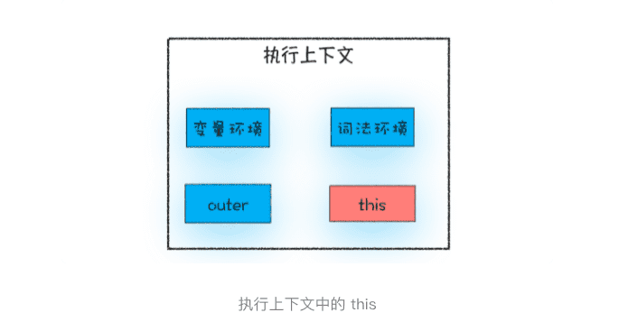

> 从javasscript执行上下文的视角讲清楚this

**在对象内部的方法中使用对象内部的属性是一个非常普遍的需求**(c++ 语言中能访问)。但是 JavaScript 的作用域机制并不支持这一点，基于这个需求，JavaScript 又搞出来另外一套 **this** 机制。

**作用域链和 this 是两套不同的系统，它们之间基本没太多联系。**

### 1.JavaScript 中的this是什么

**执行上下文中包含了变量环境、词法环境、外部环境、this**

> this 是和执行上下文绑定的，也就是说每个执行上下文中都有一个 this。前面《调用栈》中，执行上下文主要分为三种——全局执行上下文、函数执行上下文和 eval 执行上下文，所以对应的 this 也只有这三种——全局执行上下文中的 this、函数中的 this 和 eval 中的 this。

### 2.全局执行上下文中的this

**全局执行上下文中的 this 是指向 window 对象的。这也是 this 和作用域链的唯一交点，作用域链的最底端包含了 window 对象，全局执行上下文中的 this 也是指向 window 对象。**

### 3.函数执行上下文中的 this

