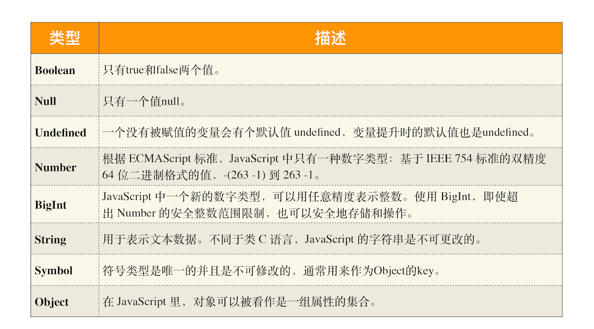

> 数据是如何存储的？

### 1.JavaScript 是什么类型的语言

**在使用之前就需要确认其变量数据类型的称为静态语言。**

**在运行过程中需要检查数据类型的语言称为动态语言。**

**支持隐式类型转换的语言称为弱类型语言，不支持隐式类型转换的语言称为强类型语言。**


### 2.JavaScript 的数据类型

**JavaScript 是一种弱类型的、动态的语言。**

> 弱类型，意味着你不需要告诉 JavaScript 引擎这个或那个变量是什么数据类型，JavaScript 引擎在运行代码的时候自己会计算出来。动态，意味着你可以使用同一个变量保存不同类型的数据。



> 把前面的 7 种数据类型称为**原始类型**，把最后一个对象类型称为**引用类型**，之所以把它们区分为两种不同的类型，是因为它们在内存中存放的位置不一样。

### 3.内存空间


在 JavaScript 的执行过程中， 主要有三种类型内存空间，分别是**代码空间**、**栈空间**和**堆空间**。

### 4.栈空间和堆空间

```javascript
function foo(){
    var a = "极客时间"
    var b = a
    var c = {name:"极客时间"}
    var d = c
}
foo()
```


**原始类型的数据值都是直接保存在“栈”中的，引用类型的值是存放在“堆”中的。**

**原始类型的赋值会完整复制变量值，而引用类型的赋值是复制引用地址。**

> JavaScript 引擎需要用栈来维护程序执行期间上下文的状态，如果栈空间大了话，所有的数据都存放在栈空间里面，那么会影响到上下文切换的效率，进而又影响到整个程序的执行效率。
>
> 所以通常情况下，栈空间都不会设置太大，主要用来存放一些原始类型的小数据。而引用类型的数据占用的空间都比较大，所以这一类数据会被存放到堆中，堆空间很大，能存放很多大的数据，不过缺点是分配内存和回收内存都会占用一定的时间。

### 5.再谈闭包

```javascript
function foo() {
    var myName = "极客时间"
    let test1 = 1
    const test2 = 2
    var innerBar = { 
        setName:function(newName){
            myName = newName
        },
        getName:function(){
            console.log(test1)
            return myName
        }
    }
    return innerBar
}
var bar = foo()
bar.setName("极客邦")
bar.getName()
console.log(bar.getName())
```

站在内存模型的角度来分析这段代码的执行流程：

1.当 JavaScript 引擎执行到 foo 函数时，首先会编译，并创建一个空执行上下文。

2.在编译过程中，遇到内部函数 setName，JavaScript 引擎还要对内部函数做一次快速的词法扫描，发现该内部函数引用了 foo 函数中的 myName 变量，由于是内部函数引用了外部函数的变量，所以 JavaScript 引擎判断这是一个闭包，于是在堆空间创建换一个“closure(foo)”的对象（这是一个内部对象，JavaScript 是无法访问的），用来保存 myName 变量。

3.接着继续扫描到 getName 方法时，发现该函数内部还引用变量 test1，于是 JavaScript 引擎又将 test1 添加到“closure(foo)”对象中。这时候堆中的“closure(foo)”对象中就包含了 myName 和 test1 两个变量了。

4.由于 test2 并没有被内部函数引用，所以 test2 依然保存在调用栈中。


当执行到 foo 函数时，闭包就产生了；当 foo 函数执行结束之后，返回的 getName 和 setName 方法都引用“closure(foo)”对象，所以即使 foo 函数退出了，“ closure(foo)”依然被其内部的 getName 和 setName 方法引用。所以在下次调用bar.setName或者bar.getName时，创建的执行上下文中就包含了“closure(foo)”。

**产生闭包的核心有两步：第一步是需要预扫描内部函数；第二步是把内部函数引用的外部变量保存到堆中。**

> 1:打开“开发者工具”
> 2:在控制台执行上述代码
> **3:然后选择“Memory”标签，点击"take snapshot" 获取V8的堆内存快照。**
> 4:然后“command+f"(mac) 或者 "ctrl+f"(win),搜索“setName”，然后你就会发现setName对象下面包含了 raw_outer_scope_info_or_feedback_metadata，对闭包的引用数据就在这里面。


