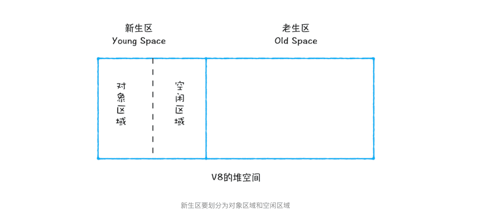
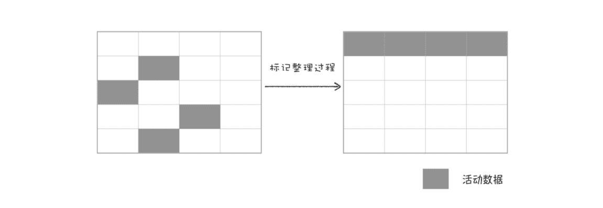

> 垃圾数据是如何自动回收的？

**原始数据类型是存储在栈空间中的，引用类型的数据是存储在堆空间中的**。

>  不过有些数据被使用之后，可能就不再需要了，我们把这种数据称为垃圾数据。如果这些垃圾数据一直保存在内存中，那么内存会越用越多，所以我们需要对这些垃圾数据进行回收，以释放有限的内存空间。

### 1.不同语言的垃圾回收策略

通常情况下，垃圾数据回收分为**手动回收**和**自动回收**两种策略。


### 2.调用栈中的数据是如何回收的

```javascript
function foo(){
    var a = 1
    var b = {name:"极客邦"}
    function showName(){
      var c = 2
      var d = {name:"极客时间"}
    }
    showName()
}
foo()
```


与此同时，还有一个记**录当前执行状态的指针（称为 ESP**），指向调用栈中 showName 函数的执行上下文，表示当前正在执行 showName 函数。


从图中可以看出，当 showName 函数执行结束之后，ESP 向下移动到 foo 函数的执行上下文中，上面 showName 的执行上下文虽然保存在栈内存中，但是已经是无效内存了。比如当 foo 函数再次调用另外一个函数时，这块内容会被直接覆盖掉，用来存放另外一个函数的执行上下文。

所以说，当一个函数执行结束之后，**JavaScript 引擎会通过向下移动 ESP 来销毁该函数保存在栈中的执行上下文。**

### 3.堆中的数据是如何回收的


**要回收堆中的垃圾数据，就需要用到 JavaScript 中的垃圾回收器了。**

#### 1.代际假说 The Generational Hypothesis

**代际假说**有以下两个特点：

- 第一个是大部分对象在内存中存在的时间很短，简单来说，就是很多对象一经分配内存，很快就变得不可访问；
- 第二个是不死的对象，会活得更久。

- 第一个是大部分对象在内存中存在的时间很短，简单来说，就是很多对象一经分配内存，很快就变得不可访问；第二个是不死的对象，会活得更久。

> 其实这两个特点不仅仅适用于 JavaScript，同样适用于大多数的动态语言，如 Java、Python 等。
> 通常，垃圾回收算法有很多种，但是并没有哪一种能胜任所有的场景，你需要权衡各种场景，根据对象的生存周期的不同而使用不同的算法，以便达到最好的效果.

在 V8 中会把堆分为新生代和老生代两个区域，新生代中存放的是生存时间短的对象，老生代中存放的生存时间久的对象。

新生区通常只支持 1～8M 的容量，而老生区支持的容量就大很多了。对于这两块区域，V8 分别使用两个不同的垃圾回收器，以便更高效地实施垃圾回收。

- **副垃圾回收器，主要负责新生代的垃圾回收。**

- **主垃圾回收器，主要负责老生代的垃圾回收。**

#### 2.垃圾回收器的工作流程

**不论什么类型的垃圾回收器，它们都有一套共同的执行流程。**

第一步是标记空间中活动对象和非活动对象。所谓活动对象就是还在使用的对象，非活动对象就是可以进行垃圾回收的对象。

第二步是回收非活动对象所占据的内存。其实就是在所有的标记完成之后，统一清理内存中所有被标记为可回收的对象。

第三步是做内存整理。一般来说，频繁回收对象后，内存中就会存在大量不连续空间，我们把这些不连续的内存空间称为内存碎片。当内存中出现了大量的内存碎片之后，如果需要分配较大连续内存的时候，就有可能出现内存不足的情况。所以最后一步需要整理这些内存碎片，但这步其实是可选的，因为有的垃圾回收器不会产生内存碎片，比如接下来我们要介绍的副垃圾回收器。

#### 3.副垃圾回收器

副垃圾回收器主要负责新生区的垃圾回收.

> 而通常情况下，大多数小的对象都会被分配到新生区，所以说这个区域虽然不大，但是垃圾回收还是比较频繁的。

新生代中用 **Scavenge 算法**来处理。所谓 Scavenge 算法，是把新生代空间对半划分为两个区域，一半是**对象区域**，一半是**空闲区域**，如下图所示：



新加入的对象都会存放到对象区域，当对象区域快被写满时，就需要执行一次垃圾清理操作。

在垃圾回收过程中，首先要对对象区域中的垃圾做标记；标记完成之后，就进入垃圾清理阶段，副垃圾回收器会把这些存活的对象复制到空闲区域中，同时它还会把这些对象有序地排列起来，所以这个复制过程，也就相当于完成了内存整理操作，复制后空闲区域就没有内存碎片了。

完成复制后，对象区域与空闲区域进行角色翻转，也就是原来的对象区域变成空闲区域，原来的空闲区域变成了对象区域。这样就完成了垃圾对象的回收操作，同时这种角色翻转的操作还能让新生代中的这两块区域无限重复使用下去。

由于新生代中采用的 Scavenge 算法，所以每次执行清理操作时，都需要将存活的对象从对象区域复制到空闲区域。但复制操作需要时间成本，如果新生区空间设置得太大了，那么每次清理的时间就会过久，所以**为了执行效率，一般新生区的空间会被设置得比较小。**

也正是因为新生区的空间不大，所以很容易被存活的对象装满整个区域。为了解决这个问题，**JavaScript 引擎采用了对象晋升策略**，也就是经过两次垃圾回收依然还存活的对象，会被移动到老生区中。

#### 4.主垃圾回收器

主垃圾回收器主要负责老生区中的垃圾回收。除了新生区中晋升的对象，一些大的对象会直接被分配到老生区。因此老生区中的对象有两个特点，一个是对象占用空间大，另一个是对象存活时间长。

由于老生区的对象比较大，若要在老生区中使用 Scavenge 算法进行垃圾回收，复制这些大的对象将会花费比较多的时间，从而导致回收执行效率不高，同时还会浪费一半的空间。因而，主垃圾回收器是采用**标记 - 清除（Mark-Sweep）**的算法进行垃圾回收的。下面我们来看看该算法是如何工作的。

首先是标记过程阶段。标记阶段就是从一组根元素开始，递归遍历这组根元素，在这个遍历过程中，能到达的元素称为活动对象，没有到达的元素就可以判断为**垃圾数据。**


从上图你可以大致看到垃圾数据的标记过程，当 showName 函数执行结束之后，ESP 向下移动，指向了 foo 函数的执行上下文，这时候如果遍历调用栈，是不会找到引用 1003 地址的变量，也就意味着 1003 这块数据为垃圾数据，被标记为红色。由于 1050 这块数据被变量 b 引用了，所以这块数据会被标记为活动对象。这就是大致的标记过程。

接下来就是垃圾的清除过程。它和副垃圾回收器的垃圾清除过程完全不同，你可以理解这个过程是清除掉红色标记数据的过程，可参考下图大致理解下其清除过程：


上面的标记过程和清除过程就是**标记 - 清除算法**，不过**对一块内存多次执行标记 - 清除算法后，会产生大量不连续的内存碎片**。而碎片过多会导致大对象无法分配到足够的连续内存，于是又产生了另外一种算法——**标记 - 整理（Mark-Compact）**，这个标记过程仍然与标记 - 清除算法里的是一样的，但后续步骤不是直接对可回收对象进行清理，而是让所有存活的对象都向一端移动，然后直接清理掉端边界以外的内存。你可以参考下图：



#### 5.全停顿

V8 是使用副垃圾回收器和主垃圾回收器处理垃圾回收的，不过由于 JavaScript 是运行在主线程之上的，一旦执行垃圾回收算法，都需要将正在执行的 JavaScript 脚本暂停下来，待垃圾回收完毕后再恢复脚本执行。我们把这种行为叫做**全停顿（Stop-The-World）**。

比如堆中的数据有 1.5GB，V8 实现一次完整的垃圾回收需要 1 秒以上的时间，这也是由于垃圾回收而引起 JavaScript 线程暂停执行的时间，若是这样的时间花销，那么应用的性能和响应能力都会直线下降。主垃圾回收器执行一次完整的垃圾回收流程如下图所示：


在 V8 新生代的垃圾回收中，因其空间较小，且存活对象较少，所以全停顿的影响不大，但老生代就不一样了。如果在执行垃圾回收的过程中，占用主线程时间过久，就像上面图片展示的那样，花费了 200 毫秒，在这 200 毫秒内，主线程是不能做其他事情的。比如页面正在执行一个 JavaScript 动画，因为垃圾回收器在工作，就会导致这个动画在这 200 毫秒内无法执行的，这将会造成页面的卡顿现象。

为了降低老生代的垃圾回收而造成的卡顿，V8 将标记过程分为一个个的子标记过程，同时让垃圾回收标记和 JavaScript 应用逻辑交替进行，直到标记阶段完成，我们把这个算法称为**增量标记（Incremental Marking）算法**。如下图所示：

 

使用增量标记算法，可以把一个完整的垃圾回收任务拆分为很多小的任务，这些小的任务执行时间比较短，可以穿插在其他的 JavaScript 任务中间执行，这样当执行上述动画效果时，就不会让用户因为垃圾回收任务而感受到页面的卡顿了。

> 从上面的分析你也能看出来，无论是垃圾回收的策略，还是处理全停顿的策略，往往都没有一个完美的解决方案，你需要花一些时间来做权衡，而这需要牺牲当前某几方面的指标来换取其他几个指标的提升。
>
> 其实站在工程师的视角，我们经常需要在满足需求的前提下，权衡各个指标的得失，把系统设计得尽可能适应最核心的需求。生活中处理事情的原则也与之类似，古人很早就说过“**两害相权取其轻，两利相权取其重**”，所以与其患得患失，不如冷静地分析哪些才是核心诉求，然后果断决策牺牲哪些以使得利益最大化。


