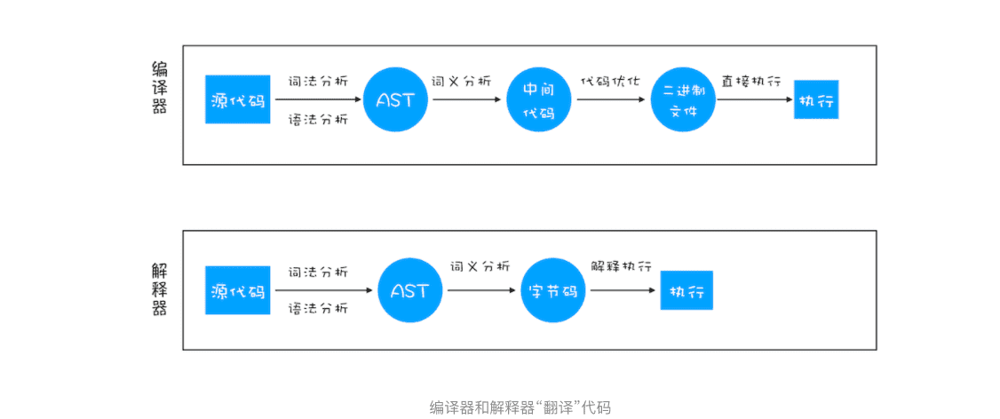
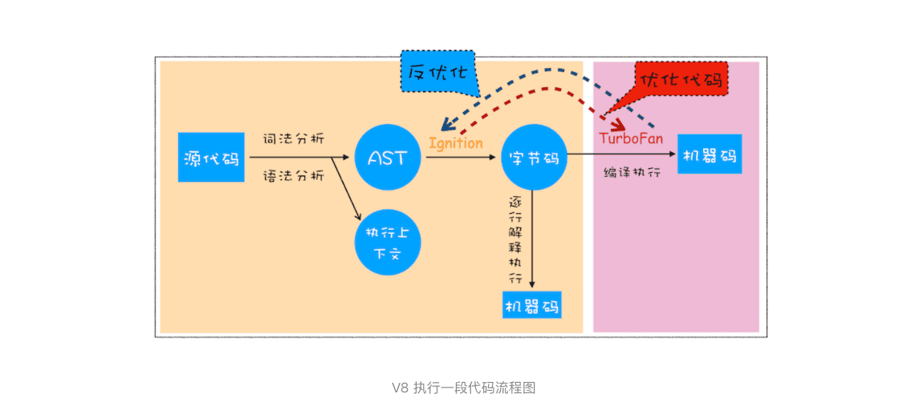
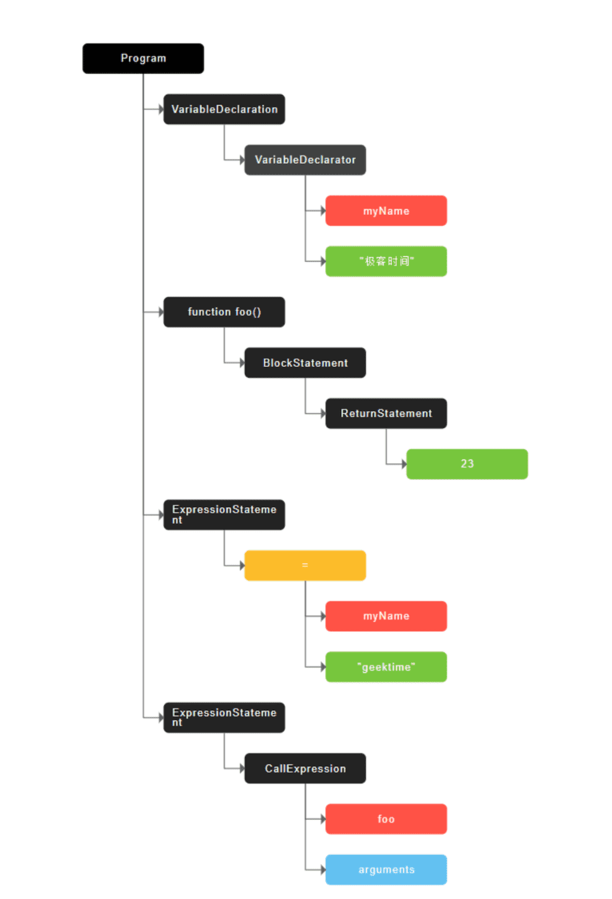
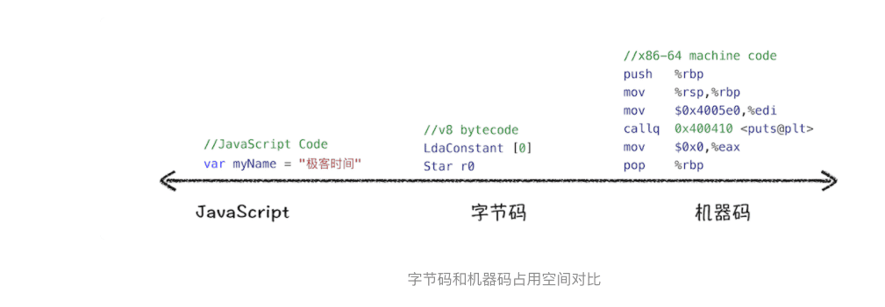
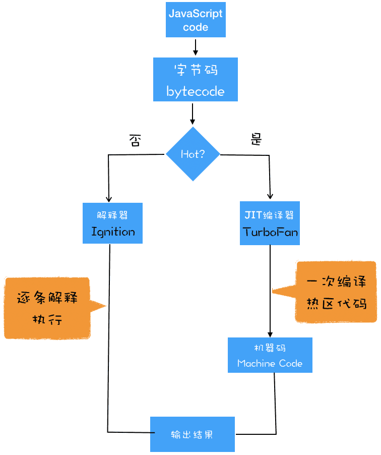

> V8是如何执行一段JavaScript代码的？

要深入理解 V8 的工作原理，需要搞清楚一些概念和原理，比如**编译器（Compiler）**、**解释器（Interpreter）**、**抽象语法树（AST**）、**字节码（Bytecode）**、**即时编译器（JIT）**等概念。

### 1.编译器和解释器

**编译型语言在程序执行之前，需要经过编译器的编译过程，并且编译之后会直接保留机器能读懂的二进制文件，这样每次运行程序时，都可以直接运行该二进制文件，而不需要再次重新编译了**。比如 C/C++、GO 等都是编译型语言。

**而由解释型语言编写的程序，在每次运行时都需要通过解释器对程序进行动态解释和执行。**比如 Python、JavaScript 等都属于解释型语言。




>  **抽象语法书 AST**


### 2.V8 是如何执行一段 JavaScript 代码的

**V8 在执行过程中既有解释器 Ignition，又有编译器 TurboFan**



#### 1.生成抽象语法树（AST）和执行上下文

将源代码转换为**抽象语法树**，并生成**执行上下文**（上节讲了）。

```javascript
var myName = "极客时间"
function foo(){
  return 23;
}
myName = "geektime"
foo()
```

> [javascript-ast](http://resources.jointjs.com/demos/javascript-ast) 站点 处理，生成AST结构
>
> 


> Babel 的工作原理就是先将 ES6 源码转换为 AST，然后再将 ES6 语法的 AST 转换为 ES5 语法的 AST，最后利用 ES5 的 AST 生成 JavaScript 源代码。除了 Babel 外，还有 ESLint 也使用 AST。

**1.生成 AST 需要经过两个阶段**

##### 1.第一阶段是分词（tokenize），又称为词法分析，


##### 2.第二阶段是解析（parse），又称为语法分析

其作用是将上一步生成的 token 数据，根据语法规则转为 AST。如果源码符合语法规则，这一步就会顺利完成。但如果源码存在语法错误，这一步就会终止，并抛出一个“语法错误”。这就是 AST 的生成过程，先分词，再解析。

有了 AST 后，那接下来 V8 就会生成该段代码的执行上下文。至于执行上下文的具体内容，可看前几章。

#### 2.生成字节码

有了 AST 和执行上下文后，那接下来的第二步，解释器 Ignition 就登场了，它会根据 AST 生成字节码，并解释执行字节码

> 其实一开始 V8 并没有字节码，而是直接将 AST 转换为机器码，由于执行机器码的效率是非常高效的，所以这种方式在发布后的一段时间内运行效果是非常好的。但是随着 Chrome 在手机上的广泛普及，特别是运行在 512M 内存的手机上，内存占用问题也暴露出来了，因为 V8 需要消耗大量的内存来存放转换后的机器码。为了解决内存占用问题，V8 团队大幅重构了引擎架构，引入字节码，并且抛弃了之前的编译器，最终花了将进四年的时间，实现了现在的这套架构。

那什么是字节码呢？为什么引入字节码就能解决内存占用问题呢？

**字节码就是介于 AST 和机器码之间的一种代码。但是与特定类型的机器码无关，字节码需要通过解释器将其转换为机器码后才能执行。**



从图中可以看出，机器码所占用的空间远远超过了字节码，所以使用字节码可以减少系统的内存使用。

#### 3.执行代码

如果有一段第一次执行的字节码，解释器 Ignition 会逐条解释执行。

解释器 Ignition 除了负责生成字节码之外，它还有另外一个作用，就是解释执行字节码。

在 Ignition 执行字节码的过程中，如果发现有**热点代码（HotSpot）**，比如一段代码被重复执行多次，这种就称为**热点代码**，那么后台的编译器 TurboFan 就会把该段热点的字节码编译为高效的机器码，然后当再次执行这段被优化的代码时，只需要执行编译后的机器码就可以了，这样就大大提升了代码的执行效率。

> V8 的解释器和编译器的取名也很有意思。解释器 Ignition 是点火器的意思，编译器 TurboFan 是涡轮增压的意思，寓意着代码启动时通过点火器慢慢发动，一旦启动，涡轮增压介入，其执行效率随着执行时间越来越高效率，因为热点代码都被编译器 TurboFan 转换了机器码，直接执行机器码就省去了字节码“翻译”为机器码的过程。
>
> 其实字节码配合解释器和编译器是最近一段时间很火的技术，比如 Java 和 Python 的虚拟机也都是基于这种技术实现的，我们把这种技术称为**即时编译（JIT）**.
>
> 具体到 V8，就是指解释器 Ignition 在解释执行字节码的同时，收集代码信息，当它发现某一部分代码变热了之后，TurboFan 编译器便闪亮登场，把热点的字节码转换为机器码，并把转换后的机器码保存起来，以备下次使用。
>
> 对于 JavaScript 工作引擎，除了 V8 使用了“字节码 +JIT”技术之外，苹果的 SquirrelFish Extreme 和 Mozilla 的 SpiderMonkey 也都使用了该技术。
>
> 

### 3.JavaScript 的性能优化

虽然在 V8 诞生之初，也出现过一系列针对 V8 而专门优化 JavaScript 性能的方案，比如**隐藏类**、**内联缓存**等概念都是那时候提出来的。不过随着 V8 的架构调整，你越来越不需要这些微优化策略了，相反，对于优化 JavaScript 执行效率，应该将优化的中心聚焦在**单次脚本的执行时间**和**脚本的网络下载上**，主要关注以下三点内容：

1. 提升单次脚本的执行速度，避免 JavaScript 的长任务霸占主线程，这样可以使得页面快速响应交互；
2. 避免大的内联脚本，因为在解析 HTML 的过程中，解析和编译也会占用主线程；
3. 减少 JavaScript 文件的容量，因为更小的文件会提升下载速度，并且占用更低的内存。

> 你是怎么理解“V8 执行时间越久，执行效率越高”这个性质的？
>
> 因为更多的代码成为热点代码之后，转为了机器码来执行。
>
> 引入了字节码，就有弹性空间了，可以在内存和执行速度之间做调节。相比之前的V8，将JS代码全部编译成字节码，这种模式就没有协商的空间了！
>
> V8解析后的字节码或热节点的机器码是存在哪的，是以缓存的形式存储的么？
>
> 是以哈希表形式存在堆内存中的


