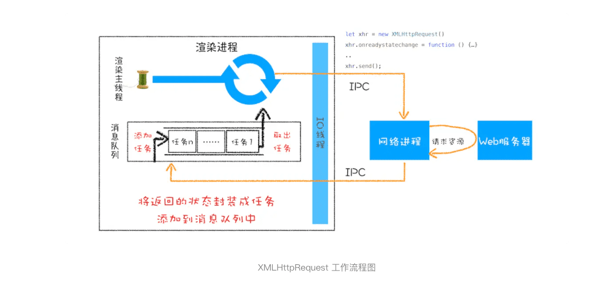

> XMLHttpRequest 是怎么实现的？

### 1.回调函数 VS 系统调用栈

```javascript
let callback = function(){
    console.log('i am do homework')
}
function doWork(cb) {
    console.log('start do work')
    cb()
    console.log('end do work')
}
doWork(callback)
// 上面的回调方法有个特点，就是回调函数 callback 是在主函数 doWork 返回之前执行的，我们把这个回调过程称为同步回调。
```

```javascript

let callback = function(){
    console.log('i am do homework')
}
function doWork(cb) {
    console.log('start do work')
    setTimeout(cb,1000)   
    console.log('end do work')
}
doWork(callback)
// 在这个例子中，我们使用了 setTimeout 函数让 callback 在 doWork 函数执行结束后，又延时了 1 秒再执行，这次 callback 并没有在主函数 doWork 内部被调用，我们把这种回调函数在主函数外部执行的过程称为异步回调。
```

异步回调过程，异步回调是指回调函数在主函数之外执行，一般有两种方式：

- 第一种是把异步函数做成一个任务，添加到信息队列尾部；
- 第二种是把异步函数添加到微任务队列中，这样就可以在当前任务的末尾处执行微任务了。

### 2.XMLHttpRequest 运作机制



渲染进程会将请求发送给网络进程，然后网络进程负责资源的下载，等网络进程接收到数据之后，就会利用 IPC 来通知渲染进程；渲染进程接收到消息之后，会将 xhr 的回调函数封装成任务并添加到消息队列中，等主线程循环系统执行到该任务的时候，就会根据相关的状态来调用对应的回调函数。

```javascript

 function GetWebData(URL){
    /**
     * 1:新建XMLHttpRequest请求对象
     */
    let xhr = new XMLHttpRequest()

    /**
     * 2:注册相关事件回调处理函数 
     */
    xhr.onreadystatechange = function () {
        switch(xhr.readyState){
          case 0: //请求未初始化
            console.log("请求未初始化")
            break;
          case 1://OPENED
            console.log("OPENED")
            break;
          case 2://HEADERS_RECEIVED
            console.log("HEADERS_RECEIVED")
            break;
          case 3://LOADING  
            console.log("LOADING")
            break;
          case 4://DONE
            if(this.status == 200||this.status == 304){
                console.log(this.responseText);
                }
            console.log("DONE")
            break;
        }
    }

    xhr.ontimeout = function(e) { console.log('ontimeout') }
    xhr.onerror = function(e) { console.log('onerror') }

    /**
     * 3:打开请求
     */
    xhr.open('Get', URL, true);//创建一个Get请求,采用异步


    /**
     * 4:配置参数
     */
    xhr.timeout = 3000 //设置xhr请求的超时时间
    xhr.responseType = "text" //设置响应返回的数据格式
    xhr.setRequestHeader("X_TEST","time.geekbang")

    /**
     * 5:发送请求
     */
    xhr.send();
}
```

### 3.XMLHttpRequest 使用过程中的“坑”

#### 1.跨域问题

#### 2.HTTPS 混合内容的问题

HTTPS 混合内容是 HTTPS 页面中包含了不符合 HTTPS 安全要求的内容，比如包含了 HTTP 资源，通过 HTTP 加载的图像、视频、样式表、脚本等，都属于混合内容。

> setTimeout 是直接将延迟任务添加到延迟队列中，而 XMLHttpRequest 发起请求，是由浏览器的其他进程或者线程去执行，然后再将执行结果利用 IPC 的方式通知渲染进程，之后渲染进程再将对应的消息添加到消息队列中。如果你搞懂了 setTimeout 和 XMLHttpRequest 的工作机制后，再来理解其他 WebAPI 就会轻松很多了，因为大部分 WebAPI 的工作逻辑都是类似的。


