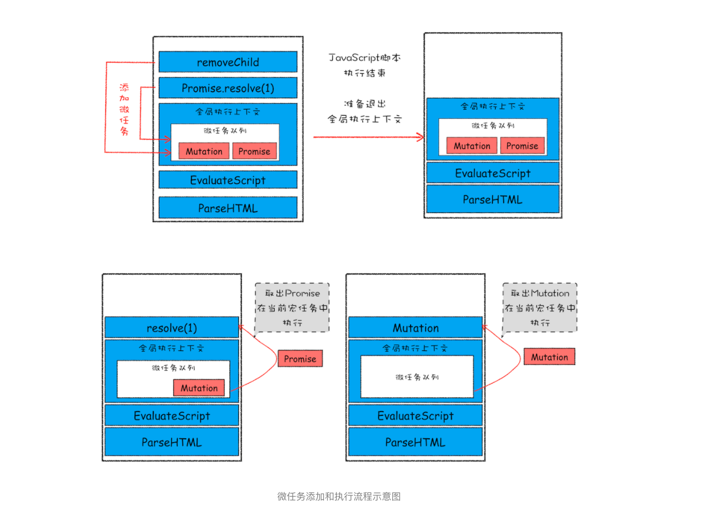

> 不是所有任务都是一个待遇
>
> **微任务可以在实时性和效率之间做一个有效的权衡。**

### 1.宏任务

页面中的大部分任务都是在主线程上执行的，这些任务包括了：

- 渲染事件（如解析 DOM、计算布局、绘制）
- 用户交互事件（如鼠标点击、滚动页面、放大缩小等）
- JavaScript 脚本执行事件
- 网络请求完成、文件读写完成事件。

为了协调这些任务有条不紊地在主线程上执行，页面进程引入了消息队列和事件循环机制，渲染进程内部会维护多个消息队列，比如延迟执行队列和普通的消息队列。然后主线程采用一个 for 循环，不断地从这些任务队列中取出任务并执行任务。我们把这些消息队列中的任务称为**宏任务**。

```javascript
<!DOCTYPE html>
<html>
    <body>
        <div id='demo'>
            <ol>
                <li>test</li>
            </ol>
        </div>
    </body>
    <script type="text/javascript">
        function timerCallback2(){
          console.log(2)
        }
        function timerCallback(){
            console.log(1)
            setTimeout(timerCallback2,0)
        }
        setTimeout(timerCallback,0)
    </script>
</html>
```

所以说宏任务的**时间粒度**比较大，执行的时间间隔是不能精确控制的，对一些高实时性的需求就不太符合了，比如后面要介绍的监听 DOM 变化的需求。

### 2.微任务

异步回调的概念主要有两种方式：

**第一种是把异步回调函数封装成一个宏任务，添加到消息队列尾部，当循环系统执行到该任务的时候执行回调函数。**

**第二种方式的执行时机是在主函数执行结束之后**、当前宏任务结束之前执行回调函数，这通常都是以微任务形式体现的。

**微任务就是一个需要异步执行的函数，执行时机是在主函数执行结束之后、当前宏任务结束之前。**

在现代浏览器里面，产生微任务有两种方式：

第一种方式是使用 MutationObserver 监控某个 DOM 节点，然后再通过 JavaScript 来修改这个节点，或者为这个节点添加、删除部分子节点，当 DOM 节点发生变化时，就会产生 DOM 变化记录的微任务。

第二种方式是使用 Promise，当调用 Promise.resolve() 或者 Promise.reject() 的时候，也会产生微任务。


通常情况下，**在当前宏任务中的 JavaScript 快执行完成时，也就在 JavaScript 引擎准备退出全局执行上下文并清空调用栈的时候，**JavaScript 引擎会检查全局执行上下文中的微任务队列，然后按照顺序执行队列中的微任务。**WHATWG 把执行微任务的时间点称为检查点。**当然除了在退出全局执行上下文式这个检查点之外，还有其他的检查点，不过不是太重要，这里就不做介绍了。

> 执行完宏任务时 ，会清空调用栈。

如果在执行微任务的过程中，产生了新的微任务，同样会将该微任务添加到微任务队列中，V8 引擎一直循环执行微任务队列中的任务，直到队列为空才算执行结束。也就是说在执行微任务过程中产生的新的微任务并不会推迟到下个宏任务中执行，而是在当前的宏任务中继续执行。



以上就是微任务的工作流程，从上面分析我们可以得出如下几个结论

- 微任务和宏任务是绑定的，每个宏任务在执行时，会创建自己的微任务队列。
- 微任务的执行时长会影响到当前宏任务的时长。比如一个宏任务在执行过程中，产生了 100 个微任务，执行每个微任务的时间是 10 毫秒，那么执行这 100 个微任务的时间就是 1000 毫秒，也可以说这 100 个微任务让宏任务的执行时间延长了 1000 毫秒。所以你在写代码的时候一定要注意控制微任务的执行时长。
- 在一个宏任务中，分别创建一个用于回调的宏任务和微任务，无论什么情况下，微任务都早于宏任务执行。

### 监听 DOM 变化方法演变

> 虽然监听 DOM 的需求是如此重要，不过早期页面并没有提供对监听的支持，所以那时要观察 DOM 是否变化，唯一能做的就是轮询检测，比如使用 setTimeout 或者 setInterval 来定时检测 DOM 是否有改变。这种方式简单粗暴，但是会遇到两个问题：如果时间间隔设置过长，DOM 变化响应不够及时；反过来如果时间间隔设置过短，又会浪费很多无用的工作量去检查 DOM，会让页面变得低效。
>
> 直到 2000 年的时候引入了 Mutation Event，Mutation Event 采用了观察者的设计模式，当 DOM 有变动时就会立刻触发相应的事件，这种方式属于同步回调。
>
> 采用 Mutation Event 解决了实时性的问题，因为 DOM 一旦发生变化，就会立即调用 JavaScript 接口。但也正是这种实时性造成了严重的性能问题，因为每次 DOM 变动，渲染引擎都会去调用 JavaScript，这样会产生较大的性能开销。比如利用 JavaScript 动态创建或动态修改 50 个节点内容，就会触发 50 次回调，而且每个回调函数都需要一定的执行时间，这里我们假设每次回调的执行时间是 4 毫秒，那么 50 次回调的执行时间就是 200 毫秒，若此时浏览器正在执行一个动画效果，由于 Mutation Event 触发回调事件，就会导致动画的卡顿。
>
> **为了解决了 Mutation Event 由于同步调用 JavaScript 而造成的性能问题，从 DOM4 开始，推荐使用 MutationObserver 来代替 Mutation Event。MutationObserver API 可以用来监视 DOM 的变化，包括属性的变化、节点的增减、内容的变化等。**
>
> 首先，MutationObserver 将响应函数改成异步调用，可以不用在每次 DOM 变化都触发异步调用，而是等多次 DOM 变化后，**一次触发异步调用**，并且还会使用一个数据结构来记录这期间所有的 DOM 变化。这样即使频繁地操纵 DOM，也不会对性能造成太大的影响。
>
> 我们通过异步调用和减少触发次数来缓解了性能问题，那么如何保持消息通知的及时性呢？如果采用 setTimeout 创建宏任务来触发回调的话，那么实时性就会大打折扣，因为上面我们分析过，在两个任务之间，可能会被渲染进程插入其他的事件，从而影响到响应的实时性。
>
> **微任务**就可以上场了，在每次 DOM 节点发生变化的时候，渲染引擎将变化记录封装成微任务，并将微任务添加进当前的微任务队列中。这样当执行到检查点的时候，V8 引擎就会按照顺序执行微任务了。


MutationObserver 采用了“异步 + 微任务”的策略。

通过**异步**操作解决了同步操作的**性能问题**；

通过**微任务**解决了**实时性的问题**。


