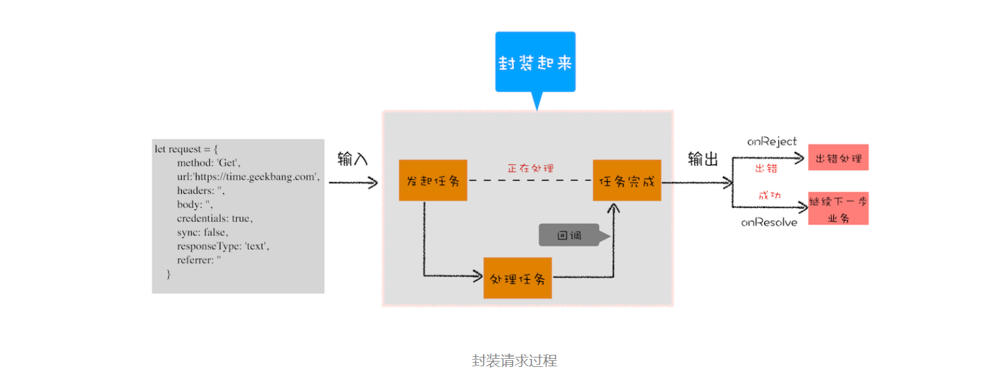
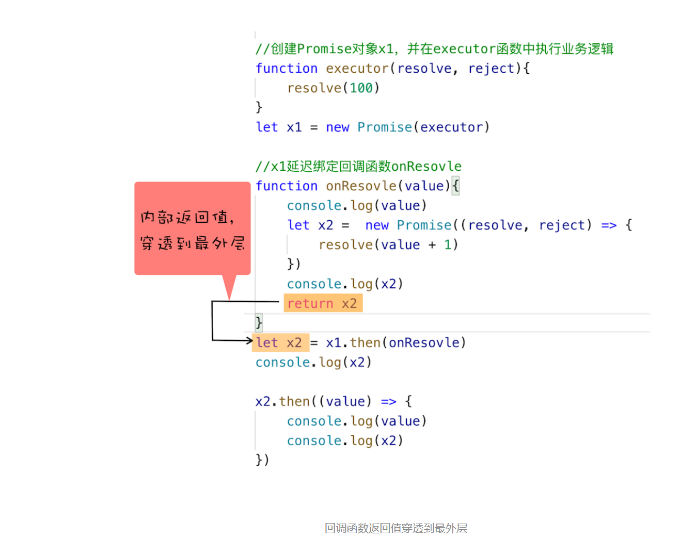

> 使用Promise，告别回调函数

### 1.异步编程的问题：代码逻辑不连续

```javascript

//执行状态
function onResolve(response){console.log(response) }
function onReject(error){console.log(error) }

let xhr = new XMLHttpRequest()
xhr.ontimeout = function(e) { onReject(e)}
xhr.onerror = function(e) { onReject(e) }
xhr.onreadystatechange = function () { onResolve(xhr.response) }

//设置请求类型，请求URL，是否同步信息
let URL = 'https://time.geekbang.com'
xhr.open('Get', URL, true);

//设置参数
xhr.timeout = 3000 //设置xhr请求的超时时间
xhr.responseType = "text" //设置响应返回的数据格式
xhr.setRequestHeader("X_TEST","time.geekbang")

//发出请求
xhr.send();


// 异步回调会导致代码逻辑不连贯、不线性等。
```

### 2.封装异步代码，让处理流程变得线性



### 3.新的问题：回调地狱

```javascript

XFetch(makeRequest('https://time.geekbang.org/?category'),
      function resolve(response) {
          console.log(response)
          XFetch(makeRequest('https://time.geekbang.org/column'),
              function resolve(response) {
                  console.log(response)
                  XFetch(makeRequest('https://time.geekbang.org')
                      function resolve(response) {
                          console.log(response)
                      }, function reject(e) {
                          console.log(e)
                      })
              }, function reject(e) {
                  console.log(e)
              })
      }, function reject(e) {
          console.log(e)
      })
```

### 4.Promise：消灭嵌套调用和多次错误处理

```javascript

function executor(resolve, reject) {
    let rand = Math.random();
    console.log(1)
    console.log(rand)
    if (rand > 0.5)
        resolve()
    else
        reject()
}
var p0 = new Promise(executor);

var p1 = p0.then((value) => {
    console.log("succeed-1")
    return new Promise(executor)
})

var p3 = p1.then((value) => {
    console.log("succeed-2")
    return new Promise(executor)
})

var p4 = p3.then((value) => {
    console.log("succeed-3")
    return new Promise(executor)
})

p4.catch((error) => {
    console.log("error")
})
console.log(2)
//是因为 Promise 对象的错误具有“冒泡”性质，会一直向后传递，直到被 onReject 函数处理或 catch 语句捕获为止。具备了这样“冒泡”的特性后，就不需要在每个 Promise 对象中单独捕获异常了
//通过这种方式，我们就消灭了嵌套调用和频繁的错误处理，这样使得我们写出来的代码更加优雅，更加符合人的线性思维。
```

Promise 主要通过下面两步解决嵌套回调问题的。

**首先，Promise 实现了回调函数的延时绑定。**回调函数的延时绑定在代码上体现就是先创建 Promise 对象 x1，通过 Promise 的构造函数 executor 来执行业务逻辑；创建好 Promise 对象 x1 之后，再使用 x1.then 来设置回调函数。示范代码如下：

```

//创建Promise对象x1，并在executor函数中执行业务逻辑
function executor(resolve, reject){
    resolve(100)
}
let x1 = new Promise(executor)


//x1延迟绑定回调函数onResolve
function onResolve(value){
    console.log(value)
}
x1.then(onResolve)
```

**其次，需要将回调函数 onResolve 的返回值穿透到最外层。**



Promise 通过**回调函数延迟绑定**和**回调函数返回值穿透**的技术，解决了循环嵌套。

### 5.Promise 与 微任务

```javascript

function executor(resolve, reject) {
    resolve(100)
}
let demo = new Promise(executor)

function onResolve(value){
    console.log(value)
}
demo.then(onResolve)
```

对于上面这段代码，我们需要重点关注下它的执行顺序。

首先执行 new Promise 时，Promise 的构造函数会被执行，不过由于 Promise 是 V8 引擎提供的，所以暂时看不到 Promise 构造函数的细节。

接下来，Promise 的构造函数会调用 Promise 的参数 executor 函数。然后在 executor 中执行了 resolve，resolve 函数也是在 V8 内部实现的，那么 resolve 函数到底做了什么呢？我们知道，执行 resolve 函数，会触发 demo.then 设置的回调函数 onResolve，所以可以推测，resolve 函数内部调用了通过 demo.then 设置的 onResolve 函数。

不过这里需要注意一下，由于 Promise 采用了回调函数延迟绑定技术，所以在执行 resolve 函数的时候，回调函数还没有绑定，那么只能推迟回调函数的执行。

这样按顺序陈述可能把你绕晕了，下面来模拟实现一个 Promise，我们会实现它的构造函数、resolve 方法以及 then 方法，以方便你能看清楚 Promise 的背后都发生了什么。这里我们就把这个对象称为 Bromise，下面就是 Bromise 的实现代码：

```javascript

function Bromise(executor) {
    var onResolve_ = null
    var onReject_ = null
     //模拟实现resolve和then，暂不支持rejcet
    this.then = function (onResolve, onReject) {
        onResolve_ = onResolve
    };
    function resolve(value) {
          //setTimeout(()=>{
            onResolve_(value)
           // },0)
    }
    executor(resolve, null);
}
```

> ，是由于 Bromise 的延迟绑定导致的，在调用到 onResolve_ 函数的时候，Bromise.then 还没有执行，所以执行上述代码的时候，当然会报“onResolve_ is not a function“的错误了。

要让 resolve 中的 onResolve_ 函数延后执行，可以在 resolve 函数里面加上一个定时器，让其延时执行 onResolve_ 函数，你可以参考下面改造后的代码：

```javascript

function resolve(value) {
          setTimeout(()=>{
              onResolve_(value)
            },0)
    }
```

上面采用了定时器来推迟 onResolve 的执行，不过使用定时器的效率并不是太高，好在我们有微任务，所以 Promise 又把这个定时器改造成了微任务了，这样既可以让 onResolve_ 延时被调用，又提升了代码的执行效率。这就是 Promise 中使用微任务的原由了。


