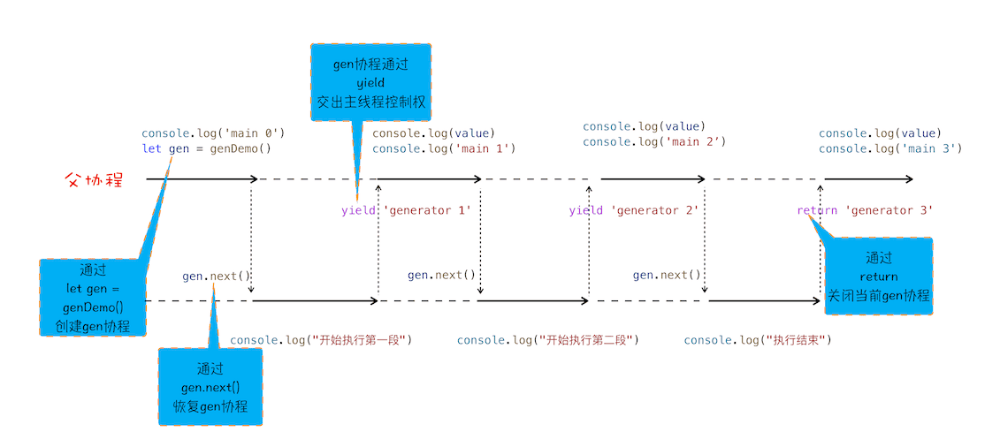
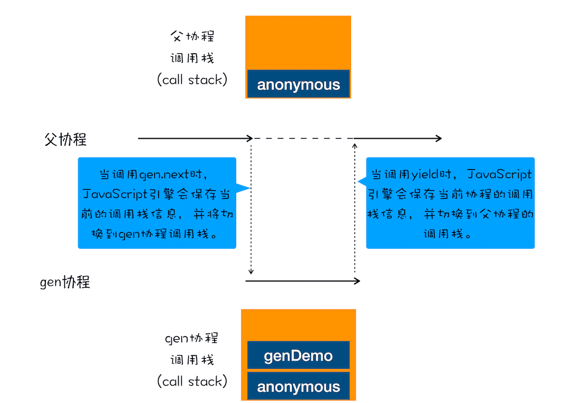
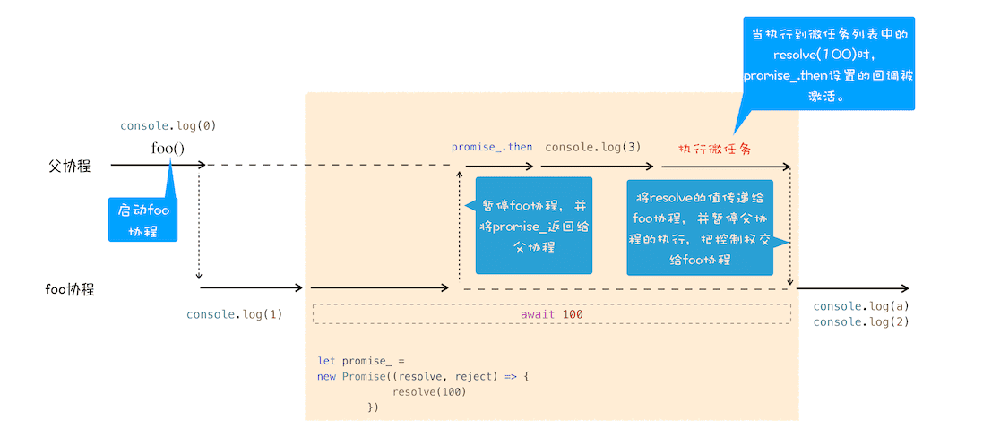

> 使用同步的方法去写异步代码

### 1.生成器 VS 协程

#### 1.协程

协程实现函数的暂停和回复。**协程是一种比线程更加轻量级的存在**。你可以把协程看成是跑在线程上的任务，一个线程上可以存在多个协程，但是**在线程上同时只能执行一个协程**，比如当前执行的是 A 协程，要启动 B 协程，那么 A 协程就需要将主线程的控制权交给 B 协程，这就体现在 A 协程暂停执行，B 协程恢复执行；同样，也可以从 B 协程中启动 A 协程。通常，如果从 A 协程启动 B 协程，我们就把 A 协程称为 B 协程的父协程。正如一个进程可以拥有多个线程一样，一个线程也可以拥有多个协程。最重要的是，协**程不是被操作系统内核所管理，而完全是由程序所控制（也就是在用户态执行）**。这样带来的好处就是性能得到了很大的提升，不会像线程切换那样消耗资源。

```javascript

function* genDemo() {
    console.log("开始执行第一段")
    yield 'generator 2'

    console.log("开始执行第二段")
    yield 'generator 2'

    console.log("开始执行第三段")
    yield 'generator 2'

    console.log("执行结束")
    return 'generator 2'
}

console.log('main 0')
let gen = genDemo()
console.log(gen.next().value)
console.log('main 1')
console.log(gen.next().value)
console.log('main 2')
console.log(gen.next().value)
console.log('main 3')
console.log(gen.next().value)
console.log('main 4')
```




1. 通过调用生成器函数 genDemo 来创建一个协程 gen，创建之后，gen 协程并没有立即执行。
2. 要让 gen 协程执行，需要通过调用 gen.next。
3. 当协程正在执行的时候，可以通过 yield 关键字来暂停 gen 协程的执行，并返回主要信息给父协程。
4. 如果协程在执行期间，遇到了 return 关键字，那么 JavaScript 引擎会结束当前协程，并将 return 后面的内容返回给父协程。

父协程有自己的调用栈，gen 协程时也有自己的调用栈，当 gen 协程通过 yield 把控制权交给父协程时，V8 是如何切换到父协程的调用栈？当父协程通过 gen.next 恢复 gen 协程时，又是如何切换 gen 协程的调用栈？

1. gen 协程和父协程是在主线程上交互执行的，并不是并发执行的，它们之前的切换是通过 yield 和 gen.next 来配合完成的。
2. 当在 gen 协程中调用了 yield 方法时，JavaScript 引擎会保存 gen 协程当前的调用栈信息，并恢复父协程的调用栈信息。同样，当在父协程中执行 gen.next 时，JavaScript 引擎会保存父协程的调用栈信息，并恢复 gen 协程的调用栈信息。




```javascript
import co from 'co'
//foo函数
function* foo() {
  let response1 = yield new Promise((resolve, reject)=>{ // yield 后面的值 赋值 通过next().value 
    console.log('start')
    setTimeout(function(){
      resolve('s')
    },3000)
  })
  console.log('response1')  // next(val) response1 通过next中的参数返回
  console.log(response1)  
  let response2 = yield new Promise((resolve, reject)=>{
    setTimeout(function(){
      resolve('sss')
    },2000)
  })
  console.log('response2')
  console.log(response2)
}

// co(foo())  以下代码跟这段代码功能相同

//执行foo函数的代码
let gen = foo()
function getGenPromise(gen,prevValue) {
  return gen.next(prevValue).value
}
getGenPromise(gen).then((response) => {
  console.log('response3')
  console.log(response)
  return getGenPromise(gen,response)
}).then((response) => {
  console.log('response4')
  console.log(response)
  return getGenPromise(gen,response)
})
```

### 2.async

根据 MDN 定义，async 是一个通过**异步执行**并**隐式返回 Promise** 作为结果的函数。

### 3.await 

```javascript
async function foo() {
  console.log(1)
  let a = await 100
  console.log(a)
  console.log(2)
}
console.log(0)
foo()
console.log(3)
```



> 使用 async/await 可以实现用同步代码的风格来编写异步代码，这是因为 async/await 的基础技术使用了生成器和 Promise，生成器是协程的实现，利用生成器能实现生成器函数的暂停和恢复。
>
> V8 引擎还为 async/await 做了大量的语法层面包装，所以了解隐藏在背后的代码有助于加深你对 async/await 的理解。

```javascript

async function foo() {
    console.log('foo')  // await console.log('foo') 就搞不明白怎么回事了？
}
async function bar() {
    console.log('bar start')
    await foo()
    console.log('bar end')
}
console.log('script start')
setTimeout(function () {
    console.log('setTimeout')
}, 0)
bar();
new Promise(function (resolve) {
    console.log('promise executor')
    resolve();
}).then(function () {
    console.log('promise then')
})
console.log('script end')
```

1. 首先在主协程中初始化异步函数foo和bar，碰到console.log打印script start；
2.  解析到setTimeout，初始化一个Timer，创建一个新的task
3.  执行bar函数，将控制权交给协程，输出bar start，碰到await，执行foo，输出foo，创建一个 Promise返回给主协程
4.  将返回的promise添加到微任务队列，向下执行 new Promise，输出 promise executor，返回resolve 添加到微任务队列
5.  输出script end
6.  当前task结束之前检查微任务队列，执行第一个微任务，将控制器交给**协程输出bar end**
7.  执行第二个微任务 输出 promise then
8.  当前任务执行完毕进入下一个任务，输出setTimeout