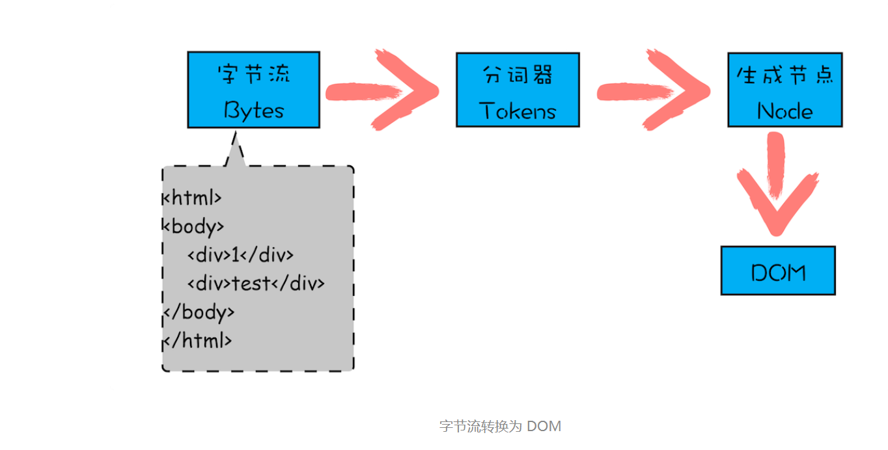
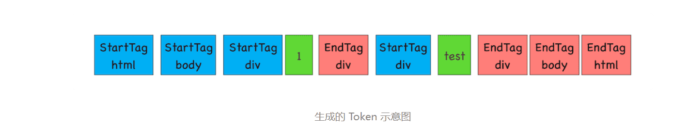
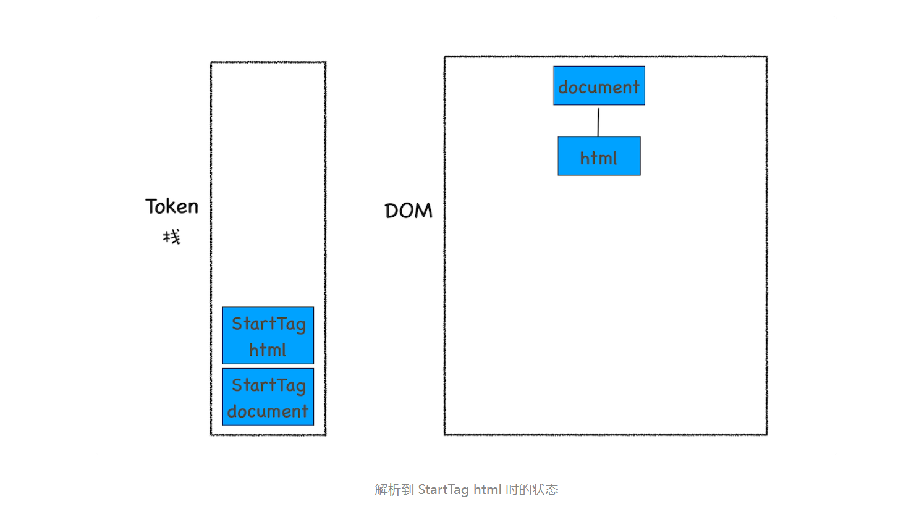
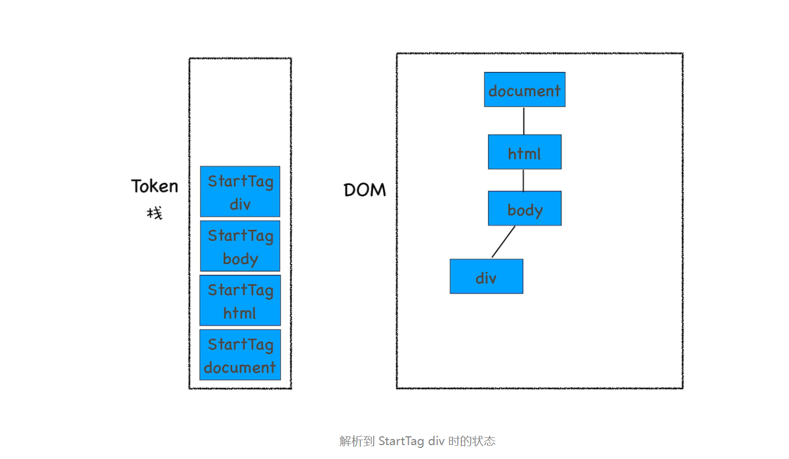
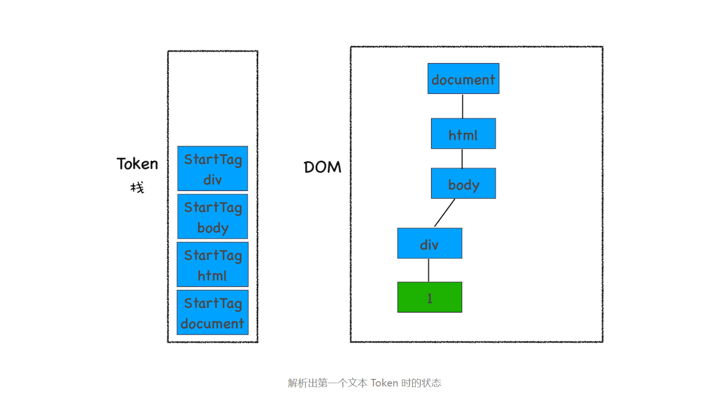
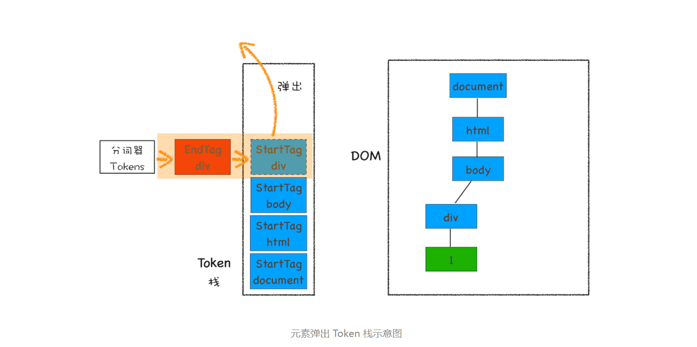
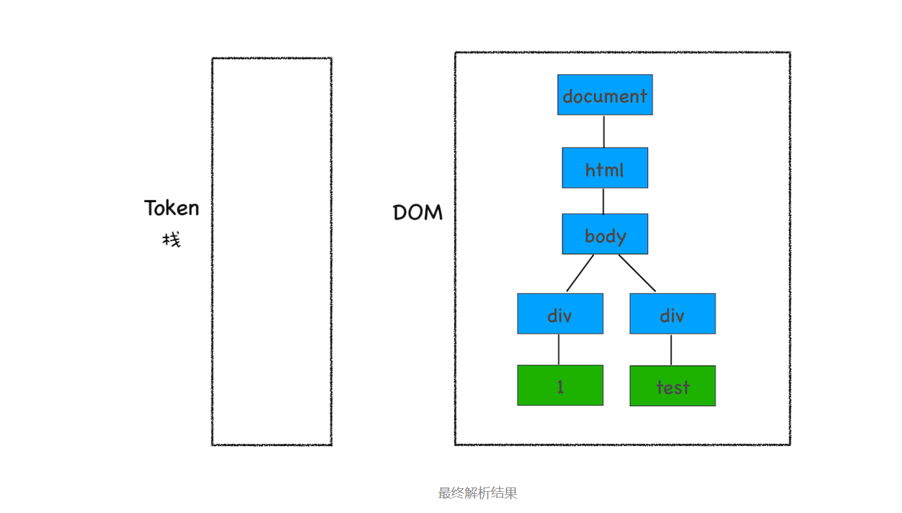

> JavaScript是如何影响DOM树构建的

### 1.什么是DOM

从网络传给渲染引擎的 HTML 文件字节流是无法直接被渲染引擎理解的，所以要将其转化为渲染引擎能够理解的内部结构，这个结构就是 DOM。DOM 提供了对 HTML 文档结构化的表述。在渲染引擎中，DOM 有三个层面的作用。

- 从页面的视角来看，DOM 是生成页面的基础数据结构。
- 从 JavaScript 脚本视角来看，DOM 提供给 JavaScript 脚本操作的接口，通过这套接口，JavaScript 可以对 DOM 结构进行访问，从而改变文档的结构、样式和内容。
- 从安全视角来看，DOM 是一道安全防护线，一些不安全的内容在 DOM 解析阶段就被拒之门外了。

简言之，DOM 是表述 HTML 的内部数据结构，它会将 Web 页面和 JavaScript 脚本连接起来，并过滤一些不安全的内容。

### 2.DOM 树如何生成

在渲染引擎内部，有一个叫 **HTML 解析器（HTMLParser）**的模块，它的职责就是负责将 HTML 字节流转换为 DOM 结构。

> HTML 解析器是等整个 HTML 文档加载完成之后开始解析的，还是随着 HTML 文档边加载边解析的？
>
> HTML 解析器并不是等整个文档加载完成之后再解析的，而是**网络进程加载了多少数据，HTML 解析器便解析多少数据。**
>
> 那详细的流程是怎样的呢？
>
> 网络进程接收到响应头之后，会根据响应头中的 content-type 字段来判断文件的类型，比如 content-type 的值是“text/html”，那么浏览器就会判断这是一个 HTML 类型的文件，然后为该请求选择或者创建一个渲染进程。渲染进程准备好之后，**网络进程和渲染进程之间会建立一个共享数据的管道**，网络进程接收到数据后就往这个管道里面放，而渲染进程则从管道的另外一端不断地读取数据，并同时将读取的数据“喂”给 HTML 解析器。你可以把这个管道想象成一个“水管”，网络进程接收到的字节流像水一样倒进这个“水管”，而“水管”的另外一端是渲染进程的 HTML 解析器，它会动态接收字节流，并将其解析为 DOM。



字节流转换为 DOM 需要三个阶段。

**第一个阶段，通过分词器将字节流转换为 Token。**



**至于后续的第二个和第三个阶段是同步进行的，需要将 Token 解析为 DOM 节点，并将 DOM 节点添加到 DOM 树中。**

HTML 解析器维护了一个 **Token 栈结构**，，该 Token 栈主要用来计算节点之间的父子关系，在第一个阶段中生成的 Token 会被按照顺序压到这个栈中。具体的处理规则如下所示：

- 如果压入到栈中的是 **StartTag Token**，HTML 解析器会为该 Token 创建一个 DOM 节点，然后将该节点加入到 DOM 树中，它的父节点就是栈中相邻的那个元素生成的节点。
- 如果分词器解析出来是**文本 Token**，那么会生成一个文本节点，然后将该节点加入到 DOM 树中，文本 Token 是不需要压入到栈中，它的父节点就是当前栈顶 Token 所对应的 DOM 节点。
- 如果分词器解析出来的是 **EndTag 标签**，比如是 EndTag div，HTML 解析器会查看 Token 栈顶的元素是否是 StarTag div，如果是，就将 StartTag div 从栈中弹出，表示该 div 元素解析完成。











### 3.JavaScript 是如何影响 DOM 生成的

#### 1.内嵌Javascript脚本

```html

<html>
<body>
    <div>1</div>
    <script>
    let div1 = document.getElementsByTagName('div')[0]
    div1.innerText = 'time.geekbang'
    </script>
    <div>test</div>
</body>
</html>
```

`<script> `标签之前，所有的解析流程跟原先一样，解析到`<script>` 标签时，渲染引擎判断这是一段脚本，此时 HTML 解析器就会暂停 DOM 的解析（因为接下来的 JavaScript 可能要修改当前已经生成的 DOM 结构），JavaScript 引擎介入，并执行 script 标签中的这段脚本，因为这段 JavaScript 脚本修改了 DOM 中第一个 div 中的内容，所以执行这段脚本之后，div 节点内容已经修改为 time.geekbang 了。脚本执行完成之后，HTML 解析器恢复解析过程，继续解析后续的内容，直至生成最终的 DOM。

#### 2.JavaScript 文件加载

```javascript
//foo.js
let div1 = document.getElementsByTagName('div')[0]
div1.innerText = 'time.geekbang'
```

```html
<html>
<body>
    <div>1</div>
    <script type="text/javascript" src='foo.js'></script>
    <div>test</div>
</body>
</html>
```

其整个执行流程还是一样的，执行到 JavaScript 标签时，暂停整个 DOM 的解析，执行 JavaScript 代码，不过这里执行 JavaScript 时，需要先下载这段 JavaScript 代码。这里需要重点关注下载环境，因为 JavaScript 文件的下载过程会阻塞 DOM 解析，而通常下载又是非常耗时的，会受到网络环境、JavaScript 文件大小等因素的影响。

不过 Chrome 浏览器做了很多优化，其中一个主要的优化是**预解析操作**。当渲染引擎收到字节流之后，会开启一个预解析线程，用来分析 HTML 文件中包含的 JavaScript、CSS 等相关文件，解析到相关文件之后，预解析线程会提前下载这些文件。

再回到 DOM 解析上，我们知道引入 JavaScript 线程会阻塞 DOM，不过也有一些相关的策略来规避，比如使用 CDN 来加速 JavaScript 文件的加载，压缩 JavaScript 文件的体积。另外，如果 JavaScript 文件中没有操作 DOM 相关代码，就可以将该 JavaScript 脚本设置为异步加载，通过 async 或 defer 来标记代码，使用方式如下所示：

```html

<script async type="text/javascript" src='foo.js'></script>
 
<script defer type="text/javascript" src='foo.js'></script>
```

#### 3.javascript 文件中操作了CCSOM 

```javascript
//theme.css
div {color:blue}
```

```html
<html>
    <head>
        <style src='theme.css'></style>
    </head>
<body>
    <div>1</div>
    <script>
            let div1 = document.getElementsByTagName('div')[0]
            div1.innerText = 'time.geekbang' //需要DOM
            div1.style.color = 'red'  //需要CSSOM
        </script>
    <div>test</div>
</body>
</html>
```

该示例中，JavaScript 代码出现了 div1.style.color = ‘red' 的语句，它是用来操纵 CSSOM 的，所以在执行 JavaScript 之前，需要先解析 JavaScript 语句之上所有的 CSS 样式。所以如果代码里引用了外部的 CSS 文件，那么在执行 JavaScript 之前，还需要等待外部的 CSS 文件下载完成，并解析生成 CSSOM 对象之后，才能执行 JavaScript 脚本。

而 JavaScript 引擎在解析 JavaScript 之前，是不知道 JavaScript 是否操纵了 CSSOM 的，**所以渲染引擎在遇到 JavaScript 脚本时，不管该脚本是否操纵了 CSSOM，都会执行 CSS 文件下载，解析操作，再执行 JavaScript 脚本。**

**JavaScript 脚本是依赖样式表的，这又多了一个阻塞过程。**

>  我们知道了 JavaScript 会阻塞 DOM 生成，而样式文件又会阻塞 JavaScript 的执行，所以在实际的工程中需要重点关注 JavaScript 文件和样式表文件，使用不当会影响到页面性能的。

> 额外说明一下，渲染引擎还有一个安全检查模块叫 **XSSAuditor**，是用来检测词法安全的。在分词器解析出来 Token 之后，它会检测这些模块是否安全，比如是否引用了外部脚本，是否符合 CSP 规范，是否存在跨站点请求等。如果出现不符合规范的内容，XSSAuditor 会对该脚本或者下载任务进行拦截。

```html
<!-- 输出什么？ -->
<html>
<body>
    <div>1</div>
    <script>
    let div1 = document.getElementsByTagName('div')[0]
    div1.innerText = 'time.geekbang'

    let div2 = document.getElementsByTagName('div')[1]
    div2.innerText = 'time.geekbang.com'
    </script>
    <div>test</div>
</body>
</html>
```


