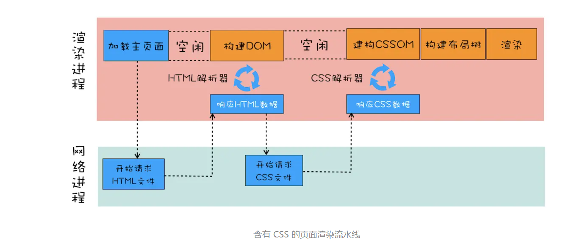
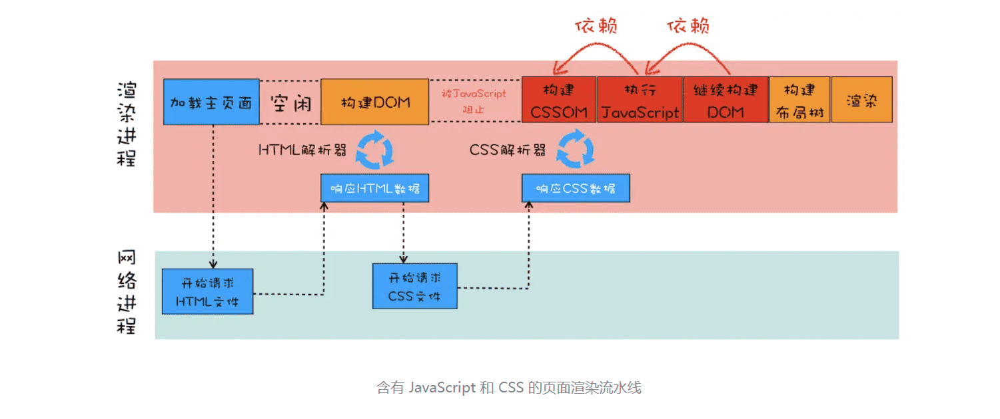
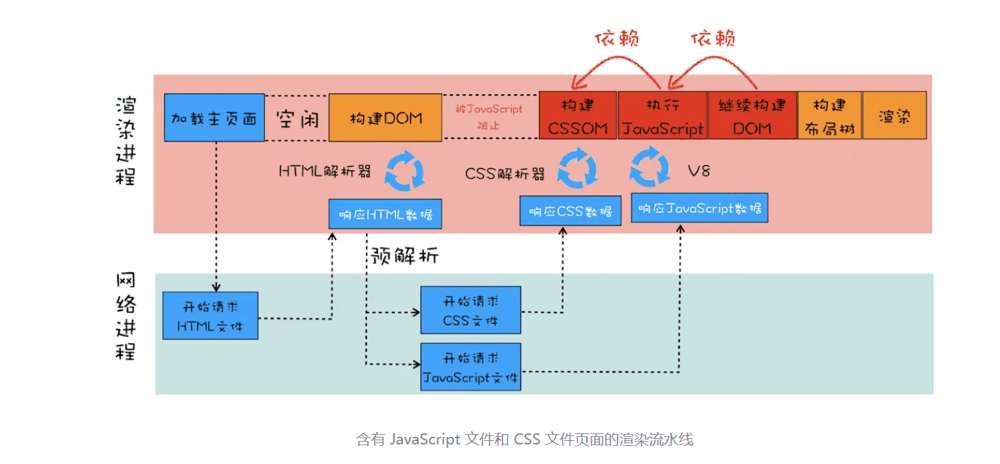

> CSS如何影响首次加载时的白屏时间？

### 1.渲染流水线视角下的 CSS

```css
//theme.css
div{ 
    color : coral;
    background-color:black
}
```

```html
<html>
<head>
    <link href="theme.css" rel="stylesheet">
</head>
<body>
    <div>geekbang com</div>
</body>
</html>
```



首先是发起主页面的请求，这个发起请求方可能是渲染进程，也有可能是浏览器进程，发起的请求被送到网络进程中去执行。网络进程接收到返回的 HTML 数据之后，将其发送给渲染进程，渲染进程会解析 HTML 数据并构建 DOM。**特别注意下，请求 HTML 数据和构建 DOM 中间有一段空闲时间，这个空闲时间有可能成为页面渲染的瓶颈。**

前章提到过，当渲染进程接收 HTML 文件字节流时，会先开启一个**预解析线程**，如果遇到 JavaScript 文件或者 CSS 文件，那么预解析线程会提前下载这些数据。对于上面的代码，预解析线程会解析出来一个外部的 theme.css 文件，并发起 theme.css 的下载。注意一下，就是在 DOM 构建结束之后、theme.css 文件还未下载完成的这段时间内，渲染流水线无事可做，因为下一步是合成布局树，而合成布局树需要 CSSOM 和 DOM，所以这里需要等待 CSS 加载结束并解析成 CSSOM。

**那渲染流水线为什么需要 CSSOM 呢？**

和 HTML 一样，渲染引擎也是无法直接理解 CSS 文件内容的，所以需要将其解析成渲染引擎能够理解的结构，这个结构就是 CSSOM。和 DOM 一样，CSSOM 也具有两个作用，**第一个是提供给 JavaScript 操作样式表的能力，第二个是为布局树的合成提供基础的样式信息。**

> 1-5 渲染流程

```javascript
//theme.css
div{ 
    color : coral;
    background-color:black
}
```

```html
<html>
<head>
    <link href="theme.css" rel="stylesheet">
</head>
<body>
    <div>geekbang com</div>
    <script>
        console.log('time.geekbang.org')
    </script>
    <div>geekbang com</div>
</body>
</html>
```



在解析 DOM 的过程中，如果遇到了 JavaScript 脚本，那么需要先暂停 DOM 解析去执行 JavaScript，因为 JavaScript 有可能会修改当前状态下的 DOM。

不过在执行 JavaScript 脚本之前，如果页面中包含了外部 CSS 文件的引用，或者通过 style 标签内置了 CSS 内容，那么渲染引擎还需要将这些内容转换为 CSSOM，因为 JavaScript 有修改 CSSOM 的能力，所以在执行 JavaScript 之前，还需要依赖 CSSOM。也就是说 CSS 在部分情况下也会阻塞 DOM 的生成。

```javascript
//theme.css
div{ 
    color : coral;
    background-color:black
}
```

```javascript
//foo.js
console.log('time.geekbang.org')
```

```javascript
<html>
<head>
    <link href="theme.css" rel="stylesheet">
</head>
<body>
    <div>geekbang com</div>
    <script src='foo.js'></script>
    <div>geekbang com</div>
</body>
</html>
```



从图中可以看出来，在接收到 HTML 数据之后的预解析过程中，HTML 预解析器识别出来了有 CSS 文件和 JavaScript 文件需要下载，然后就同时发起这两个文件的下载请求，需要注意的是，这两个文件的下载过程是重叠的，所以下载时间按照最久的那个文件来算。

后面的流水线就和前面是一样的了，不管 CSS 文件和 JavaScript 文件谁先到达，都要先等到 CSS 文件下载完成并生成 CSSOM，然后再执行 JavaScript 脚本，最后再继续构建 DOM，构建布局树，绘制页面。

### 2.影响页面展示的因素以及优化策略

为什么要花这么多文字来分析渲染流水线呢？主要原因就是**渲染流水线影响到了首次页面展示的速度，而首次页面展示的速度又直接影响到了用户体验。**

- 第一个阶段，等请求发出去之后，到提交数据阶段，这时页面展示出来的还是之前页面的内容。  1-4导航流程

  > 影响第一个阶段的因素主要是网络或者是服务器处理这块儿

- 第二个阶段，提交数据之后渲染进程会创建一个空白页面，我们通常把这段时间称为解析白屏，并等待 CSS 文件和 JavaScript 文件的加载完成，生成 CSSOM 和 DOM，然后合成布局树，最后还要经过一系列的步骤准备首次渲染。

- 第三个阶段，等首次渲染完成之后，就开始进入完整页面的生成阶段了，然后页面会一点点被绘制出来。

  > 后面讲第三个阶段

重点关注第二个阶段，这个阶段的主要问题是白屏时间，如果白屏时间过久，就会影响到用户体验。为了缩短白屏时间，我们来挨个分析这个阶段的主要任务，包括了解析 HTML、下载 CSS、下载 JavaScript、生成 CSSOM、执行 JavaScript、生成布局树、绘制页面一系列操作。

通常情况下的瓶颈主要体现在**下载 CSS 文件****、下载 JavaScript 文件**和**执行 JavaScript**。

所以要想缩短白屏时长，可以有以下策略：

- 通过内联 JavaScript、内联 CSS 来移除这两种类型的文件下载，这样获取到 HTML 文件之后就可以直接开始渲染流程了。
- 但并不是所有的场合都适合内联，那么还可以尽量减少文件大小，比如通过 webpack 等工具移除一些不必要的注释，并压缩 JavaScript 文件。
- 还可以将一些不需要在解析 HTML 阶段使用的 JavaScript 标记上 async 或者 defer。
- 对于大的 CSS 文件，可以通过媒体查询属性，将其拆分为多个不同用途的 CSS 文件，这样只有在特定的场景下才会加载特定的 CSS 文件。


