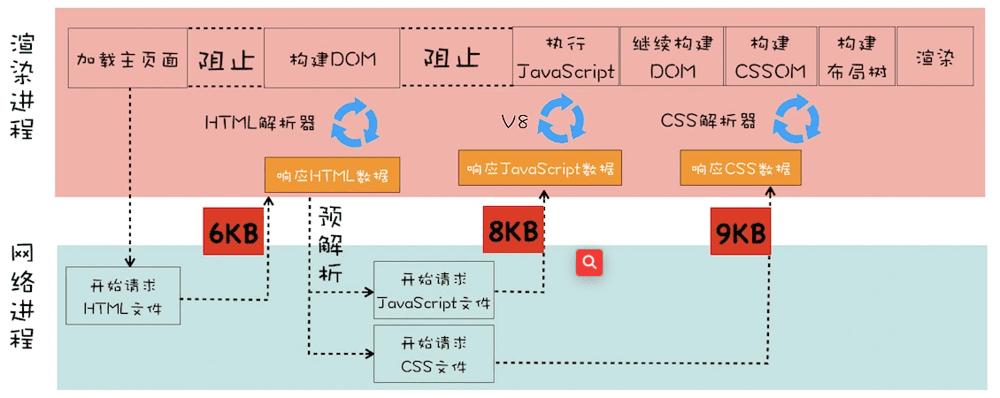
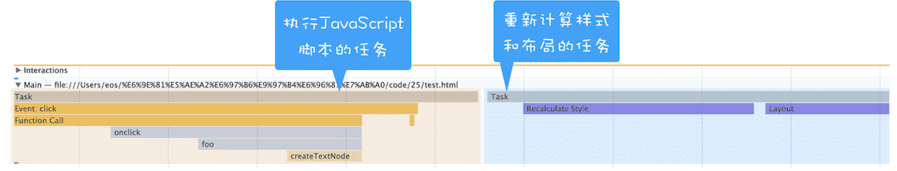
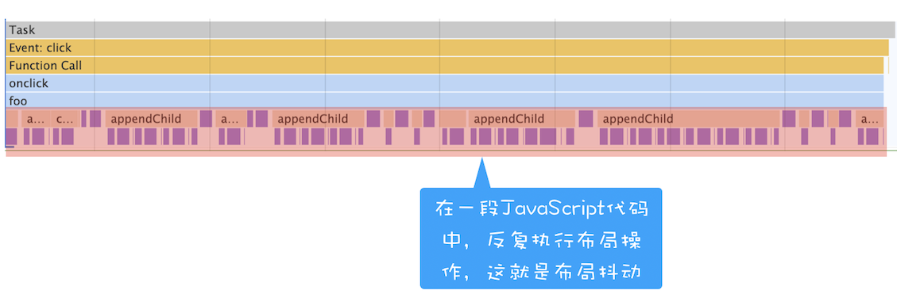

> 如何系统地优化页面？

通常一个页面有三个阶段：**加载阶段**、**交互阶段**和**关闭阶段**。

- 加载阶段，是指从发出请求到渲染出完整页面的过程，影响到这个阶段的主要因素有网络和 JavaScript 脚本。
- 交互阶段，主要是从页面加载完成到用户交互的整合过程，影响到这个阶段的主要因素是 JavaScript 脚本
- 关闭阶段，主要是用户发出关闭指令后页面所做的一些清理操作。

### 1.加载阶段

加载阶段渲染流水线



并非所有的资源都会阻塞页面的首次绘制，比如图片、音频、视频等文件就不会阻塞页面的首次渲染；而 JavaScript、首次请求的 HTML 资源文件、CSS 文件是会阻塞首次渲染的，因为在构建 DOM 的过程中需要 HTML 和 JavaScript 文件，在构造渲染树的过程中需要用到 CSS 文件。

**这些能阻塞网页首次渲染的资源称为关键资源。**基于关键资源，我们可以继续细化出来三个影响页面首次渲染的核心因素。

#### 1.第一个是关键资源个数。

关键资源个数越多，首次页面的加载时间就会越长。

如何减少关键资源的个数？

一种方式是可以将 JavaScript 和 CSS 改成内联的形式，比如上图的 JavaScript 和 CSS，若都改成内联模式，那么关键资源的个数就由 3 个减少到了 1 个。另一种方式，如果 JavaScript 代码没有 DOM 或者 CSSOM 的操作，则可以改成 async 或者 defer 属性；同样对于 CSS，如果不是在构建页面之前加载的，则可以添加媒体取消阻止显现的标志。当 JavaScript 标签加上了 async 或者 defer、CSSlink 属性之前加上了取消阻止显现的标志后，它们就变成了非关键资源了。

#### 2.第二个是关键资源大小。

通常情况下，所有关键资源的内容越小，其整个资源的下载时间也就越短，那么阻塞渲染的时间也就越短。

如何减少关键资源的大小？

可以压缩 CSS 和 JavaScript 资源，移除 HTML、CSS、JavaScript 文件中一些注释内容，也可以通过前面讲的取消 CSS 或者 JavaScript 中关键资源的方式。

#### 3.第三个是请求关键资源需要多少个 RTT（Round Trip Time）。

当使用 TCP 协议传输一个文件时，比如这个文件大小是 0.1M，由于 TCP 的特性，这个数据并不是一次传输到服务端的，而是需要拆分成一个个数据包来回多次进行传输的。**RTT 就是这里的往返时延。它是网络中一个重要的性能指标，表示从发送端发送数据开始，到发送端收到来自接收端的确认，总共经历的时延。**

>  通常 1 个 HTTP 的数据包在 14KB 左右，所以 1 个 0.1M 的页面就需要拆分成 8 个包来传输了，也就是说需要 8 个 RTT。

如何减少关键资源 RTT 的次数？

2.可以通过减少关键资源的个数和减少关键资源的大小搭配来实现。除此之外，还可以使用 CDN 来减少每次 RTT 时长。

**总的优化原则就是减少关键资源个数，降低关键资源大小，降低关键资源的 RTT 次数。**

### 2.交互阶段 

谈交互阶段的优化，其实就是在谈渲染进程渲染帧的速度，因为在交互阶段，帧的渲染速度决定了交互的流畅度。

**一个大的原则就是让单个帧的生成速度变快。**

#### 1.减少 JavaScript 脚本执行时间

有时 JavaScript 函数的一次执行时间可能有几百毫秒，这就严重霸占了主线程执行其他渲染任务的时间。针对这种情况我们可以采用以下两种策略：

- 一种是将一次执行的函数分解为多个任务，使得每次的执行时间不要过久。

  setTimeout 创建宏任务、或 创建微任务 来吧函数分解

- 另一种是采用 Web Workers。你可以把 Web Workers 当作主线程之外的一个线程，在 Web Workers 中是可以执行 JavaScript 脚本的，不过 Web Workers 中没有 DOM、CSSOM 环境，这意味着在 Web Workers 中是无法通过 JavaScript 来访问 DOM 的，所以我们可以把一些和 DOM 操作无关且耗时的任务放到 Web Workers 中去执行。

总之，在交互阶段，对 JavaScript 脚本总的原则就是不要一次霸占太久主线程。

#### 2.避免强制同步布局

通过 DOM 接口执行添加元素或者删除元素等操作后，是需要重新计算样式和布局的，不过正常情况下这些操作都是在另外的任务中异步完成的，这样做是为了避免当前的任务占用太长的主线程时间。

```javascript

<html>
<body>
    <div id="mian_div">
        <li id="time_li">time</li>
        <li>geekbang</li>
    </div>

    <p id="demo">强制布局demo</p>
    <button onclick="foo()">添加新元素</button>

    <script>
        function foo() {
            let main_div = document.getElementById("mian_div")      
            let new_node = document.createElement("li")
            let textnode = document.createTextNode("time.geekbang")
            new_node.appendChild(textnode);
            document.getElementById("mian_div").appendChild(new_node);
        }
    </script>
</body>
</html>
```




执行 JavaScript 添加元素是在一个任务中执行的，重新计算样式布局是在另外一个任务中执行，这就是正常情况下的布局操作。

**所谓强制同步布局，是指 JavaScript 强制将计算样式和布局操作提前到当前的任务中。**

```javascript

function foo() {
    let main_div = document.getElementById("mian_div")
    let new_node = document.createElement("li")
    let textnode = document.createTextNode("time.geekbang")
    new_node.appendChild(textnode);
    document.getElementById("mian_div").appendChild(new_node);
    //由于要获取到offsetHeight，
    //但是此时的offsetHeight还是老的数据，
    //所以需要立即执行布局操作
    console.log(main_div.offsetHeight)
}
```

将新的元素添加到 DOM 之后，我们又调用了main_div.offsetHeight来获取新 main_div 的高度信息。如果要获取到 main_div 的高度，就需要重新布局，所以这里在获取到 main_div 的高度之前，JavaScript 还需要强制让渲染引擎默认执行一次布局操作。我们把这个操作称为**强制同步布局**。

为了避免强制同步布局，我们可以调整策略，在修改 DOM 之前查询相关值。

```javascript
function foo() {
    let main_div = document.getElementById("mian_div")
    //为了避免强制同步布局，在修改DOM之前查询相关值
    console.log(main_div.offsetHeight)
    let new_node = document.createElement("li")
    let textnode = document.createTextNode("time.geekbang")
    new_node.appendChild(textnode);
    document.getElementById("mian_div").appendChild(new_node);
    
}
```

#### 3.避免布局抖动

还有一种比强制同步布局更坏的情况，那就是布局抖动。所谓布局抖动，是指在一次 JavaScript 执行过程中，多次执行强制布局和抖动操作。

```javascript

function foo() {
    let time_li = document.getElementById("time_li")
    for (let i = 0; i < 100; i++) {
        let main_div = document.getElementById("mian_div")
        let new_node = document.createElement("li")
        let textnode = document.createTextNode("time.geekbang")
        new_node.appendChild(textnode);
        new_node.offsetHeight = time_li.offsetHeight;
        document.getElementById("mian_div").appendChild(new_node);
    }
}
```




> 在 foo 函数内部重复执行计算样式和布局，这会大大影响当前函数的执行效率。这种情况的避免方式和强制同步布局一样，都是尽量不要在修改 DOM 结构时再去查询一些相关值。

#### 4.合理利用 CSS 合成动画

尽量用css 合成动画，如果提前知道某个元素执行动画操作，要加上`will-change`

#### 5.避免频繁的垃圾回收

JavaScript 使用了自动垃圾回收机制，如果在一些函数中频繁创建临时对象，那么垃圾回收器也会频繁地去执行垃圾回收策略。这样当垃圾回收操作发生时，就会占用主线程，从而影响到其他任务的执行，严重的话还会让用户产生掉帧、不流畅的感觉。

所以要尽量避免产生那些临时垃圾数据。那该怎么做呢？**可以尽可能优化储存结构，尽可能避免小颗粒对象的产生。**


