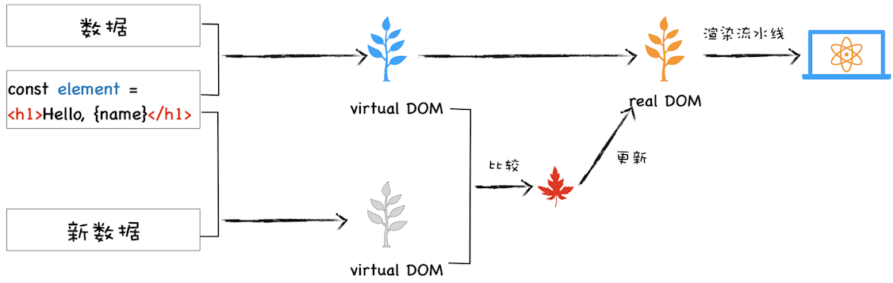

> 虚拟DOM和实际的DOM有何不同？

### 1.DOM的缺陷

比如，我们可以调用document.body.appendChild(node)往 body 节点上添加一个元素，调用该 API 之后会引发一系列的连锁反应。首先渲染引擎会将 node 节点添加到 body 节点之上，然后触发样式计算、布局、绘制、栅格化、合成等任务，我们把这一过程称为**重排**。除了重排之外，还有可能引起**重绘**或者**合成**操作，形象地理解就是“**牵一发而动全身**”。另外，对于 DOM 的不当操作还有可能引发**强制同步布局**和**布局抖动**的问题，这些操作都会大大降低渲染效率。因此，对于 DOM 的操作我们时刻都需要非常小心谨慎。

### 2.什么是虚拟DOM

虚拟DOM要解决的事情：

- 将页面改变的内容应用到虚拟 DOM 上，而不是直接应用到 DOM 上。
- 变化被应用到虚拟 DOM 上时，虚拟 DOM 并不急着去渲染页面，而仅仅是调整虚拟 DOM 的内部状态，这样操作虚拟 DOM 的代价就变得非常轻了。
- 在虚拟 DOM 收集到足够的改变时，再把这些变化一次性应用到真实的 DOM 上。

> 虚拟DOM 也是计算机中 分层设计思维。

React 流程画的一张虚拟 DOM 执行流程图：

- **创建阶段。**首先依据 JSX 和基础数据创建出来虚拟 DOM，它反映了真实的 DOM 树的结构。然后由虚拟 DOM 树创建出真实 DOM 树，真实的 DOM 树生成完后，再触发渲染流水线往屏幕输出页面。
- **更新阶段。**如果数据发生了改变，那么就需要根据新的数据创建一个新的虚拟 DOM 树；然后 React 比较两个树，找出变化的地方，并把变化的地方一次性更新到真实的 DOM 树上；最后渲染引擎更新渲染流水线，并生成新的页面。

最新的虚拟DOM更新机制：**React Fiber**

> 最开始的时候，比较两个虚拟 DOM 的过程是在一个递归函数里执行的，其核心算法是 **reconciliation**。通常情况下，这个比较过程执行得很快，不过当虚拟 DOM 比较复杂的时候，执行比较函数就有可能占据主线程比较久的时间，这样就会导致其他任务的等待，造成页面卡顿。为了解决这个问题，React 团队重写了 reconciliation 算法，新的算法称为 **Fiber reconciler**，之前老的算法称为 **Stack reconciler**。
>
> 其实协程的另外一个称呼就是 Fiber，所以在这里我们可以把 Fiber 和协程关联起来，那么所谓的 Fiber reconciler 相信你也很清楚了，就是在执行算法的过程中出让主线程，这样就解决了 Stack reconciler 函数占用时间过久的问题。至于具体的实现过程在这里我就不详细分析了，如果感兴趣的话，你可以自行查阅相关资料进行学习。

了解完虚拟 DOM 的大致执行流程，你应该也就知道为何需要虚拟 DOM 了。不过以上都从单纯的技术视角来分析虚拟 DOM 的，那接下来我们再从双缓存和 MVC 模型这两个视角来聊聊虚拟 DOM。

### 3.双缓存

在开发游戏或者处理其他图像的过程中，屏幕从前缓冲区读取数据然后显示。但是很多图形操作都很复杂且需要大量的运算，比如一幅完整的画面，可能需要计算多次才能完成，如果每次计算完一部分图像，就将其写入缓冲区，那么就会造成一个后果，那就是在显示一个稍微复杂点的图像的过程中，你看到的页面效果可能是一部分一部分地显示出来，因此在刷新页面的过程中，会让用户感受到界面的闪烁。

而使用双缓存，可以让你先将计算的中间结果存放在另一个缓冲区中，等全部的计算结束，该缓冲区已经存储了完整的图形之后，再将该缓冲区的图形数据一次性复制到显示缓冲区，这样就使得整个图像的输出非常稳定。

在这里，**你可以把虚拟 DOM 看成是 DOM 的一个 buffer，和图形显示一样，它会在完成一次完整的操作之后，再把结果应用到 DOM 上，这样就能减少一些不必要的更新，同时还能保证 DOM 的稳定输出。**

### 4.MVC模式

MVC 的整体结构比较简单，由模型、视图和控制器组成，其MVC 的整体结构比较简单，由模型、视图和控制器组成，其核心思想就是将数据和视图分离。

基于 MVC 又能衍生出很多其他的模式，如 MVP、MVVM 等，不过万变不离其宗，它们的基础骨架都是基于 MVC 而来。

**基于 React 和 Redux 构建 MVC 模型**

可以把虚拟 DOM 看成是 MVC 的视图部分，其控制器和模型都是由 Redux 提供的。其具体实现过程如下：

- 图中的控制器是用来监控 DOM 的变化，一旦 DOM 发生变化，控制器便会通知模型，让其更新数据；
- 模型数据更新好之后，控制器会通知视图，告诉它模型的数据发生了变化；
- 视图接收到更新消息之后，会根据模型所提供的数据来生成新的虚拟 DOM；
- 比较出变化的节点之后，React 将变化的虚拟节点应用到 DOM 上，这样就会触发 DOM 节点的更新；
- DOM 节点的变化又会触发后续一系列渲染流水线的变化，从而实现页面的更新。

**在实际工程项目中，你需要学会分析出这各个模块，并梳理出它们之间的通信关系，这样对于任何框架你都能轻松上手了。**

> 其实虚拟 DOM 主要是一个抽象层，用以描述视图，抽象视图变化，诞生主要目的是跨平台。所以才有 React Native，weex。解决 js 操作 dom 性能问题只是附带的，而且虚拟 DOM 是有代价的，在页面结构简单操作也简单的情况下相对 js 操作 DOM 并不一定会有优势。

