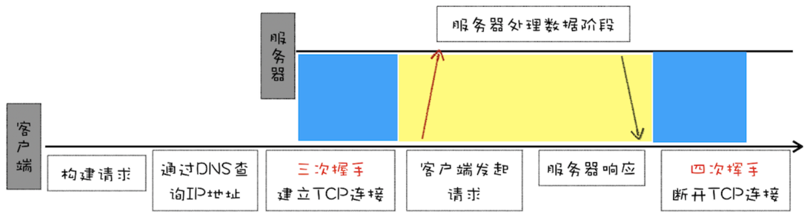

> HTTP性能优化

### 1.超文本传输协议 HTTP/0.9

HTTP/0.9 的一个完整的请求流程

- 因为 HTTP 都是基于 TCP 协议的，所以客户端先要根据 IP 地址、端口和服务器建立 TCP 连接，而建立连接的过程就是 TCP 协议三次握手的过程。
- 建立好连接之后，会发送一个 GET 请求行的信息，如GET /index.html用来获取 index.html。
- 服务器接收请求信息之后，读取对应的 HTML 文件，并将数据以 ASCII 字符流返回给客户端。
- HTML 文档传输完成后，断开连接。



总的来说，当时的需求很简单，就是用来传输体积很小的 HTML 文件，所以 HTTP/0.9 的实现有以下三个特点。

- 第一个是只有一个请求行，并没有 HTTP 请求头和请求体，因为只需要一个请求行就可以完整表达客户端的需求了。
- 第二个是服务器也没有返回头信息，这是因为服务器端并不需要告诉客户端太多信息，只需要返回数据就可以了。
- 第三个是返回的文件内容是以 ASCII 字符流来传输的，因为都是 HTML 格式的文件，所以使用 ASCII 字节码来传输是最合适的。

### 2.被浏览器推动的 HTTP/1.0

首先在浏览器中展示的不单是 HTML 文件了，还包括了 JavaScript、CSS、图片、音频、视频等不同类型的文件。因此**支持多种类型的文件下载是 HTTP/1.0 的一个核心诉求**，而且文件格式不仅仅局限于 ASCII 编码，还有很多其他类型编码的文件。

#### 1.那么该如何实现多种类型文件的下载呢？

要支持多种类型的文件，需要解决以下几个问题。

- 首先，浏览器需要知道服务器返回的数据是什么类型的，然后浏览器才能根据不同的数据类型做针对性的处理。
- 其次，由于万维网所支持的应用变得越来越广，所以单个文件的数据量也变得越来越大。为了减轻传输性能，服务器会对数据进行压缩后再传输，所以浏览器需要知道服务器压缩的方法。
- 再次，由于万维网是支持全球范围的，所以需要提供国际化的支持，服务器需要对不同的地区提供不同的语言版本，这就需要浏览器告诉服务器它想要什么语言版本的页面。
- 最后，由于增加了各种不同类型的文件，而每种文件的编码形式又可能不一样，为了能够准确地读取文件，浏览器需要知道文件的编码类型。

```http
accept: text/html
accept-encoding: gzip, deflate, br
accept-Charset: ISO-8859-1,utf-8
accept-language: zh-CN,zh
```

HTTP/1.0 除了对多文件提供良好的支持外，还依据当时实际的需求引入了很多其他的特性，这些特性都是通过请求头和响应头来实现的。下面我们来看看新增的几个典型的特性：

- 有的请求服务器可能无法处理，或者处理出错，这时候就需要告诉浏览器服务器最终处理该请求的情况，这就引入了状态码。状态码是通过响应行的方式来通知浏览器的。
- 为了减轻服务器的压力，在 HTTP/1.0 中提供了 Cache 机制，用来缓存已经下载过的数据。
- 服务器需要统计客户端的基础信息，比如 Windows 和 macOS 的用户数量分别是多少，所以 HTTP/1.0 的请求头中还加入了用户代理的字段。

### 3.缝缝补补的 HTTP/1.1

#### 1.改进持久连接

在当时，由于通信的文件比较小，而且每个页面的引用也不多，所以这种传输形式没什么大问题。但是随着浏览器普及，单个页面中的图片文件越来越多，有时候一个页面可能包含了几百个外部引用的资源文件，如果在下载每个文件的时候，都需要经历建立 TCP 连接、传输数据和断开连接这样的步骤，无疑会增加大量无谓的开销。

为了解决这个问题，**HTTP/1.1 中增加了持久连接的方法，它的特点是在一个 TCP 连接上可以传输多个 HTTP 请求，只要浏览器或者服务器没有明确断开连接，那么该 TCP 连接会一直保持。**

HTTP 的持久连接可以有效减少 TCP 建立连接和断开连接的次数，这样的好处是减少了服务器额外的负担，并提升整体 HTTP 的请求时长。

持久连接在 HTTP/1.1 中是默认开启的，所以你不需要专门为了持久连接去 HTTP 请求头设置信息，如果你不想要采用持久连接，可以在 HTTP 请求头中加上Connection: close。**目前浏览器中对于同一个域名，默认允许同时建立 6 个 TCP 持久连接。**

#### 2.不成熟的 HTTP 管线化

持久连接虽然能减少 TCP 的建立和断开次数，但是它需要等待前面的请求返回之后，才能进行下一次请求。如果 TCP 通道中的某个请求因为某些原因没有及时返回，那么就会阻塞后面的所有请求，这就是著名的**队头阻塞**的问题。

HTTP/1.1 中试图通过**管线化的技术**来解决队头阻塞的问题。HTTP/1.1 中的管线化是指将多个 HTTP 请求整批提交给服务器的技术，虽然可以整批发送请求，不过服务器依然需要根据请求顺序来回复浏览器的请求。

FireFox、Chrome 都做过管线化的试验，但是由于各种原因，它们最终都放弃了管线化技术。

#### 3.提供虚拟主机的支持

在 HTTP/1.0 中，每个域名绑定了一个唯一的 IP 地址，因此一个服务器只能支持一个域名。但是随着虚拟主机技术的发展，需要实现在一台物理主机上绑定多个虚拟主机，每个虚拟主机都有自己的单独的域名，这些单独的域名都公用同一个 IP 地址。

#### 4.对动态生成的内容提供了完美支持

在设计 HTTP/1.0 时，需要在响应头中设置完整的数据大小，如**Content-Length: 901**，这样浏览器就可以根据设置的数据大小来接收数据。不过随着服务器端的技术发展，很多页面的内容都是动态生成的，因此在传输数据之前并不知道最终的数据大小，这就导致了浏览器不知道何时会接收完所有的文件数据。

HTTP/1.1 通过引入 **Chunk transfer 机制**来解决这个问题，服务器会将数据分割成若干个任意大小的数据块，每个数据块发送时会附上上个数据块的长度，最后使用一个零长度的块作为发送数据完成的标志。这样就提供了对动态内容的支持。5. 客户端 Cookie、安全机制

#### 5.客户端 Cookie、安全机制

除此之外，HTTP/1.1 还引入了客户端 Cookie 机制和安全机制。

> 你认为 HTTP/1.1 还有哪些不足？
>
> 1.对头阻塞问题


