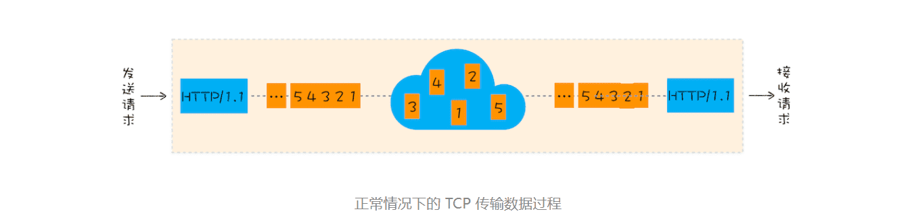
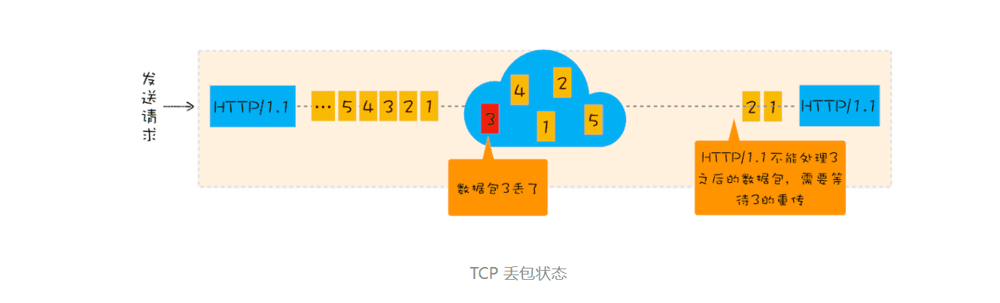
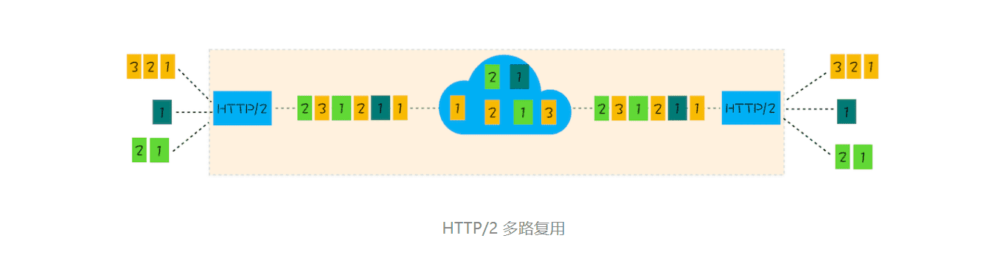

> 甩掉TCP、TLS的包袱，构建高效网络

### 1.TCP 的队头阻塞

**在 TCP 传输过程中，由于单个数据包的丢失而造成的阻塞称为 TCP 上的队头阻塞。**

通过该图，我们知道在 HTTP/2 中，多个请求是跑在一个 TCP 管道中的，如果其中任意一路数据流中出现了丢包的情况，那么就会阻塞该 TCP 连接中的所有请求。这不同于 HTTP/1.1，使用 HTTP/1.1 时，浏览器为每个域名开启了 6 个 TCP 连接，如果其中的 1 个 TCP 连接发生了队头阻塞，那么其他的 5 个连接依然可以继续传输数据。

所以随着丢包率的增加，HTTP/2 的传输效率也会越来越差。有测试数据表明，当系统达到了 2% 的丢包率时，HTTP/1.1 的传输效率反而比 HTTP/2 表现得更好。

### 2.TCP 建立连接的延时

除了 TCP 队头阻塞之外，TCP 的握手过程也是影响传输效率的一个重要因素。

为了搞清楚 TCP 协议建立连接的延迟问题，我们还是先来回顾下网络延迟的概念，这会有助于你对后面内容的理解。**网络延迟又称为 RTT（Round Trip Time）**。我们把从浏览器发送一个数据包到服务器，再从服务器返回数据包到浏览器的整个往返时间称为 RTT（如下图）。RTT 是反映网络性能的一个重要指标。

