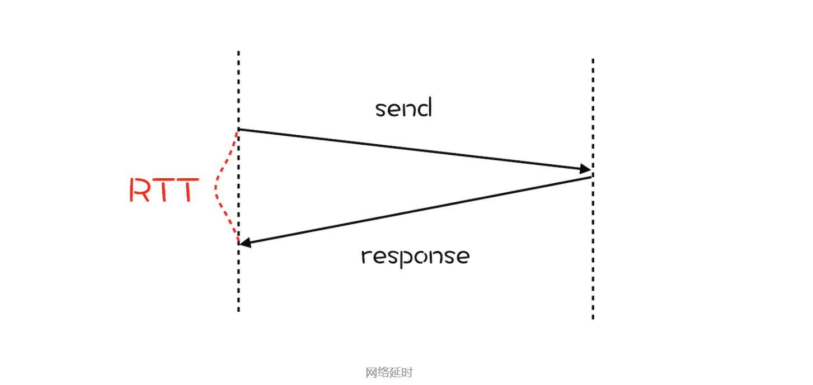
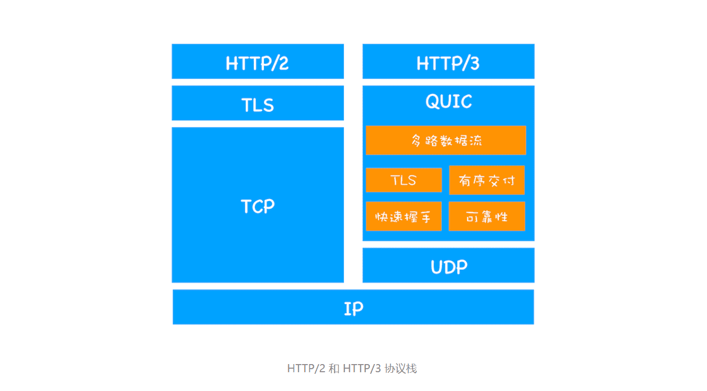
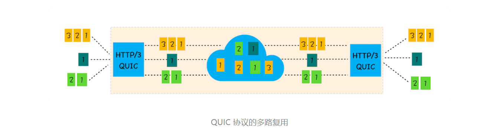

> 甩掉TCP、TLS的包袱，构建高效网络

### 1.TCP 的队头阻塞

**在 TCP 传输过程中，由于单个数据包的丢失而造成的阻塞称为 TCP 上的队头阻塞。**

通过该图，我们知道在 HTTP/2 中，多个请求是跑在一个 TCP 管道中的，如果其中任意一路数据流中出现了丢包的情况，那么就会阻塞该 TCP 连接中的所有请求。这不同于 HTTP/1.1，使用 HTTP/1.1 时，浏览器为每个域名开启了 6 个 TCP 连接，如果其中的 1 个 TCP 连接发生了队头阻塞，那么其他的 5 个连接依然可以继续传输数据。

所以随着丢包率的增加，HTTP/2 的传输效率也会越来越差。有测试数据表明，当系统达到了 2% 的丢包率时，HTTP/1.1 的传输效率反而比 HTTP/2 表现得更好。

### 2.TCP 建立连接的延时

除了 TCP 队头阻塞之外，TCP 的握手过程也是影响传输效率的一个重要因素。

为了搞清楚 TCP 协议建立连接的延迟问题，我们还是先来回顾下网络延迟的概念，这会有助于你对后面内容的理解。**网络延迟又称为 RTT（Round Trip Time）**。我们把从浏览器发送一个数据包到服务器，再从服务器返回数据包到浏览器的整个往返时间称为 RTT（如下图）。RTT 是反映网络性能的一个重要指标。

> TTFB

那建立 TCP 连接时，需要花费多少个 RTT 呢？

HTTP/1 和 HTTP/2 都是使用 TCP 协议来传输的，而如果使用 HTTPS 的话，还需要使用 TLS 协议进行安全传输，而使用 TLS 也需要一个握手过程，这样就需要有两个握手延迟过程。

1.在建立 TCP 连接的时候，需要和服务器进行三次握手来确认连接成功，也就是说需要在消耗完 1.5 个 RTT 之后才能进行数据传输。

2.进行 TLS 连接，TLS 有两个版本——TLS1.2 和 TLS1.3，每个版本建立连接所花的时间不同，大致是需要 1～2 个 RTT

总之，在传输数据之前，我们需要花掉 3～4 个 RTT。

如果浏览器和服务器的物理距离较近，那么 1 个 RTT 的时间可能在 10 毫秒以内，也就是说总共要消耗掉 30～40 毫秒。这个时间也许用户还可以接受，但如果服务器相隔较远，那么 1 个 RTT 就可能需要 100 毫秒以上了，这种情况下整个握手过程需要 300～400 毫秒，这时用户就能明显地感受到“慢”了。

### 3.TCP 协议僵化

TCP 协议存在队头阻塞和建立连接延迟等缺点，那是不是可以通过改进 TCP 协议来解决这些问题呢？

答案是：**非常困难**。之所以这样，主要有两个原因。

一个是**中间设备的僵化**。要搞清楚什么是中间设备僵化，我们先要弄明白什么是中间设备。我们知道互联网是由多个网络互联的网状结构，为了能够保障互联网的正常工作，我们需要在互联网的各处搭建各种设备，这些设备就被称为中间设备。

> 这些中间设备有很多种类型，并且每种设备都有自己的目的，这些设备包括了路由器、防火墙、NAT、交换机等。它们通常依赖一些很少升级的软件，这些软件使用了大量的 TCP 特性，这些功能被设置之后就很少更新了。
>
> 所以，如果我们在客户端升级了 TCP 协议，但是当新协议的数据包经过这些中间设备时，它们可能不理解包的内容，于是这些数据就会被丢弃掉。这就是中间设备僵化，它是阻碍 TCP 更新的一大障碍。

除了中间设备僵化外，**操作系统也是导致 TCP 协议僵化的另外一个原因**。因为 TCP 协议都是通过操作系统内核来实现的，应用程序只能使用不能修改。通常操作系统的更新都滞后于软件的更新，因此要想自由地更新内核中的 TCP 协议也是非常困难的。

### 4.QUIC 协议

> HTTP/2 存在一些比较严重的与 TCP 协议相关的缺陷，但由于 TCP 协议僵化，我们几乎不可能通过修改 TCP 协议自身来解决这些问题，那么解决问题的思路是绕过 TCP 协议，发明一个 TCP 和 UDP 之外的新的传输协议。但是这也面临着和修改 TCP 一样的挑战，因为中间设备的僵化，这些设备只认 TCP 和 UDP，如果采用了新的协议，新协议在这些设备同样不被很好地支持。

因此，HTTP/3 选择了一个折衷的方法——UDP 协议，基于 UDP 实现了类似于 TCP 的多路数据流、传输可靠性等功能，我们把这套功能称为 QUIC 协议。关于 HTTP/2 和 HTTP/3 协议栈的比较，你可以参考下图：

HTTP/3 中的 QUIC 协议集合了以下几点功能:

- **实现了类似 TCP 的流量控制、传输可靠性的功能。**虽然 UDP 不提供可靠性的传输，但 QUIC 在 UDP 的基础之上增加了一层来保证数据可靠性传输。它提供了数据包重传、拥塞控制以及其他一些 TCP 中存在的特性。
- **集成了 TLS 加密功能。**目前 QUIC 使用的是 TLS1.3，相较于早期版本 TLS1.3 有更多的优点，其中最重要的一点是减少了握手所花费的 RTT 个数。
- **实现了 HTTP/2 中的多路复用功能。**和 TCP 不同，QUIC 实现了在同一物理连接上可以有多个独立的逻辑数据流（如下图）。实现了数据流的单独传输，就解决了 TCP 中队头阻塞的问题。

- **实现了快速握手功能。**由于 QUIC 是基于 UDP 的，所以 QUIC 可以实现使用 0-RTT 或者 1-RTT 来建立连接，这意味着 QUIC 可以用最快的速度来发送和接收数据，这样可以大大提升首次打开页面的速度。

### 5.HTTP/3 的挑战

在技术层面，HTTP/3 是个完美的协议。不过要将 HTTP/3 应用到实际环境中依然面临着诸多严峻的挑战，这些挑战主要来自于以下三个方面。

第一，从目前的情况来看，服务器和浏览器端都没有对 HTTP/3 提供比较完整的支持。Chrome 虽然在数年前就开始支持 Google 版本的 QUIC，但是这个版本的 QUIC 和官方的 QUIC 存在着非常大的差异。

第二，部署 HTTP/3 也存在着非常大的问题。因为系统内核对 UDP 的优化远远没有达到 TCP 的优化程度，这也是阻碍 QUIC 的一个重要原因。

第三，中间设备僵化的问题。这些设备对 UDP 的优化程度远远低于 TCP，据统计使用 QUIC 协议时，大约有 3%～7% 的丢包率。

