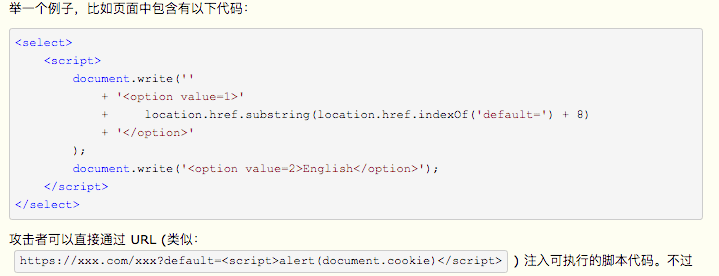

#### 1.XSS Cross Site Scripting 跨站脚本

XSS 攻击是指黑客往HTML文件中或DOM 中注入恶意脚本，从而在用户浏览页面利用注入的恶意脚本对用户实施攻击的一种手段。

- 可以窃取 Cookie 信息。恶意 JavaScript 可以通过“document.cookie”获取 Cookie 信息，然后通过 XMLHttpRequest 或者 Fetch 加上 CORS 功能将数据发送给恶意服务器；恶意服务器拿到用户的 Cookie 信息之后，就可以在其他电脑上模拟用户的登录，然后进行转账等操作。

- 可以监听用户行为。恶意 JavaScript 可以使用“addEventListener”接口来监听键盘事件，比如可以获取用户输入的信用卡等信息，将其发送到恶意服务器。黑客掌握了这些信息之后，又可以做很多违法的事情。

- 可以通过修改 DOM 伪造假的登录窗口，用来欺骗用户输入用户名和密码等信息。

- 还可以在页面内生成浮窗广告，这些广告会严重地影响用户体验。

  除了以上几种情况外，恶意脚本还能做很多其他事情。

> 最开始的时候，这种攻击是通过跨域来实现的，所以叫“跨域脚本”。但是发展到现在，往 HTML 文件中注入恶意代码的方式越来越多了，所以是否跨域注入脚本已经不是唯一的注入手段了，但是 XSS 这个名字却一直保留至今。

#### 2.XSS 分类

主要有**存储型XSSS攻击**、**反射型XSS攻击**和**基于DOM的XSS攻击** 三种方式来注入恶意脚本

1. 存储型XSS攻击

   攻击步骤

   - 首先黑客利用站点漏洞将一段恶意 JavaScript 代码提交到网站的数据库中；
   - 然后用户向网站请求包含了恶意 JavaScript 脚本的页面；
   - 当用户浏览该页面的时候，恶意脚本就会将用户的 Cookie 信息等数据上传到服务器

   攻击成功需要同时满足以下几个条件：

   - POST 请求提交表单后端没做转义直接入库。
   - 后端从数据库中取出数据没做转义直接输出给前端。
   - 前端拿到后端数据没做转义直接渲染成 DOM。

   

2. 反射型XSS攻击

   ，一般是通过给别人发送**带有恶意脚本代码参数的 URL**，当 URL 地址被打开时，特有的恶意代码参数被 HTML 解析、执行。

   > 在一个反射型 XSS 攻击过程中，恶意 JavaScript 脚本属于用户发送给网站请求中的一部分，随后网站又把恶意 JavaScript 脚本返回给用户。当恶意 JavaScript 脚本在用户页面中被执行时，黑客就可以利用该脚本做一些恶意操作。

   举例：

   

   为了防止出现非持久型 XSS 漏洞，需要确保这么几件事情：

   - Web 页面渲染的所有内容或者渲染的数据都必须来自于服务端。
   - 尽量不要从 `URL`，`document.referrer`，`document.forms` 等这种 DOM API 中获取数据直接渲染。
   - 尽量不要使用 `eval`, `new Function()`，`document.write()`，`document.writeln()`，`window.setInterval()`，`window.setTimeout()`，`innerHTML`，`document.createElement()` 等可执行字符串的方法。
   - 如果做不到以上几点，也必须对涉及 DOM 渲染的方法传入的字符串参数做 escape 转义。
   - 前端渲染的时候对任何的字段都需要做 escape 转义编码。

3. 基于DOM的XSS攻击

   基于 DOM 的 XSS 攻击是不牵涉到页面 Web 服务器的。具体来讲，黑客通过各种手段将恶意脚本注入用户的页面中，比如通过网络劫持在页面传输过程中修改 HTML 页面的内容，这种劫持类型很多，有通过 WiFi 路由器劫持的，有通过本地恶意软件来劫持的，它们的共同点是在 Web 资源传输过程或者在用户使用页面的过程中修改 Web 页面的数据

#### 3.阻止XSS 攻击

1. 服务器对输入脚本进行过滤或转码

2. 充分利用好CSP 

   CSP 本质上就是建立白名单，开发者明确告诉浏览器哪些外部资源可以加载和执行。

3. 使用 HttpOnly 来保护重要的 Cookie 信息。