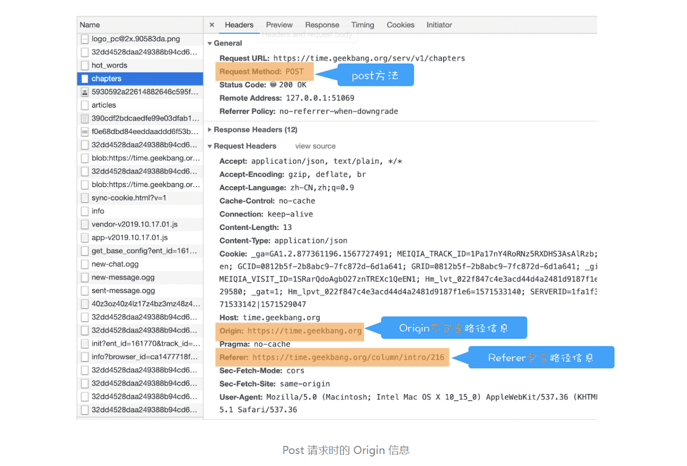

> 陌生链接不要随便点

#### 1.什么是CSRF攻击

CSRF 英文全称是 Cross-site request forgery，所以又称为“跨站请求伪造”，是指黑客引诱用户打开黑客的网站，在黑客的网站中，利用用户的登录状态发起的跨站请求。简单来讲，**CSRF 攻击就是黑客利用了用户的登录状态，并通过第三方的站点来做一些坏事。**

>和 XSS 不同的是，CSRF 攻击不需要将恶意代码注入用户的页面，仅仅是利用服务器的漏洞和用户的登录状态来实施攻击。

> 以极客时间官网为例子，来分析这三种攻击方式都是怎么实施的。这里假设极客时间具有转账功能，可以通过 POST 或 Get 来实现转账，转账接口如下所示：
>
> ```C++
> 
> #同时支持POST和Get
> #接口 
> https://time.geekbang.org/sendcoin
> #参数
> ##目标用户
> user
> ##目标金额
> number
> ```
>
> 有了上面的转账接口，我们就可以来模拟 CSRF 攻击了。
>
> **1.自动发起 Get 请求**
>
> ```html
> 
> <!DOCTYPE html>
> <html>
>   <body>
>     <h1>黑客的站点：CSRF攻击演示</h1>
>     
>   </body>
> </html>
> ```
>
> 这是黑客页面的 HTML 代码，在这段代码中，黑客将转账的请求接口隐藏在 img 标签内，欺骗浏览器这是一张图片资源。当该页面被加载时，浏览器会自动发起 img 的资源请求，如果服务器没有对该请求做判断的话，那么服务器就会认为该请求是一个转账请求，于是用户账户上的 100 极客币就被转移到黑客的账户上去了。
>
> **2.自动发起 POST 请求**
>
> 除了自动发送 Get 请求之外，有些服务器的接口是使用 POST 方法的，所以黑客还需要在他的站点上伪造 POST 请求，当用户打开黑客的站点时，是自动提交 POST 请求，具体的方式你可以参考下面示例代码：
>
> ```html
> 
> <!DOCTYPE html>
> <html>
> <body>
>   <h1>黑客的站点：CSRF攻击演示</h1>
>   <form id='hacker-form' action="https://time.geekbang.org/sendcoin" method=POST>
>     <input type="hidden" name="user" value="hacker" />
>     <input type="hidden" name="number" value="100" />
>   </form>
>   <script> document.getElementById('hacker-form').submit(); </script>
> </body>
> </html>
> ```
>
> 在这段代码中，我们可以看到黑客在他的页面中构建了一个隐藏的表单，该表单的内容就是极客时间的转账接口。当用户打开该站点之后，这个表单会被自动执行提交；当表单被提交之后，服务器就会执行转账操作。因此使用构建自动提交表单这种方式，就可以自动实现跨站点 POST 数据提交。
>
> **3.引诱用户点击链接**
>
> 除了自动发起 Get 和 Post 请求之外，还有一种方式是诱惑用户点击黑客站点上的链接，这种方式通常出现在论坛或者恶意邮件上。黑客会采用很多方式去诱惑用户点击链接，示例代码如下所示：
>
> ```html
> 
> <div>
>    </img> </div> <div>
>   <a href="https://time.geekbang.org/sendcoin?user=hacker&number=100" taget="_blank">
>     点击下载美女照片
>   </a>
> </div>
> ```
>
> 这段黑客站点代码，页面上放了一张美女图片，下面放了图片下载地址，而这个下载地址实际上是黑客用来转账的接口，一旦用户点击了这个链接，那么他的极客币就被转到黑客账户上了。
>
> 以上三种就是黑客经常采用的攻击方式。如果当用户登录了极客时间，以上三种 CSRF 攻击方式中的任何一种发生时，那么服务器都会将一定金额的极客币发送到黑客账户。
>
> **和 XSS 不同的是，CSRF 攻击不需要将恶意代码注入用户的页面，仅仅是利用服务器的漏洞和用户的登录状态来实施攻击。**


#### 2.完成 CSRF 攻击必须要有三个条件：

- 目标站点一定要有 CSRF 漏洞；
- 用户要登录过目标站点，并且在浏览器上保持有该站点的登录状态；
- 需要用户打开一个第三方站点，可以是黑客的站点，也可以是一些论坛；

#### 3.如何防御

1. **SameSite**

   值有Strict、Lax、None

   可以对 Cookie 设置 SameSite 属性。该属性表示 Cookie 不随着跨域请求发送，可以很大程度减少 CSRF 的攻击，但是该属性目前并不是所有浏览器都兼容。

   > Strict 最为严格。如果 SameSite 的值是 Strict，那么浏览器会完全禁止第三方 Cookie。简言之，如果你从极客时间的页面中访问 InfoQ 的资源，而 InfoQ 的某些 Cookie 设置了 SameSite = Strict 的话，那么这些 Cookie 是不会被发送到 InfoQ 的服务器上的。只有你从 InfoQ 的站点去请求 InfoQ 的资源时，才会带上这些 Cookie。
   >
   > Lax 相对宽松一点。在跨站点的情况下，从第三方站点的链接打开和从第三方站点提交 Get 方式的表单这两种方式都会携带 Cookie。但如果在第三方站点中使用 Post 方法，或者通过 img、iframe 等标签加载的 URL，这些场景都不会携带 Cookie。
   >
   > 而如果使用 None 的话，在任何情况下都会发送 Cookie 数据。

2. 验证请求的来源站点

   因为CSRF 攻击大多来自第三方站点，因此服务器可以禁止来自第三方站点的请求。通过HTTP请求头中的Referer和Origin属性。

   Referer 是 HTTP 请求头中的一个字段，记录了该 HTTP 请求的来源地址

   虽然可以通过 Referer 告诉服务器 HTTP 请求的来源，但是有一些场景是不适合将来源 URL 暴露给服务器的，因此浏览器提供给开发者一个选项，可以不用上传 Referer 值，具体可参考 Referrer Policy。

   但在服务器端验证请求头中的 Referer 并不是太可靠，因此标准委员会又制定了 Origin 属性，在一些重要的场合，比如通过 XMLHttpRequest、Fecth 发起跨站请求或者通过 Post 方法发送请求时，都会带上 Origin 属性

   Origing 属性包含了域名信息，并没包含具体的URL路径，这是Origin和Referer的一个主要区别

   > Origin 的值之所以不包含详细路径信息，是有些站点因为安全考虑，不想把源站点的详细路径暴露给服务器。

   

3. CSRF Token

   第一步：在浏览器向服务器发起请求时，服务器生成一个 CSRF Token。CSRF Token 其实就是服务器生成的字符串，然后将该字符串植入到返回的页面中。

   第二部：在浏览器端如果要发起转账的请求，那么需要带上页面中的 CSRF Token，然后服务器会验证该 Token 是否合法。如果是从第三方站点发出的请求，那么将无法获取到 CSRF Token 的值，所以即使发出了请求，服务器也会因为 CSRF Token 不正确而拒绝请求。

4. 验证码

#### 4.问答

1. 第三方网站是如何拿到cookie的 2.同源策略为什么不能阻止CSRF。
   同源策略并没有完全限制网站不能使用非同源的资源，比如引用第三方script文件，引用第三方CSS文件等，同样的，也没有限制一些跨域写操作，比如表单提交。因此，光靠同源策略不能阻止CSRF。明白了可以在第三方站点成功发送跨域请求这一点之后，浏览器会自动带上请求的那个站点的cookie。

