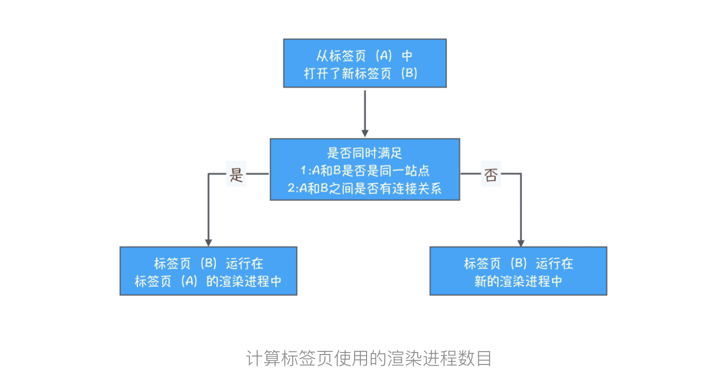
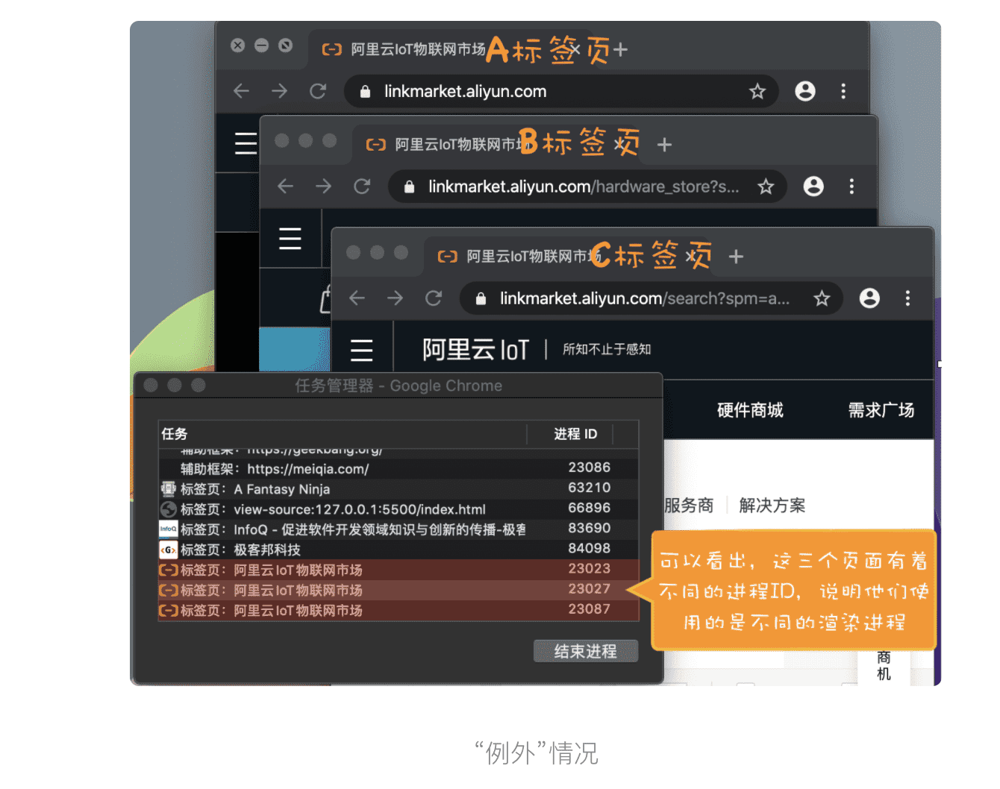
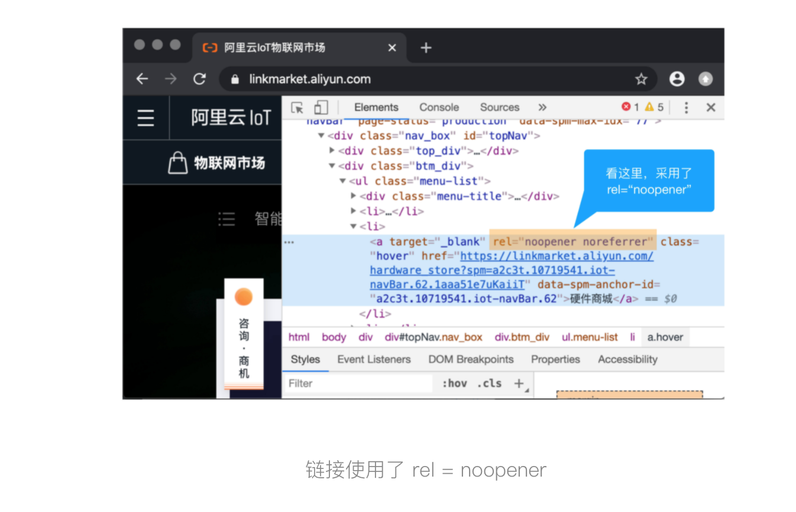
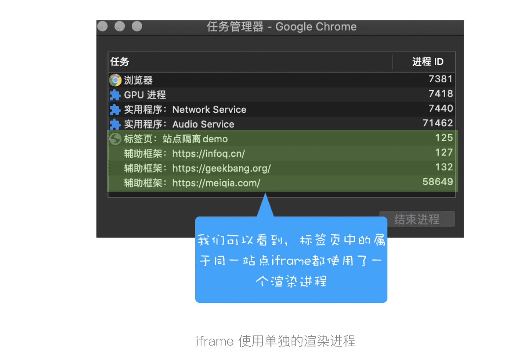
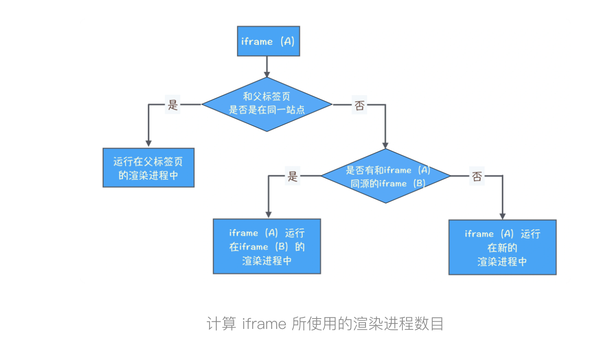

> 如何计算Chrome中渲染进程的个数？
>
> 从Chrome 浏览器中的任务管理器中可以看到Chrome 都启动了那些进程
>
> 既然都是同一站点，为什么从 A 标签页中打开 B 标签页，就会使用同一个渲染进程，而分别打开这两个标签页，又会分别使用不同的渲染进程？
>
> 具体地讲，如果我从极客邦 (www.geekbang.org) 的标签页中打开新的极客时间 (time.geekbang.org) 标签页，由于这两个标签页属于同一站点 (相同协议、相同根域名)，所以他们会共用同一个渲染进程。

### 1.标签页之间的链接

**浏览器标签页之间是可以通过**JavaScript脚本来链接的，有以下几种情况：

#### 1.通过`<a>`标签和新标签建立链接

```html
<a  href="https://time.geekbang.org/" target="_blank" class="">极客时间</a>
```

#### 2.通过 JavaScript 中的 window.open 方法来和新标签页建立连接

```javascript
new_window = window.open("http://time.geekbang.org")
```

其实通过上述两种方式打开的新标签页，不论这两个标签页是否属于同一站点，他们之间都能通过 opener 来建立连接，所以他们之间是有联系的。在 WhatWG 规范中，把这一类具有相互连接关系的标签页称为**浏览上下文组 ( browsing context group)。**

既然提到浏览上下文组，就有必要提下浏览上下文，通常情况下，我们把一个标签页所包含的内容，诸如 window 对象，历史记录，滚动条位置等信息称为浏览上下文。这些通过脚本相互连接起来的浏览上下文就是浏览上下文组。如果你有兴趣，可以参开下[规范文档。](https://html.spec.whatwg.org/multipage/browsers.html#groupings-of-browsing-contexts)

也就是说，如果在极客邦的标签页中，通过链接打开了多个新的标签页，不管这几个新的标签页是否是同一站点，他们都和极客邦的标签页构成了浏览上下文组，因为这些标签页中的 opener 都指向了极客邦标签页。

**Chrome 浏览器会将浏览上下文组中属于同一站点的标签分配到同一个渲染进程中，**这是因为如果一组标签页，**既在同一个浏览上下文组中，又属于同一站点，**那么它们可能需要在对方的标签页中执行脚本。因此，它们必须运行在同一渲染进程中。



### 2.一个“例外”

Chrome 浏览器为标签页分配渲染进程的策略了:

1.如果两个标签页都位于同一个浏览上下文组，且属于同一站点，那么这两个标签页会被浏览器分配到同一个渲染进程中。

2.如果这两个条件不能同时满足，那么这两个标签页会分别使用不同的渲染进程来渲染。

如果从 A 标签页中打开 B 标签页，那我们能肯定 A 标签页和 B 标签页属于同一浏览上下文组吗?

> 请问老师，https://linkmarket.aliyun.com 内新开的标签页都是新开一个渲染进程，能帮忙解释下吗?




既然属于同一站点，又不在同一个渲染进程中，所以可以推断这三个标签页不属于同一个浏览上下文组:

1.首先验证这三个标签页是不是真的不在同一个浏览上下文组中；

2.然后再分析它们为什么不在同一浏览上下文组。

为了验证猜测，通过控制台，来看看 B 标签页和 C 标签标签页的 opener 的值，结果发现这两个标签页中的 opener 的值都是 null，这就确定了 B、C 标签页和 A 标签页没有连接关系，当然也就不属于同一浏览上下文组了。

> window.opener 为 null

验证了猜测，接下来来查查，阿里的这个站点是不是采用了什么特别的手段，移除了这两个标签页之间的连接关系。



通过上图，发现，a 链接的 rel 属性值都使用了 noopener 和 noreferrer，通过 noopener，我们能猜测得到这两个值是让被链接的标签页和当前标签页不要产生连接关系。

通常，将 noopener 的值引入 rel 属性中，就是告诉浏览器通过这个链接打开的标签页中的 opener 值设置为 null，引入 noreferrer 是告诉浏览器，新打开的标签页不要有引用关系。

### 3.站点隔离

目前 Chrome 浏览器已经默认实现了站点隔离的功能，这意味着标签页中的 iframe 也会遵守同一站点的分配原则，如果标签页中的 iframe 和标签页是同一站点，并且有连接关系，那么标签页依然会和当前标签页运行在同一个渲染进程中，如果 iframe 和标签页不属于同一站点，那么 iframe 会运行在单独的渲染进程中。

```javascript
<head>
    <title>站点隔离:demo</title>
    <style>
        iframe {
            width: 800px;
            height: 300px;
        }
    </style>
</head>
<body>
    <div><iframe src="iframe.html"></iframe></div>
    <div><iframe src="https://www.infoq.cn/"></iframe></div>
    <div><iframe src="https://time.geekbang.org/"></iframe></div>
    <div><iframe src="https://www.geekbang.org/"></iframe></div>
</body>
</html>
```




结合上图和 HTML 代码，发现，由于 InfoQ、极客邦两个 iframe 与父标签页不属于同一站点，所以它们会被分配到不同的渲染进程中，而 iframe.html 和源标签页属于同一站点，所以它会和源标签页运行在同一个渲染进程中。




