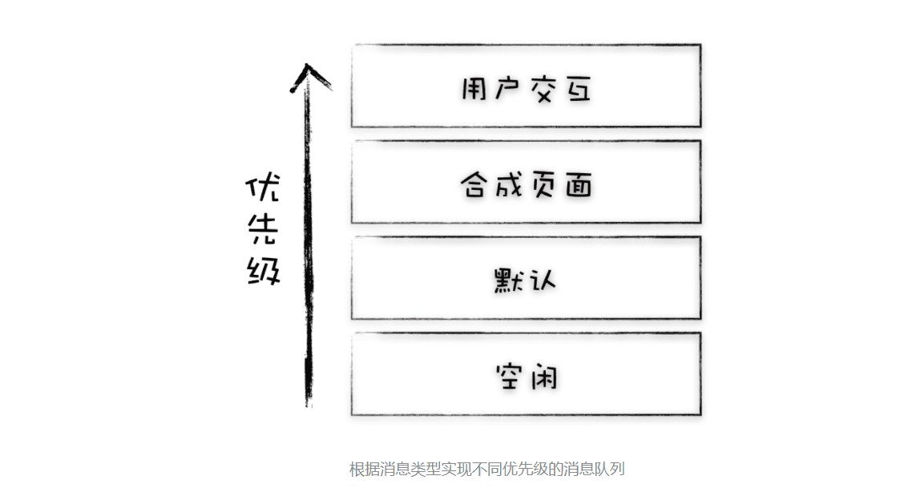
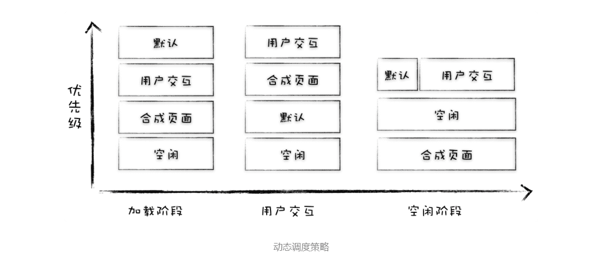

> 有了setTimeOut，为什么还要使用rAF？

> 主线程维护了一个普通的消息队列和一个延迟消息队列，调度模块会按照规则依次取出这两个消息队列中的任务，并在主线程上执行。为了下文讲述方便，在这里我把普通的消息队列和延迟队列都当成一个消息队列。

### 1.单消息队列的队头阻塞问题

**在单消息队列架构下，存在着低优先级任务会阻塞高优先级任务的情况.**

### 2.Chromium 是如何解决队头阻塞问题的？

#### 1.第一次迭代：引入一个高优先级队列

 观察上图，我们使用了一个优先级高的消息队列和一个优先级低消息队列，渲染进程会将它认为是紧急的任务添加到高优先级队列中，不紧急的任务就添加到低优先级的队列中。然后我们再在渲染进程中引入一个**任务调度器**，负责从多个消息队列中选出合适的任务，通常实现的逻辑，先按照顺序从高优先级队列中取出任务，如果高优先级的队列为空，那么再按照顺序从低优级队列中取出任务。

观察上图，我们实现了三个不同优先级的消息队列，然后可以使用任务调度器来统一调度这三个不同消息队列中的任务。

好了，现在我们引入了多个消息队列，结合任务调度器我们就可以灵活地调度任务了，这样我们就可以让高优先级的任务提前执行，采用这种方式似乎解决了消息队列的队头阻塞问题。

不过大多数任务需要保持其相对执行顺序，如果将用户输入的消息或者合成消息添加进多个不同优先级的队列中，那么这种任务的相对执行顺序就会被打乱，甚至有可能出现还未处理输入事件，就合成了该事件要显示的图片。因此我们需要让一些相同类型的任务保持其相对执行顺序。

#### 2.第二次迭代：根据消息类型来实现消息队列

要解决上述问题，可以为不同类型的任务创建不同优先级的消息队列，比如：

通过迭代，这种策略已经相当实用了，但是它依然存在着问题，那就是这几种消息队列的优先级都是固定的，任务调度器会按照这种固定好的静态的优先级来分别调度任务。那么静态优先级会带来什么问题呢？

虽然在交互阶段，采用上述这种静态优先级的策略没有什么太大问题的，但是在页面加载阶段，如果依然要优先执行用户输入事件和合成事件，那么页面的解析速度将会被拖慢。Chromium 团队曾测试过这种情况，使用静态优先级策略，网页的加载速度会被拖慢 14%。

#### 3.第三次迭代：动态调度策略

可以看出，我们所采用的优化策略像个跷跷板，虽然优化了高优先级任务，却拖慢低优先级任务，之所以会这样，是因为我们采取了静态的任务调度策略，对于各种不同的场景，这种静态策略就显得过于死板。

所以我们还得根据实际场景来继续平衡这个跷跷板，也就是说在不同的场景下，根据实际情况，动态调整消息队列的优先级。

这张图展示了 Chromium 在不同的场景下，是如何调整消息队列优先级的。通过这种动态调度策略，就可以满足不同场景的核心诉求了，同时这也是 Chromium 当前所采用的任务调度策略。

首先我们来看看**页面加载阶段**的场景，在这个阶段，用户的最高诉求是在尽可能短的时间内看到页面，至于交互和合成并不是这个阶段的核心诉求，因此我们需要调整策略，在加载阶段将页面解析，JavaScript 脚本执行等任务调整为优先级最高的队列，降低交互合成这些队列的优先级。

页面加载完成之后就进入了**交互阶段**，在介绍 Chromium 是如何调整交互阶段的任务调度策略之前，我们还需要岔开一下，来回顾下页面的渲染过程。

在显卡中有一块叫着**前缓冲区**的地方，这里存放着显示器要显示的图像，显示器会按照一定的频率来读取这块前缓冲区，并将前缓冲区中的图像显示在显示器上，不同的显示器读取的频率是不同的，通常情况下是 60HZ，也就是说显示器会每间隔 1/60 秒就读取一次前缓冲区。

如果浏览器要更新显示的图片，那么浏览器会将新生成的图片提交到显卡的**后缓冲区**中，提交完成之后，GPU 会将**后缓冲区和前缓冲区互换位置**，也就是前缓冲区变成了后缓冲区，后缓冲区变成了前缓冲区，这就保证了显示器下次能读取到 GPU 中最新的图片。

这时候我们会发现，显示器从前缓冲区读取图片，和浏览器生成新的图像到后缓冲区的过程是不同步的，如下图所示：

这种显示器读取图片和浏览器生成图片不同步，容易造成众多问题。

- 如果渲染进程生成的帧速比屏幕的刷新率慢，那么屏幕会在两帧中显示同一个画面，当这种断断续续的情况持续发生时，用户将会很明显地察觉到动画卡住了。
- 如果渲染进程生成的帧速率实际上比屏幕刷新率快，那么也会出现一些视觉上的问题，比如当帧速率在 100fps 而刷新率只有 60Hz 的时候，GPU 所渲染的图像并非全都被显示出来，这就会造成丢帧现象。
- 就算屏幕的刷新频率和 GPU 更新图片的频率一样，由于它们是两个不同的系统，所以屏幕生成帧的周期和 VSync 的周期也是很难同步起来的。

所以 VSync 和系统的时钟不同步就会造成掉帧、卡顿、不连贯等问题。

为了解决这些问题，就需要将显示器的时钟同步周期和浏览器生成页面的周期绑定起来，Chromium 也是这样实现，那么下面我们就来看看 Chromium 具体是怎么实现的？

**当显示器将一帧画面绘制完成后，并在准备读取下一帧之前，显示器会发出一个垂直同步信号（vertical synchronization）给 GPU，简称 VSync。**这时候浏览器就会充分利用好 VSync 信号。

具体地讲，当 GPU 接收到 VSync 信号后，会将 VSync 信号同步给浏览器进程，浏览器进程再将其同步到对应的渲染进程，渲染进程接收到 VSync 信号之后，就可以准备绘制新的一帧了，具体流程你可以参考下图：

好了，我们花了很大篇幅介绍了 VSync 和页面中的一帧是怎么显示出来，有了这些知识，我们就可以回到主线了，来分析下渲染进程是如何优化交互阶段页面的任务调度策略的？

从上图可以看出，当渲染进程接收到用户交互的任务后，接下来大概率是要进行绘制合成操作，因此我们可以设置，**当在执行用户交互的任务时，将合成任务的优先级调整到最高。**

接下来，处理完成 DOM，计算好布局和绘制，就需要将信息提交给合成线程来合成最终图片了，然后合成线程进入工作状态。现在的场景是合成线程在工作了，**那么我们就可以把下个合成任务的优先级调整为最低，并将页面解析、定时器等任务优先级提升。**

在合成完成之后，合成线程会提交给渲染主线程提交完成合成的消息，如果当前合成操作执行的非常快，比如从用户发出消息到完成合成操作只花了 8 毫秒，因为 VSync 同步周期是 16.66（1/60）毫秒，那么这个 VSync 时钟周期内就不需要再次生成新的页面了。那么从合成结束到下个 VSync 周期内，就进入了一个空闲时间阶段，那么就可以在这段空闲时间内执行一些不那么紧急的任务，比如 V8 的垃圾回收，或者通过 **window.requestIdleCallback()** 设置的回调任务等，都会在这段空闲时间内执行。

#### 4.第四次迭代：任务饿死

好了，以上方案看上去似乎非常完美了，不过依然存在一个问题，那就是在某个状态下，一直有新的高优先级的任务加入到队列中，这样就会导致其他低优先级的任务得不到执行，这称为任务饿死。

Chromium 为了解决任务饿死的问题，给每个队列设置了执行权重，也就是如果连续执行了一定个数的高优先级的任务，那么中间会执行一次低优先级的任务，这样就缓解了任务饿死的情况。
