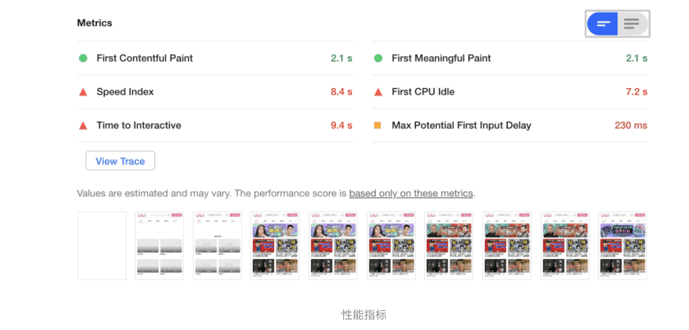
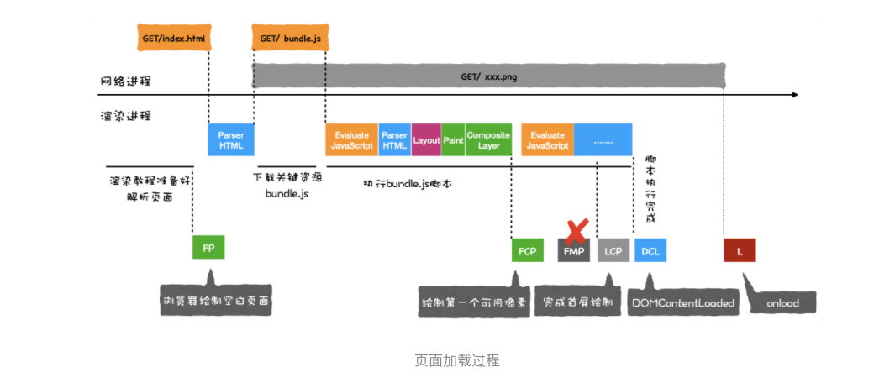

> 使用Audits 来优化Web 性能

### 1.Web 性能

> Web性能描述了Web 应用在浏览器上的加载和显示的速度。

关于Web 应用的速度要从两个阶段来考虑：

- 页面加载阶段；
- 页面交互阶段；

### 2.性能检测工具： Performance vs Audits

#### 1.Performance

Performance 非常强大，因为它提供了非常多的运行时数据，利用这些数据我们就可以分析出来 Web 应用的瓶颈。但是要完全学会其使用方式却是非常有难度的，其难点在于这些数据涉及到了特别多的概念，而这些概念又和浏览器的系统架构、消息循环机制、渲染流水线等知识紧密联系在了一起。

#### 2.Audits

> chrome devTools Lighthouse

Audtis 就简单了许多，它将检测到的细节数据隐藏在背后，只提供给我们一些直观的性能数据，同时，还会给我们提供一些优化建议。

> Perfomance 能让我们看到更多细节数据，但是更加复杂，Audits 就比较智能，但是隐藏了更多细节。

### 3.检测之前准备工作

在检测Web的性能指标之前，要配置好工作环境。需要准备以下内容：

- 首先准备 Chrome Canary 版的浏览器，Chrome Canary 是采用最新技术构建的，它的开发者工具和浏览器特性都是最新的，所以我推荐你使用 Chrome Canary 来做性能分析。当然你也可以使用稳定版的 Chrome。
- 然后我们需要在 Chrome 的隐身模式下工作，这样可以确保我们安装的扩展、浏览器缓存、Cookie 等数据不会影响到检测结果。

### 4.利用Audits 生成Web 性能报告

在生成报告之前，我们需要先配置 Audits，配置模块主要有两部分组成，一个是**监测类型 (Categories)**，另外一个是**设备类型 (Device)。**

#### 1.监控类型 (Categories)有五个对应的选项：

1. 监测并分析 Web 性能 (**Performance**)；
2. 监测并分析 PWA(**Progressive Web App**) 程序的性能；
3. 监测并分析 Web 应用是否采用了最佳实践策略 (**Best practices**)；
4. 监测并分析是否实施了无障碍功能 (**Accessibility**)，[无障碍功能](https://developers.google.com/web/fundamentals/accessibility?utm_source=lighthouse&utm_medium=devtools)让一些身体有障碍的人可以方便地浏览你的 Web 应用。
5. 监测并分析 Web 应用是否采实施了 SEO 搜素引擎优化 (**SEO**)。

#### 2.设备 (Device)

1. **Moblie** 选项是用来模拟移动设备环境的。
2. **Desktop** 选项是用来模拟桌面环境的。

### 5.解读性能报告

#### 1.性能指标（Metrics）

> 第一个部分是**性能指标 (Metrics)**

性能指标下面一共有六项内容，这六项内容分别对应了从 Web 应用的加载到页面展示完成的这段时间中，各个阶段所消耗的时长。在中间还有一个 View Trace 按钮，点击该按钮可以跳转到 Performance 标签，并且查看这些阶段在 Performance 中所对应的位置。最下方是加载过程中各个时间段的屏幕截图。

#### 2.可优化项 (Opportunities)

> 第二个部分是可优化项 (Opportunities)

可优化项是 Audits 发现页面中的一些可以直接优化的部分，你可以对照 Audits 给的这些提示来优化你的 Web 应用。

#### 3.手动诊断 (Diagnostics)

> 第三部分是手动诊断 (Diagnostics)

在手动诊断部分，采集了一些可能存在性能问题的指标，这些指标可能会影响到页面的加载性能，Audits 把详情列出来，并让你依据实际情况，来手动排查每一项。

#### 4.运行时设置 (Runtime Settings)

> **最后一部分是运行时设置 (Runtime Settings)**

这是运行时的一些基本数据，如果选择移动设备模式，你可以看到发送网络请求时的 User Agent 会变成设备相关信息，还有会模拟设备的网速，这个体现在网络限速上。

### 6.根据性能报告优化 Web 性能

在渲染进程确认要渲染当前的请求后，渲染进程会创建一个空白页面，我们把创建空白页面的这个时间点称为 First Paint，简称 FP。

然后渲染进程继续请求关键资源，在《页面性能：如何系统地优化页面？》这节中介绍过了关键资源，并且知道了关键资源包括了 JavaScript 文件和 CSS 文件，因为关键资源会阻塞页面的渲染，所以我们需要等待关键资源加载完成后，才能执行进一步的页面绘制。

上图中，bundle.js 是关键资源，因此需要完成加载之后，渲染进程才能执行该脚本，然后脚本会修改 DOM，引发重绘和重排等一系列操作，当页面中绘制了第一个像素时，我们把这个时间点称为 **First Content Paint**，简称 **FCP**。

接下来继续执行 JavaScript 脚本，当首屏内容完全绘制完成时，我们把这个时间点称为 **Largest Content Paint**，简称 **LCP**。

在 FCP 和 LCP 中间，还有一个 FMP，这个是首次有效绘制，由于 FMP 计算复杂，而且容易出错，现在不推荐使用该指标。

接下来 JavaScript 脚本执行结束，渲染进程判断该页面的 DOM 生成完毕，于是触发 **DOMContentLoad** 事件。等所有资源都加载结束之后，再触发 **onload** 事件。

**性能指标的分数是由六项指标决定的，它们分别是：**

#### 1.首次绘制 (First Paint)；

在渲染进程确认要渲染当前的请求后，渲染进程会创建一个空白页面，我们把创建空白页面的这个时间点称为 First Paint，简称 FP。

如果 FP 时间过久，那么直接说明了一个问题，那就是页面的 HTML 文件可能由于网络原因导致加载时间过久。

#### 2.首次有效绘制 (First Meaningfull Paint)；

当页面中绘制了第一个像素时，我们把这个时间点称为 First Content Paint，简称 FCP。

接下来继续执行 JavaScript 脚本，当首屏内容完全绘制完成时，我们把这个时间点称为 Largest Content Paint，简称 LCP。

可以结合上图，如果 FMP 和 LCP 消耗时间过久，那么有可能是加载关键资源花的时间过久，也有可能是 JavaScript 执行过程中所花的时间过久，所以可以针对具体的情况来具体分析。

#### 3.首屏时间 (Speed Index)；

就是上面提到的 LCP，它表示填满首屏页面所消耗的时间，首屏时间的值越大，那么加载速度越慢，具体的优化方式同优化第二项 FMP 是一样。

#### 4.首次 CPU 空闲时间 (First CPU Idle)；

> **也称为 First Interactive**

它表示页面达到最小化可交互的时间，也就是说并不需要等到页面上的所有元素都可交互，只要可以对大部分用户输入做出响应即可。要缩短首次 CPU 空闲时长，我们就需要尽可能快地加载完关键资源，尽可能快地渲染出来首屏内容，因此优化方式和第二项 FMP 和第三项 LCP 是一样的。

#### 5.完全可交互时间 (Time to Interactive)；

> 简称 TTI

它表示页面达到最小化可交互的时间，也就是说并不需要等到页面上的所有元素都可交互，只要可以对大部分用户输入做出响应即可。要它表示页面中所有元素都达到了可交互的时长。简单理解就这时候页面的内容已经完全显示出来了，所有的 JavaScript 事件已经注册完成，页面能够对用户的交互做出快速响应，通常满足响应速度在 50 毫秒以内。如果要解决 TTI 时间过久的问题，我们可以推迟执行一些和生成页面无关的 JavaScript 工作。

#### 6.最大估计输入延时 (Max Potential First Input Delay);

这个指标是估计你的 Web 页面在加载最繁忙的阶段， 窗口中响应用户输入所需的时间，为了改善该指标，我们可以使用 WebWorker 来执行一些计算，从而释放主线程。另一个有用的措施是重构 CSS 选择器，以确保它们执行较少的计算。

