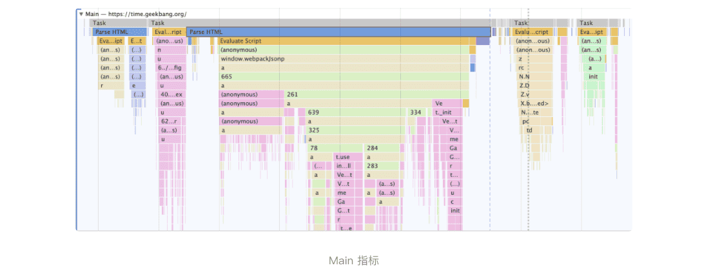

> 如何使用Performance？

### 1.配置Performance

**区域1**

设置该区域中的"network"来限制网络加载速度，设置CPU来限制CPU的运行速度。

> 通过设置,可以在 Chrome 浏览器上来模拟手机等性能不高的设备了。

**区域2、3**

黑色按钮是用来记录交互阶段性能数据的；

> 如果你是录制交互阶段的性能时，那么需要手动停止录制过程。

带箭头的圆圈形按钮用来记录加载阶段的性能数据；

> 当你录制加载阶段的性能数据时，Performance 会重新刷新页面，并等到页面完全渲染出来后，Performance 就会自动停止录制。

### 2.认识报告页

#### 1.概览面板

- 如果 FPS 图表上出现了红色块，那么就表示红色块附近渲染出一帧所需时间过久，帧的渲染时间过久，就有可能导致页面卡顿。
- 如果 CPU 图形占用面积太大，表示 CPU 使用率就越高，那么就有可能因为某个 JavaScript 占用太多的主线程时间，从而影响其他任务的执行。
- 如果 V8 的内存使用量一直在增加，就有可能是某种原因导致了内存泄漏。

> 除了以上指标以外，概览面板还展示加载过程中的几个关键时间节点，如 FP、LCP、DOMContentLoaded、Onload 等事件产生的时间点。这些关键时间点体现在了几条不同颜色的竖线上。

#### 2.性能面板

> 通过概览面板定位可能存在的时间节点，用性能面板来进一步分析数据。

**Main 指标**记录渲染主线程的任务执行过程；

**Compositor 指标**记录了合成线程的任务执行过程；

**GPU 指标**记录了 GPU 进程主线程的任务执行过程；

### 3.解读性能面板的各项指标

#### 1.Main 指标

Main 指标，它记录了渲染进程的主线程的任务执行记录。

一段段横条代表执行一个个任务，长度越长，花费的时间越多；竖向代表该任务的执行记录。

#### 2.Compositor 指标

通过渲染流水线，知道渲染主线程在生成层树 (LayerTree) 之后，然后根据层树生成每一层的绘制列表，把这个过程称为**绘制 (Paint)**。在绘制阶段结束之后，渲染主线程会将这些绘列表制**提交 (commit)给合成线程，并由合成线程合成出来漂亮的页面。因此，监控合成线程的任务执行记录也相对比较重要，所以 Chrome 又在性能面板中引入了Compositor 指标**，也就是合成线程的任务执行记录。

#### 3.光栅化线程池 (Raster)、GPU 指标

在合成线程执行任务的过程中，还需要 GPU 进程的配合来生成位图，我们把这个 GPU 生成位图的过程称为**光栅化**。如果合成线程直接和 GPU 进程进行通信，那么势必会阻塞后面的合成任务，因此合成线程又维护了一个**光栅化线程池 (Raster)**，用来让 GPU 执行光栅化的任务。因为光栅化线程池和 GPU 进程中的任务执行也会影响到页面的性能，所以性能面板也添加了这两个指标，分别是 **Raster 指标**和 **GPU 指标**。因为 Raster 是线程池，所以如果你点开 Raster 项，可以看到它维护了多个线程。

#### 4.Chrome_ChildIOThread 指

IO 线程主要用来接收用户输入事件、网络事件、设备相关等事件，如果事件需要渲染主线程来处理，那么 IO 线程还会将这些事件转发给渲染主线程。在性能面板上，**Chrome_ChildIOThread 指标**对应的就是 IO 线程的任务记录。

#### 5.Network 指标

网络记录展示了页面中的每个网络请求所消耗的时长，并以瀑布流的形式展现。

#### 6.Timings 指标

用来记录一些关键的时间节点在何时产生的数据信息

#### 7.Frames 指标

也就是浏览器生成每帧的记录，我们知道页面所展现出来的画面都是由渲染进程一帧一帧渲染出来的，帧记录就是用来记录渲染进程生成所有帧信息，包括了渲染出每帧的时长、每帧的图层构造等信息

#### 8.Interactions 指标

用来记录用户交互操作，比如点击鼠标、输入文字等交互信息。

#### 9.ThreadPoolForegroundWorker、ThreadPoolServiceThread

### 4.详情面板

Google 的官方网站查看 

[1]: https://developer.chrome.com/docs/devtools/evaluate-performance/reference/#rendering	"Performance features reference"

https://zhuanlan.zhihu.com/p/374565075

https://zhuanlan.zhihu.com/p/65065472?utm_source=wechat_session

