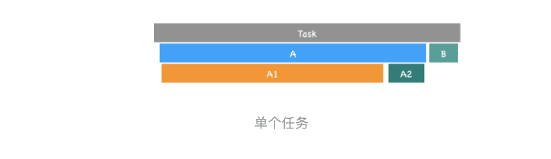

> 如何分析Performance中的Main指标？

### 1.任务 vs 过程


图上方有很多一段一段灰色横条，**每个灰色横条就对应了一个任务，灰色长条的长度对应了任务的执行时长。**

通常，渲染主线程上的任务都是比较复杂的，如果只单纯记录任务执行的时长，那么依然很难定位问题，因此，还需要将任务执行过程中的一些关键的细节记录下来，这些细节就是任务的**过程**，灰线下面的横条就是一个个过程，同样这些横条的长度就代表这些过程执行的时长。



上图这个任务记录的图形，可把图形看成下面Task 函数的执行过程:

```javascript
function A(){
    A1()
    A2()
}
function Task(){
    A()
    B()
}
Task()
```

- Task 任务会首先调用 A 过程；
- 随后 A 过程又依次调用了 A1 和 A2 过程，然后 A 过程执行完毕；
- 随后 Task 任务又执行了 B 过程；
- B 过程执行结束，Task 任务执行完成；
- 从图中可以看出，A 过程执行时间最长，所以在 A1 过程时，拉长了整个任务的执行时长。

### 2.分析页面加载过程

```html

<html>
<head>
    <title>Main</title>
    <style>
        area {
            border: 2px ridge;
        }


        box {
            background-color: rgba(106, 24, 238, 0.26);
            height: 5em;
            margin: 1em;
            width: 5em;
        }
    </style>
</head>


<body>
    <div class="area">
        <div class="box rAF"></div>
    </div>
    <br>
    <script>
        function setNewArea() {
            let el = document.createElement('div')
            el.setAttribute('class', 'area')
            el.innerHTML = '<div class="box rAF"></div>'
            document.body.append(el)
        }
        setNewArea()   
    </script>
</body>
</html>
```


加载过程主要分为三个阶段:

1. 导航阶段，该阶段主要是从网络进程接收 HTML 响应头和 HTML 响应体。
2. 解析 HTML 数据阶段，该阶段主要是将接收到的 HTML 数据转换为 DOM 和 CSSOM。
3. 生成可显示的位图阶段，该阶段主要是利用 DOM 和 CSSOM，经过计算布局、生成层树 (LayerTree)、生成绘制列表 (Paint)、完成合成等操作，生成最终的图片

#### 1.导航阶段


当你点击重新加载按钮后，当前的页面会执行上图中的这个任务：

- 该任务的第一个子过程就是 Send request，该过程表示网络请求已被发送。然后该任务进入了等待状态。
- 接着由网络进程负责下载资源，当接收到响应头的时候，该任务便执行 Receive Respone 过程，该过程表示接收到 HTTP 的响应头了。
- 接着执行 DOM 事件：pagehide、visibilitychange 和 unload 等事件，如果你注册了这些事件的回调函数，那么这些回调函数会依次在该任务中被调用。
- 这些事件被处理完成之后，那么接下来就接收 HTML 数据了，这体现在了 Recive Data 过程，Recive Data 过程表示请求的数据已被接收，如果 HTML 数据过多，会存在多个 Receive Data 过程。

等到所有的数据都接收完成之后，渲染进程会触发另外一个任务，该任务主要执行 Finish load 过程，该过程表示网络请求已经完成。

#### 2.解析 HTML 数据阶段


- 在 ParserHTML 的过程中，如果解析到了 script 标签，那么便进入了脚本执行过程，也就是图中的 Evalute Script。
- 要执行一段脚本需要首先编译该脚本，于是在 Evalute Script 过程中，先进入了脚本编译过程，也就是图中的 Complie Script。脚本编译好之后，就进入程序执行过程，执行全局代码时，V8 会先构造一个 anonymous 过程，在执行 anonymous 过程中，会调用 setNewArea 过程，setNewArea 过程中又调用了 createElement，由于之后调用了 document.append 方法，该方法会触发 DOM 内容的修改，所以又强制执行了 ParserHTML 过程生成的新的 DOM。
- DOM 生成完成之后，会触发相关的 DOM 事件，比如典型的 DOMContentLoaded，还有 readyStateChanged。

DOM 生成之后，ParserHTML 过程继续计算样式表，也就是 Reculate Style，这就是生成 CSSOM 的过程

#### 3.生成可显示位图阶段


- 首先执行布局，这个过程对应图中的 **Layout**。
- 然后更新层树 (LayerTree)，这个过程对应图中的 **Update LayerTree**。
- 有了层树之后，就需要为层树中的每一层准备绘制列表了，这个过程就称为 **Paint**。
- 准备每层的绘制列表之后，就需要利用绘制列表来生成相应图层的位图了，这个过程对应图中的 **Composite Layers**。

走到了 Composite Layers 这步，主线程的任务就完成了，接下来主线程会将合成的任务完全教给合成线程来执行,


1. 首先主线程执行到 Composite Layers 过程之后，便会将绘制列表等信息提交给合成线程，合成线程的执行记录你可以通过 Compositor 指标来查看。
2. 合成线程维护了一个 Raster 线程池，线程池中的每个线程称为 Rasterize，用来执行光栅化操作，对应的任务就是 Rasterize Paint
3. 当然光栅化操作并不是在 Rasterize 线程中直接执行的，而是在 GPU 进程中执行的，因此 Rasterize 线程需要和 GPU 线程保持通信。
4. 然后 GPU 生成图像，最终这些图层会被提交给浏览器进程，浏览器进程将其合成并最终显示在页面上。


