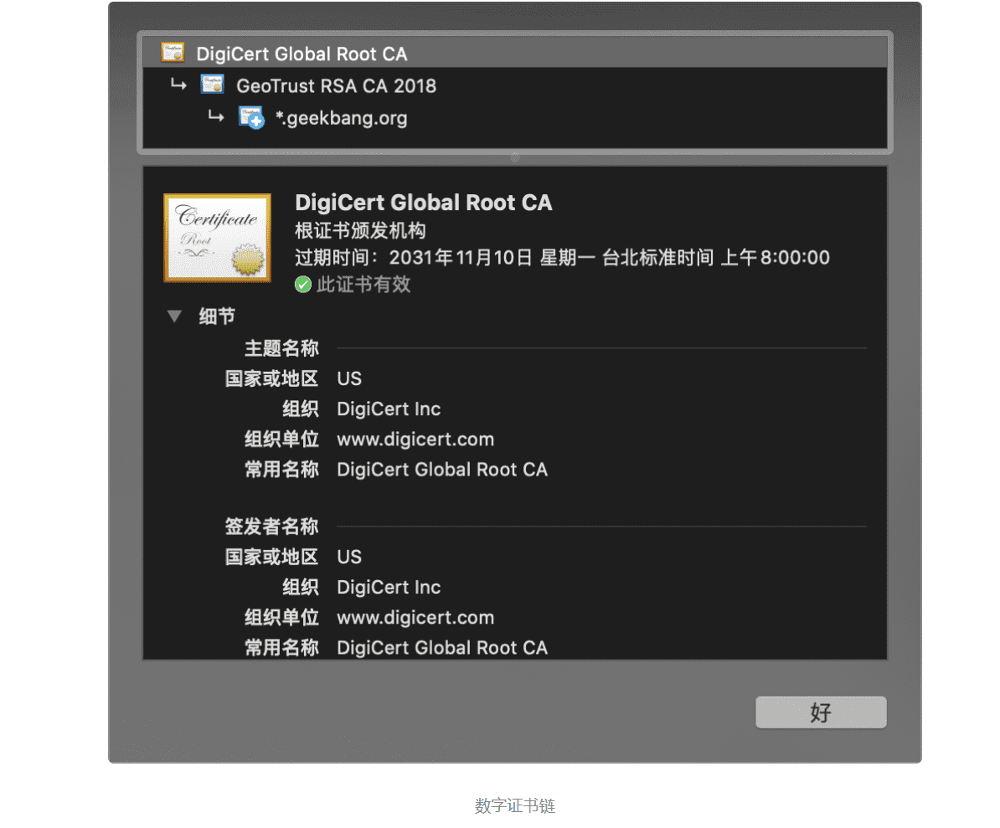

### 1.数字整数申请流程

首先极客时间填写了一张含有自己身份信息的表单，身份信息包括了自己公钥、站点资料、公司资料等信息，然后将其提交给了 CA 机构；CA 机构会审核表单中内容的真实性；审核通过后，CA 机构会拿出自己的私钥，对表单的内容进行一连串操作，包括了对明文资料进行 Hash 计算得出信息摘要， 利用 CA 的私钥加密信息摘要得出数字签名，最后将数字签名也写在表单上，并将其返还给极客时间，这样就完成了一次数字证书的申请操作。

### 2.浏览器验证证书的流程

在浏览器和服务器建立 HTTPS 链接的过程中，浏览器首先会向服务器请求数字证书，之后浏览器要做的第一件事就是验证数字证书。那么，这里所说的“验证”，它到底是在验证什么呢？

具体地讲，浏览器需要**验证证书的有效期、证书是否被 CA 吊销、证书是否是合法的 CA 机构颁发的。**

数字证书和身份证一样也是有时间期限的，**所以第一部分就是验证证书的有效期**，这部分比较简单，因为证书里面就含有证书的有效期，所以浏览器只需要判断当前时间是否在证书的有效期范围内即可。

有时候有些数字证书被 CA 吊销了，吊销之后的证书是无法使用的，所以第二部分就是**验证数字证书是否被吊销了**。通常有两种方式，一种是下载吊销证书列表 -CRL (Certificate Revocation Lists)，第二种是在线验证方式 -OCSP (Online Certificate Status Protocol) ，它们各有优缺点。

最后，还要**验证极客时间的数字证书是否是 CA 机构颁发的**，验证的流程非常简单：

- 首先，浏览器利用证书的原始信息计算出信息摘要；
- 然后，利用 CA 的公钥来解密数字证书中的数字签名，解密出来的数据也是信息摘要；
- 最后，判断这两个信息摘要是否相等就可以了。

通过这种方式就验证了数字证书是否是由 CA 机构所签发的，不过这种方式又带来了一个新的疑问：**浏览器是怎么获取到 CA 公钥的？**

### 3.浏览器是怎么获取到 CA 公钥的？

通常，当你部署 HTTP 服务器的时候，除了部署当前的数字证书之外，还需要部署 CA 机构的数字证书，CA 机构的数字证书包括了 CA 的公钥，以及 CA 机构的一些基础信息。

因此，极客时间服务器就有了两个数字证书:

- 给极客时间域名的数字证书；
- 给极客时间签名的 CA 机构的数字证书。

然后在建立 HTTPS 链接时，服务器会将这两个证书一同发送给浏览器，于是浏览器就可以获取到 CA 的公钥了。

如果有些服务器没有部署 CA 的数字证书，那么浏览器还可以通过网络去下载 CA 证书，不过这种方式多了一次证书下载操作，会拖慢首次打开页面的请求速度，一般不推荐使用。

现在浏览器端就有了极客时间的证书和 CA 的证书，完整的验证流程就如下图所示：

解决了获取 CA 公钥的问题，新的问题又来了，如果这个证书是一个恶意的 CA 机构颁发的怎么办？所以我们还需要浏览器**证明这个 CA 机构是个合法的机构。**

### 4.证明 CA 机构的合法性

这里并没有一个非常好的方法来证明 CA 的合法性，妥协的方案是，直接在操作系统中内置这些 CA 机构的数字证书，如下图所示：

我们将所有 CA 机构的数字证书都内置在操作系统中，这样当需要使用某 CA 机构的公钥时，我们只需要依据 CA 机构名称，就能查询到对应的数字证书了，然后再从数字证书中取出公钥。

可以看到，这里有一个假设条件，浏览器默认信任操作系统内置的证书为合法证书，虽然这种方式不完美，但是却是最实用的一个。

不过这种方式依然存在问题，因为在实际情况下，**CA 机构众多，因此操作系统不可能将每家 CA 的数字证书都内置进操作系统。**

### 5.数字证书链

于是人们又想出来一个折中的方案，将颁发证书的机构划分为两种类型，根 CA(Root CAs)和中间 CA(Intermediates CAs)，通常申请者都是向中间 CA 去申请证书的，而根 CA 作用就是给中间 CA 做认证，一个根 CA 会认证很多中间的 CA，而这些中间 CA 又可以去认证其他的中间 CA。

因此，每个根 CA 机构都维护了一个树状结构，一个根 CA 下面包含多个中间 CA，而中间 CA 又可以包含多个中间 CA。这样就形成了一个证书链，你可以沿着证书链从用户证书追溯到根证书。

比如你可以在 Chrome 上打开极客时间的官网，然后点击地址栏前面的那把小锁，你就可以看到 *.geekbang.org 的证书是由中间 CA GeoTrust RSA CA2018 颁发的，而中间 CA GeoTrust RSA CA2018 又是由根 CA DigiCert Global Root CA 颁发的，所以这个证书链就是：*.geekbang.org—>GeoTrust RSA CA2018–>DigiCert Global Root CA。你可以参看下图：

因此浏览器验证极客时间的证书时，会先验证 *.geekbang.org 的证书，如果合法，再验证中间 CA 的证书，如果中间 CA 也是合法的，那么浏览器会继续验证这个中间 CA 的根证书。

到了这里，依然存在一个问题，那就是**浏览器怎么证明根证书是合法的？**

### 6.如何验证根证书的合法性

其实浏览器的判断策略很简单，它只是简单地判断这个根证书在不在操作系统里面，如果在，那么浏览器就认为这个根证书是合法的，如果不在，那么就是非法的。

如果某个机构想要成为根 CA，并让它的根证书内置到操作系统中，那么这个机构首先要通过 WebTrust 国际安全审计认证。

什么是 WebTrust 认证？

WebTrust 是由两大著名注册会计师协会 AICPA（美国注册会计师协会）和 CICA（加拿大注册会计师协会）共同制定的安全审计标准，主要对互联网服务商的系统及业务运作逻辑安全性、保密性等共计七项内容进行近乎严苛的审查和鉴证。 只有通过 WebTrust 国际安全审计认证，根证书才能预装到主流的操作系统，并成为一个可信的认证机构。

目前通过 WebTrust 认证的根 CA 有 Comodo、geotrust、rapidssl、symantec、thawte、digicert 等。也就是说，这些根 CA 机构的根证书都内置在个大操作系统中，只要能从数字证书链往上追溯到这几个根证书，浏览器就会认为使用者的证书是合法的。

