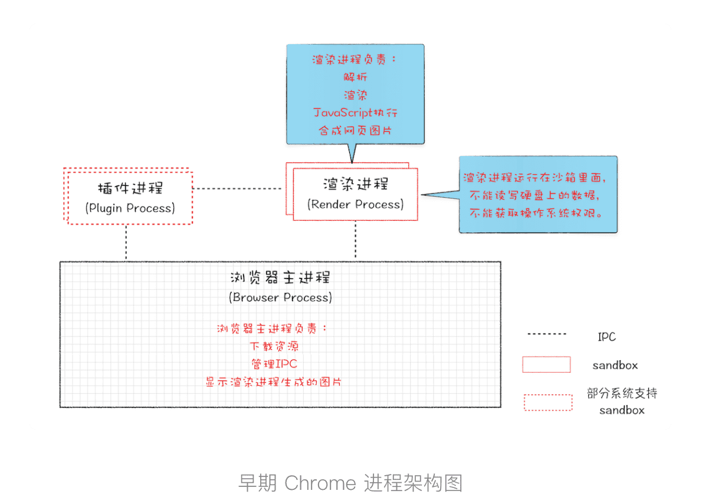
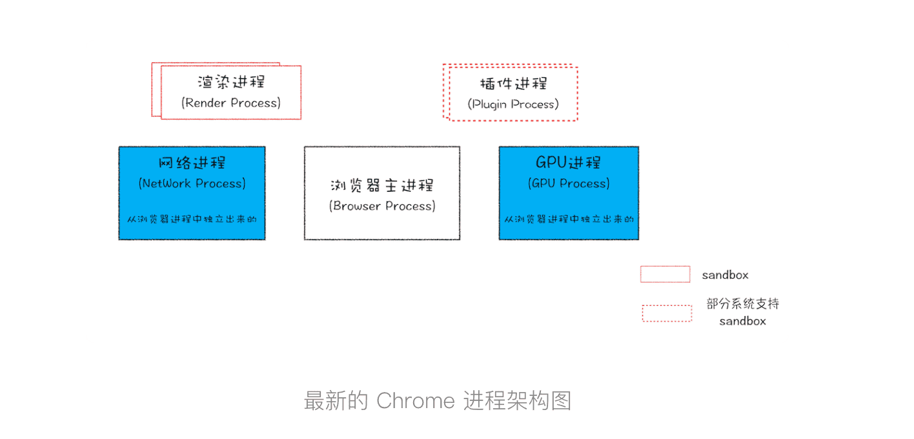
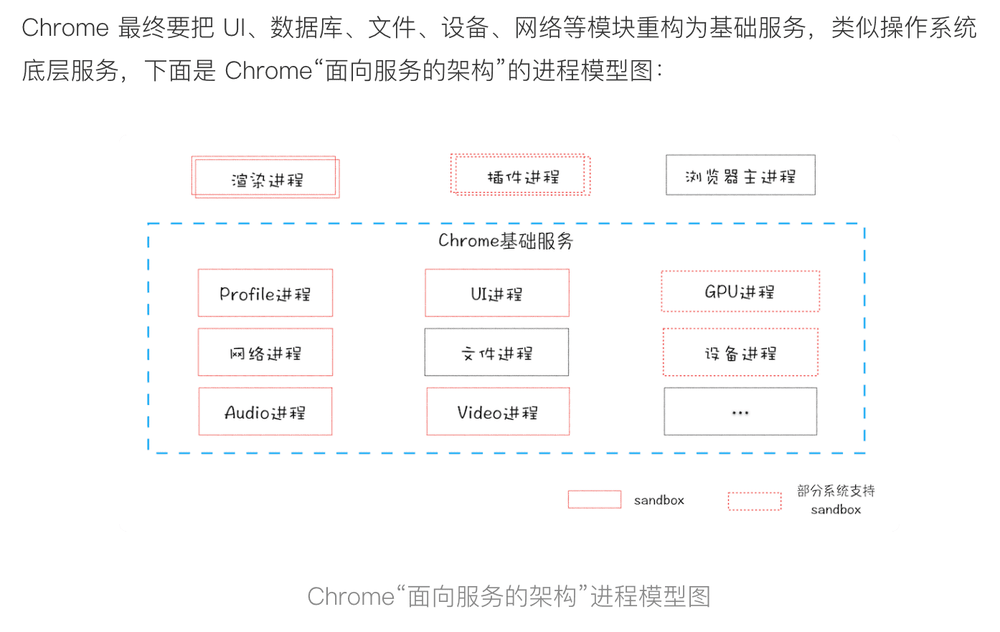

#### 线程 VS 进程

1. 多线程可以并行处理任务，但是线程是不能单独存在的，它是由进程来启动和管理的。
2. 一个进程就是一个程序的运行实例。详细解释就是，启动一个程序的时候，操作系统会为该程序创建一块内存，用来存放代码、运行中的数据和一个执行任务的主线程，我们把这样的一个运行环境叫进程。
3. 进程和线程之间的关系有以下 4 个特点
   1. 进程中的任意一线程执行出错，都会导致整个进程的崩溃
   2. 线程之间共享进程中的数据
   3. 当一个进程关闭之后，操作系统会回收进程所占用的内存
   4. 进程之间的内容相互隔离

#### 单进程浏览器时代

1. 单进程浏览器是指浏览器的所有功能模块都是运行在同一个进程里

   

   

2. 如此多的功能模块运行在一个进程里，是导致单进程浏览器**不稳定**、**不流畅**和**不安全**的一个主要因素。

#### 多进程浏览器时代

​	

1. 解决不稳定问题

   由于进程是相互隔离的，所以当一个页面或者插件崩溃时，影响到的仅仅是当前的页面进程或者插件进程，并不会影响到浏览器和其他页面，这就完美地解决了页面或者插件的崩溃会导致整个浏览器崩溃，也就是不稳定的问题。

2. 不流畅问题解决

   同样，JavaScript 也是运行在渲染进程中的，所以即使 JavaScript 阻塞了渲染进程，影响到的也只是当前的渲染页面，而并不会影响浏览器和其他页面，因为其他页面的脚本是运行在它们自己的渲染进程中的。所以当我们再在 Chrome 中运行上面那个死循环的脚本时，没有响应的仅仅是当前的页面

   > 对于内存泄漏的解决方法那就更简单了，因为当关闭一个页面时，整个渲染进程也会被关闭，之后该进程所占用的内存都会被系统回收，这样就轻松解决了浏览器页面的内存泄漏问题。

3. 解决安全问题

   采用多进程架构的额外好处是可以使用安全沙箱，你可以把沙箱看成是操作系统给进程上了一把锁，沙箱里面的程序可以运行，但是不能在你的硬盘上写入任何数据，也不能在敏感位置读取任何数据，例如你的文档和桌面。Chrome 把插件进程和渲染进程锁在沙箱里面，这样即使在渲染进程或者插件进程里面执行了恶意程序，恶意程序也无法突破沙箱去获取系统权限

#### 目前多进程架构



1. 最新的 Chrome 浏览器包括：1 个浏览器（Browser）主进程、1 个 GPU 进程、1 个网络（NetWork）进程、多个渲染进程和多个插件进程。

- **浏览器进程**。主要负责界面显示、用户交互、子进程管理，同时提供存储等功能。
- **渲染进程**。核心任务是将 HTML、CSS 和 JavaScript 转换为用户可以与之交互的网页，排版引擎 Blink 和 JavaScript 引擎 V8 都是运行在该进程中，默认情况下，Chrome 会为每个 **Tab** 标签创建一个渲染进程。出于安全考虑，渲染进程都是运行在沙箱模式下。
- **GPU 进程**。其实，Chrome 刚开始发布的时候是没有 GPU 进程的。而 GPU 的使用初衷是为了实现 3D CSS 的效果，只是随后网页、Chrome 的 UI 界面都选择采用 GPU 来绘制，这使得 GPU 成为浏览器普遍的需求。最后，Chrome 在其多进程架构上也引入了 GPU 进程。
- **网络进程**。主要负责页面的网络资源加载，之前是作为一个模块运行在浏览器进程里面的，直至最近才独立出来，成为一个单独的进程。
- **插件进程**。主要是负责插件的运行，因插件易崩溃，所以需要通过插件进程来隔离，以保证插件进程崩溃不会对浏览器和页面造成影响。

2. 虽然多进程模型提升了浏览器的稳定性、流畅性和安全性，但同样不可避免地带来了一些问题：
   - **更高的资源占用**。因为每个进程都会包含公共基础结构的副本（如 JavaScript 运行环境），这就意味着浏览器会消耗更多的内存资源。
   - **更复杂的体系架构**。浏览器各模块之间耦合性高、扩展性差等问题，会导致现在的架构已经很难适应新的需求了。

#### 未来面向服务的架构

​		为了解决这些问题，在 2016 年，Chrome 官方团队使用“**面向服务的架构**”（Services Oriented Architecture，简称 SOA）的思想设计了新的 Chrome 架构。也就是说 Chrome 整体架构会朝向现代操作系统所采用的“面向服务的架构” 方向发展，原来的各种模块会被重构成独立的服务（Service），每个服务（Service）都可以在独立的进程中运行，访问服务（Service）必须使用定义好的接口，通过 IPC 来通信，从而构建一个更内聚、松耦合、易于维护和扩展的系统，更好实现 Chrome 简单、稳定、高速、安全的目标。




#### 问答：

1. 即使是如今的多进程架构，我偶尔还会碰到一些由于单个页面卡死最终崩溃导致所有页面崩溃的情况，请问这是什么原因呢?

   是这样的，通常情况下是一个页面使用一个进程，但是，有一种情况，叫"同一站点(same-site)"，具体地讲，我们将“同一站点”定义为根域名（例如，geekbang.org）加上协议（例如，https:// 或者http://），还包含了该根域名下的所有子域名和不同的端口，比如下面这三个：

   ```javascript
   https://www.geekbang.org
   https://www.geekbang.org:8080
   https://time.geekbang.org
   ```

   都是属于同一站点，因为它们的协议都是https，而根域名也都是geekbang.org。你也许了解同源策略，但是同一站点和同源策略还是存在一些不同地方，在这里你需要了解它们不是同一件事就行了。

   Chrome的默认策略是，每个标签对应一个渲染进程。但是如果从一个页面打开了新页面，而新页面和当前页面属于同一站点时，那么新页面会复用父页面的渲染进程。官方把这个默认策略叫process-per-site-instance。

   直白的讲，就是如果几个页面符合同一站点，那么他们将被分配到一个渲染进程里面去。

   所以，这种情况下，一个页面崩溃了，会导致同一站点的页面同时崩溃，因为他们使用了同一个渲染进程。

   为什么要让他们跑在一个进程里面呢？

   因为在一个渲染进程里面，他们就会共享JS的执行环境，也就是说A页面可以直接在B页面中执行脚本。因为是同一家的站点，所以是有这个需求的。

2. 感觉挺好奇的，单进程浏览器开多个页面，渲染线程也只有一个吗？感觉一个页面开一个线程不是更合理吗？

   之前回答的有点笼统，下面是我整理过后的回答：

   首先这个问题提的很好，我们从IE6开始讲起，IE6时代，浏览器是单进程的，所有页面也都是运行在一个主线程中的，当时IE6就是这样设计，而且此时的IE6是单标签，也就是说一个页面一个窗口。

   这时候，国内有很多国产浏览器，都是基于IE6来二次开发的，而IE6原生架构就是所有页面跑在单线程里面的，意味着，所有的页面都共享着同一套JavaScript运行环境，同样，对于存储Cookie也都是在一个线程里面操作的。
   而且这些国产浏览器由于需要，都采用多标签的形式，所以其中的一个标签页面的卡顿都会影响到整个浏览器。

   基于卡顿的原因，国内浏览器就开始尝试支持页面多线程，也就是让部分页面运行在单独的线程之中，运行在单独的线程之中，意味着每个线程拥有单独的JavaScript执行环境，和Cookie环境，这时候问题就来了：
   比如A站点页面登陆一个网站，保存了一些Cookie数据到磁盘上，再在当前线程环境中保存部分Session数据，由于Session是不需要保存到硬盘上的，所以Session只会保存在当前的线程环境中。这时候再打开另外一个A站点的页面，假设这个页面在另外一个线程中里面，那么它首先读取硬盘上的Cookie信息，但是，由于Session信息是保存在另外一个线程里面的，无法直接读取，这样就要实现一个Session同步的问题，由于IE并没有源代码，所以实现起来非常空难，国内浏览器花了好长一点时间才解决这个问题的。

   Session问题解决了，但是假死的问题依然有，因为进程内使用了一个窗口，这个窗口是依附到浏览器主窗口之上的，所以他们公用一套消息循环机制，消息循环我们后面会详细地讲，这也就意味这一个窗口如果卡死了。也会导致整个浏览器的卡死。

   国产浏览器又出了一招，就是把页面做成一个单独的弹窗，如果这个页面卡死了，就把这个弹窗给隐藏掉。

   这里还要提一下为什么Chrome中的一个页面假死不会影响到主窗口呢？
   这是因为chrome输出的实际上图片，然后浏览器端把图片贴到自己的窗口上去，在Chrome的渲染进程内，并没有一个渲染窗口，输出的只是图片，如果卡住了，顶多图片不更新了。

   国产浏览器这一套技术花了四五年时间，等这套技术差不多成熟时，Chrome发布了 :(

3. 请问老师，如果打开了 2个页面，会有几个进程呢？是 1 个网络进程、1 个浏览器进程、1 个 GPU 进程以及 2个渲染进程，共 5个吗？这些进程是可以在浏览器开发者中被实际观察到的吗？

   通常情况下会是五个，但是有很多其他情况：
   1:如果页面里有iframe的话，iframe也会运行在单独的进程中！
   2:如果页面里有插件，同样插件也需要开启一个单独的进程！
   3:如果你装了扩展的话，扩展也会占用进程
   4:如果2个页面属于同一站点的话，并且从a页面中打开的b页面，那么他们会公用一个渲染进程

   这些进程都可以通过chrome的任务管理器来查看。

4. 老师，您好。我有个疑惑，您提到浏览器主进程负责将渲染进程生成的图片显示在ui上面，就是说渲染进程输出的最终是图片，浏览器显示的是图片，那么为什么浏览器中鼠标能选中文字？如果页面是图片的话文字是选不中的啊，这里面的机制又是怎样的？

   点击鼠标选中文字的时候，这些消息会传递到渲染进程，渲染进程再合成选中文字的状态，然后更新图片！

5. 为什么单进程浏览器当时不可以采用安全沙箱？

   如果一个进程使用了安全沙箱之后，该进程对于操作系统的权限就会受到限制，比如不能对一些位置的文件进行读写操作，而这些权限浏览器主进程所需要的，所以安全沙箱是不能应用到浏览器主进程之上的。

6. 所有的iframe标签都会创建一个新的渲染进程吗？

   iframe没有单独标签，是潜入在其它页面里面的，比如一个页面嵌入了三个不同域名的iframe，那么这个页面就会拥有四个渲染进程