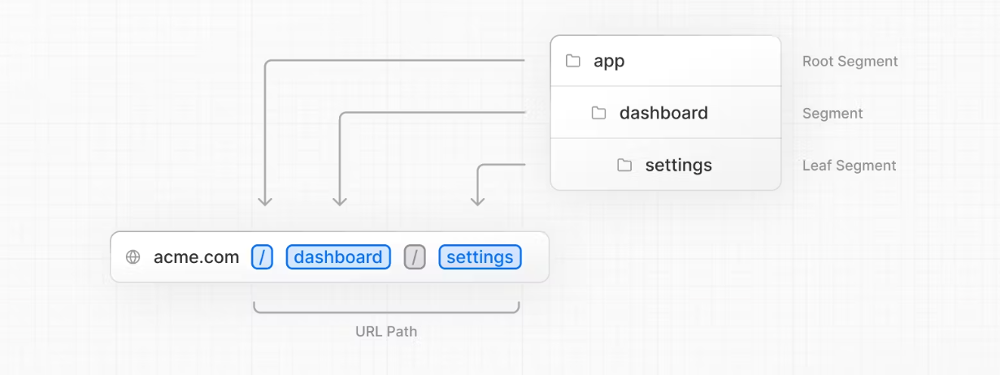
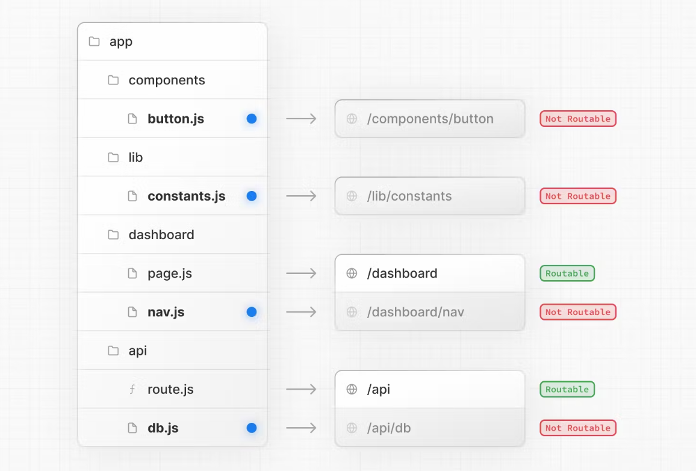
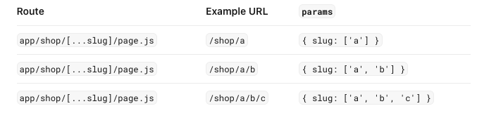

### 1.route

#### 1.路由生效的条件

文件夹下有page.js 路由才能生效，文件夹下有api/router.js 才能后端路由生效。





#### 2.[服务端路由中心、客户端导航](https://nextjs.org/docs/app/building-your-application/routing#server-centric-routing-with-client-side-navigation)

通过`Link`组件在客户端进行导航，只渲染`segments`变化的部分（体感上类似单页面应用）。

Although routing is server-centric, the router uses **client-side navigation** with the [Link Component](https://nextjs.org/docs/app/building-your-application/routing/linking-and-navigating#link-component) - resembling the behavior of a Single-Page Application. This means when a user navigates to a new route, the browser will not reload the page. Instead, the URL will be updated and Next.js will [only render the segments that change](https://nextjs.org/docs/app/building-your-application/routing#partial-rendering).

缓存按路由片段进行分割，这样可以在任何级别进行无效化，并确保在React的并发渲染中保持一致性。(即部分渲染)

 This means that for certain cases, the cache of a previously fetched segment can be re-used, further improving performance.

#### [3.高级路由模式](https://nextjs.org/docs/app/building-your-application/routing#advanced-routing-patterns)

Parallel Routes（并行路由）：允许在同一个视图中同时显示两个或多个页面，并且可以独立导航。你可以使用并行路由来创建具有自己子导航的分割视图，比如仪表盘。

Intercepting Routes（拦截路由）：允许你拦截一个路由，并在另一个路由的上下文中显示它。你可以在保持当前页面上下文很重要的情况下使用拦截路由。比如，在编辑一个任务时查看所有任务，或者在动态流中展开一张照片。

### [2.linking and Navigating](https://nextjs.org/docs/app/building-your-application/routing/linking-and-navigating)

#### 1.`Link` Component

##### [Linking to Dynamic Segments](https://nextjs.org/docs/app/building-your-application/routing/linking-and-navigating#linking-to-dynamic-segments)

##### [Checking Active Links](https://nextjs.org/docs/app/building-your-application/routing/linking-and-navigating#checking-active-links)

`usePathname()`

##### [Scrolling to an `id`](https://nextjs.org/docs/app/building-your-application/routing/linking-and-navigating#scrolling-to-an-id)

```html
<Link href="/dashboard#settings">Settings</Link>
 
// Output
<a href="/dashboard#settings">Settings</a>
```

#### 2.`useRouter` Hook	

只能用在Client Components中。

```javascript
'use client'
 
import { useRouter } from 'next/navigation'
 
export default function Page() {
  const router = useRouter()
 
  return (
    <button type="button" onClick={() => router.push('/dashboard')}>
      Dashboard
    </button>
  )
}
```

#### 3.[How Routing and Navigation Works](https://nextjs.org/docs/app/building-your-application/routing/linking-and-navigating#how-routing-and-navigation-works)

##### 1.Prefetching

###### `<Link>`

1.`Static Routes` 预加载和缓存全部路由。 

2.Dynamic Routes   Only the shared layout down until the first `loading.js` file is prefetched and cached for `30s`. 

You can disable prefetching by setting the `prefetch` prop to `false`.

###### `router.prefetch()`

##### 2.Caching

Next.js 提供了一个名为 Router Cache 的内存中的客户端缓存。

##### 3.Partial Rendering

Partial rendering means only the route segments that change on navigation re-render on the client, and any shared segments are preserved.

##### 4.Soft navigation

However, in Next.js, the App Router uses soft navigation. This means React only renders the segments that have changed while preserving React and browser state, and there is no full page reload.

##### [5. Back and Forward Navigation](https://nextjs.org/docs/app/building-your-application/routing/linking-and-navigating#5-back-and-forward-navigation)

By default, Next.js will maintain the scroll position for backwards and forwards navigation, and re-use route segments in the [Router Cache](https://nextjs.org/docs/app/building-your-application/data-fetching/fetching-caching-and-revalidating#caching-data).

### 3.Route Groups

#### 1.[Organize routes without affecting the URL path](https://nextjs.org/docs/app/building-your-application/routing/route-groups#organize-routes-without-affecting-the-url-path)

To organize routes without affecting the URL, create a group to keep related routes together. The folders in parenthesis will be omitted from the URL (e.g. `(marketing)` or `(shop)`).

#### 2.[Opting specific segments into a layout](https://nextjs.org/docs/app/building-your-application/routing/route-groups#opting-specific-segments-into-a-layout)

To opt specific routes into a layout, create a new route group (e.g. `(shop)`) and move the routes that share the same layout into the group (e.g. `account` and `cart`). The routes outside of the group will not share the layout (e.g. `checkout`).

#### 3.[Creating multiple root layouts](https://nextjs.org/docs/app/building-your-application/routing/route-groups#creating-multiple-root-layouts)

To create multiple [root layouts](https://nextjs.org/docs/app/building-your-application/routing/pages-and-layouts#root-layout-required), remove the top-level `layout.js` file, and add a `layout.js` file inside each route groups. This is useful for partitioning an application into sections that have a completely different UI or experience. The `<html>` and `<body>` tags need to be added to each root layout.

- Routes that include a route group **should not** resolve to the same URL path as other routes. For example, since route groups don't affect URL structure, `(marketing)/about/page.js` and `(shop)/about/page.js` would both resolve to `/about` and cause an error.
- If you use multiple root layouts without a top-level `layout.js` file, your home `page.js` file should be defined in one of the route groups, For example: `app/(marketing)/page.js`.
- Navigating **across multiple root layouts** will cause a **full page load** (as opposed to a client-side navigation). For example, navigating from `/cart` that uses `app/(shop)/layout.js` to `/blog` that uses `app/(marketing)/layout.js` will cause a full page load. This **only** applies to multiple root layouts.

### [4.Dynamic Routes](https://nextjs.org/docs/app/building-your-application/routing/dynamic-routes)

A Dynamic Segment can be created by wrapping a folder's name in square brackets: `[folderName]`. For example, `[id]` or `[slug]`.

Dynamic Segments are passed as the `params` prop to [`layout`](https://nextjs.org/docs/app/api-reference/file-conventions/layout), [`page`](https://nextjs.org/docs/app/api-reference/file-conventions/page), [`route`](https://nextjs.org/docs/app/building-your-application/routing/route-handlers), and [`generateMetadata`](https://nextjs.org/docs/app/api-reference/functions/generate-metadata#generatemetadata-function) functions.

#### 1.[Generating Static Params](https://nextjs.org/docs/app/building-your-application/routing/dynamic-routes#generating-static-params)

缓存请求，减少构建时间。

```javascript
export async function generateStaticParams() {
  const posts = await fetch('https://.../posts').then((res) => res.json())
 
  return posts.map((post) => ({
    slug: post.slug,
  }))
}
```

The primary benefit of the `generateStaticParams` function is its smart retrieval of data. If content is fetched within the `generateStaticParams` function using a `fetch` request, the requests are [automatically memoized](https://nextjs.org/docs/app/building-your-application/caching#request-memoization). This means a `fetch` request with the same arguments across multiple `generateStaticParams`, Layouts, and Pages will only be made once, which decreases build times.

#### 2.[Catch-all Segments](https://nextjs.org/docs/app/building-your-application/routing/dynamic-routes#catch-all-segments)

Dynamic Segments can be extended to **catch-all** subsequent segments by adding an ellipsis inside the brackets `[...folderName]`.



#### 3.[Optional Catch-all Segments](https://nextjs.org/docs/app/building-your-application/routing/dynamic-routes#optional-catch-all-segments)

Catch-all Segments can be made **optional** by including the parameter in double square brackets: `[[...folderName]]`.

For example, `app/shop/[[...slug]]/page.js` will **also** match `/shop`, in addition to `/shop/clothes`, `/shop/clothes/tops`, `/shop/clothes/tops/t-shirts`.

The difference between **catch-all** and **optional catch-all** segments is that with optional, the route without the parameter is also matched (`/shop` in the example above).


