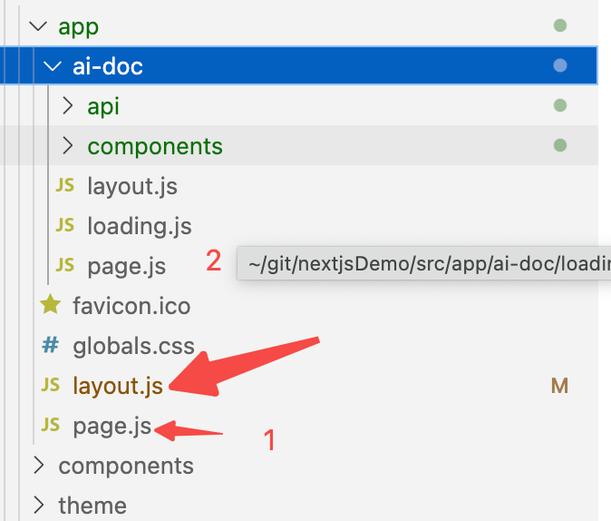
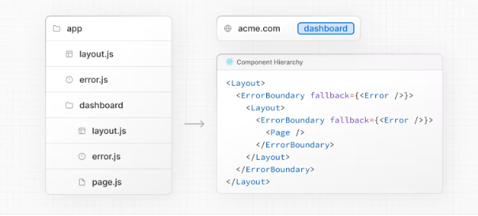

### [1.page.js](https://nextjs.org/docs/app/building-your-application/routing/pages-and-layouts#pages)

#### 1.默认为服务端组件

Pages are [Server Components](https://nextjs.org/docs/getting-started/react-essentials) by default but can be set to a [Client Component](https://nextjs.org/docs/getting-started/react-essentials#client-components).


### [2.layout.js](https://nextjs.org/docs/app/building-your-application/routing/pages-and-layouts#layouts)

#### 1.layout.js 控制同级的page.js,以及以下segments UIs。

A `layout.js` and `page.js` file can be defined in the same folder. The layout will wrap the page.




- Layouts in a route are **nested** by default. Each parent layout wraps child layouts below it using the React `children` prop.
- You can use [Route Groups](https://nextjs.org/docs/app/building-your-application/routing/route-groups) to opt specific route segments in and out of shared layouts.
- Layouts are [Server Components](https://nextjs.org/docs/getting-started/react-essentials) by default but can be set to a [Client Component](https://nextjs.org/docs/getting-started/react-essentials#client-components).
- Layouts can fetch data.
- Passing data between a parent layout and its children is not possible. However, you can fetch the same data in a route more than once, and React will [automatically dedupe the requests](https://nextjs.org/docs/app/building-your-application/data-fetching#automatic-fetch-request-deduping) without affecting performance.
- Layouts do not have access to the current route segment(s). To access route segments, you can use [`useSelectedLayoutSegment`](https://nextjs.org/docs/app/api-reference/functions/use-selected-layout-segment) or [`useSelectedLayoutSegments`](https://nextjs.org/docs/app/api-reference/functions/use-selected-layout-segments) in a Client Component.

#### 2.[Root Layout (Required)](https://nextjs.org/docs/app/building-your-application/routing/pages-and-layouts#root-layout-required)

- You can use the [built-in SEO support](https://nextjs.org/docs/app/building-your-application/optimizing/metadata) to manage `<head>` HTML elements, for example, the `<title>` element.
- You can use [route groups](https://nextjs.org/docs/app/building-your-application/routing/route-groups) to create multiple root layouts. See an [example here](https://nextjs.org/docs/app/building-your-application/routing/route-groups#creating-multiple-root-layouts).
- The root layout is a [Server Component](https://nextjs.org/docs/getting-started/react-essentials) by default and **can not** be set to a [Client Component](https://nextjs.org/docs/getting-started/react-essentials#client-components).

#### 3.[Nesting Layouts](https://nextjs.org/docs/app/building-your-application/routing/pages-and-layouts#nesting-layouts)

4.[Templates](https://nextjs.org/docs/app/building-your-application/routing/pages-and-layouts#templates)

#### 5.[Modifying `<head>`](https://nextjs.org/docs/app/building-your-application/routing/pages-and-layouts#modifying-head)

In the `app` directory, you can modify the `<head>` HTML elements such as `title` and `meta` using the [built-in SEO support](https://nextjs.org/docs/app/building-your-application/optimizing/metadata).

### [3.template.js](https://nextjs.org/docs/app/building-your-application/routing/pages-and-layouts#templates)

Templates are similar to layouts in that they wrap each child layout or page. Unlike layouts that persist across routes and maintain state, templates create a new instance for each of their children on navigation.

```
<Layout>
  {/* Note that the template is given a unique key. */}
  <Template key={routeParam}>{children}</Template>
</Layout>
```

### [4.loading.js](https://nextjs.org/docs/app/building-your-application/routing/loading-ui-and-streaming)

#### 1.[Instant Loading States](https://nextjs.org/docs/app/building-your-application/routing/loading-ui-and-streaming#instant-loading-states)

An instant loading state is fallback UI that is shown immediately upon navigation.

- Navigation is immediate, even with [server-centric routing](https://nextjs.org/docs/app/building-your-application/routing/linking-and-navigating#how-routing-and-navigation-works).
- Navigation is interruptible, meaning changing routes does not need to wait for the content of the route to fully load before navigating to another route.
- Shared layouts remain interactive while new route segments load.

#### 2.[Streaming with Suspense](https://nextjs.org/docs/app/building-your-application/routing/loading-ui-and-streaming#streaming-with-suspense)

**Streaming** allows you to break down the page's HTML into smaller chunks and progressively send those chunks from the server to the client.

```javascript
import { Suspense } from 'react'
import { PostFeed, Weather } from './Components'
 
export default function Posts() {
  return (
    <section>
      <Suspense fallback={<p>Loading feed...</p>}>
        <PostFeed />
      </Suspense>
      <Suspense fallback={<p>Loading weather...</p>}>
        <Weather />
      </Suspense>
    </section>
  )
}
```

1. **Streaming Server Rendering** - Progressively rendering HTML from the server to the client.
2. **Selective Hydration** - React prioritizes what components to make interactive first based on user interaction.

### [5.error.js](https://nextjs.org/docs/app/building-your-application/routing/error-handling)

The `error.js` file convention allows you to gracefully handle unexpected runtime errors in [nested routes](https://nextjs.org/docs/app/building-your-application/routing#nested-routes).

#### 1.[How `error.js` Works](https://nextjs.org/docs/app/building-your-application/routing/error-handling#how-errorjs-works)

 


#### 2.[Recovering From Errors](https://nextjs.org/docs/app/building-your-application/routing/error-handling#recovering-from-errors)

```javascript
'use client'
 
export default function Error({
  error,
  reset,
}: {
  error: Error
  reset: () => void
}) {
  return (
    <div>
      <h2>Something went wrong!</h2>
      <button onClick={() => reset()}>Try again</button>
    </div>
  )
}
```

#### 3.[Nested Routes](https://nextjs.org/docs/app/building-your-application/routing/error-handling#nested-routes)



#### 4.[Handling Errors in Layouts](https://nextjs.org/docs/app/building-your-application/routing/error-handling#handling-errors-in-layouts)

To handle errors within a specific layout or template, place an `error.js` file in the layouts parent segment.

To handle errors within the root layout or template, use a variation of `error.js` called `global-error.js`.

#### 5.[Handling Errors in Root Layouts](https://nextjs.org/docs/app/building-your-application/routing/error-handling#handling-errors-in-root-layouts)

Unlike the root `error.js`, the `global-error.js` error boundary wraps the **entire** application, and its fallback component replaces the root layout when active. Because of this, it is important to note that `global-error.js` **must** define its own `<html>` and `<body>` tags.

`global-error.js` is the least granular error UI and can be considered "catch-all" error handling for the whole application. It is unlikely to be triggered often as root components are typically less dynamic, and other `error.js` boundaries will catch most errors.

#### 6.[Handling Server Errors](https://nextjs.org/docs/app/building-your-application/routing/error-handling#handling-server-errors)

If an error is thrown inside a Server Component, Next.js will forward an `Error` object (stripped of sensitive error information in production) to the nearest `error.js` file as the `error` prop.

### [7.default.js](https://nextjs.org/docs/app/building-your-application/routing/parallel-routes#defaultjs)

You can define a `default.js` file to render as a fallback when Next.js cannot recover a slot's active state based on the current URL.

On navigation, Next.js will render the slot's previously active state, even if it doesn't match the current URL.

On reload, Next.js will first try to render the unmatched slot's `default.js` file. If that's not available, a 404 gets rendered.


