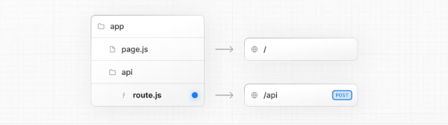

### [1.Convention](https://nextjs.org/docs/app/building-your-application/routing/route-handlers#convention)

Route Handlers are defined in a [`route.js|ts` file](https://nextjs.org/docs/app/api-reference/file-conventions/route) inside the `app` directory:

In addition to supporting native [Request](https://developer.mozilla.org/en-US/docs/Web/API/Request) and [Response](https://developer.mozilla.org/en-US/docs/Web/API/Response). Next.js extends them with [`NextRequest`](https://nextjs.org/docs/app/api-reference/functions/next-request) and [`NextResponse`](https://nextjs.org/docs/app/api-reference/functions/next-response) to provide convenient helpers for advanced use cases.

### [2.Behavior](https://nextjs.org/docs/app/building-your-application/routing/route-handlers#behavior)

#### 1.[Caching](https://nextjs.org/docs/app/building-your-application/routing/route-handlers#caching)

Route Handlers are cached by default when using the `GET` method with the `Response` object.

#### 2.[Opting out of caching](https://nextjs.org/docs/app/building-your-application/routing/route-handlers#opting-out-of-caching)

#### 3.[Route Resolution](https://nextjs.org/docs/app/building-your-application/routing/route-handlers#route-resolution)

### 4.[Examples](https://nextjs.org/docs/app/building-your-application/routing/route-handlers#examples)

#### 1.[Revalidating Cached Data](https://nextjs.org/docs/app/building-your-application/routing/route-handlers#revalidating-cached-data)

#### 2.[Dynamic Functions](https://nextjs.org/docs/app/building-your-application/routing/route-handlers#dynamic-functions)

#### 3.[Dynamic Route Segments](https://nextjs.org/docs/app/building-your-application/routing/route-handlers#dynamic-route-segments)

#### 4.[Streaming](https://nextjs.org/docs/app/building-your-application/routing/route-handlers#streaming)

#### 5.[Request Body](https://nextjs.org/docs/app/building-your-application/routing/route-handlers#request-body)

#### 6.[Request Body FormData](https://nextjs.org/docs/app/building-your-application/routing/route-handlers#request-body-formdata)

#### 7.[CORS](https://nextjs.org/docs/app/building-your-application/routing/route-handlers#cors)

#### 8.[Edge and Node.js Runtimes](https://nextjs.org/docs/app/building-your-application/routing/route-handlers#edge-and-nodejs-runtimes)

#### 9.[Non-UI Responses](https://nextjs.org/docs/app/building-your-application/routing/route-handlers#non-ui-responses)

#### 10.[Segment Config Options](https://nextjs.org/docs/app/building-your-application/routing/route-handlers#segment-config-options)

#### 11.[Segment Config Options](https://nextjs.org/docs/app/building-your-application/routing/route-handlers#segment-config-options)