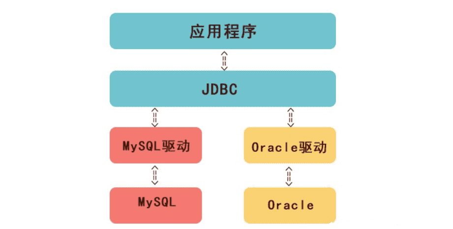
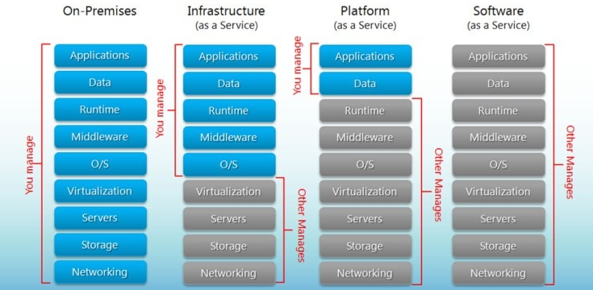

### 1.持久化

#### 1.定义

持久化是将程序数据在[持久](https://baike.baidu.com/item/持久/5702771)状态和[瞬时](https://baike.baidu.com/item/瞬时/3471916)状态间转换的机制。通俗的讲，就是瞬时数据（比如内存中的数据，是不能永久保存的）持久化为持久数据（比如持久化至数据库中，能够长久保存）。

JDBC就是一种持久化机制。文件IO也是一种持久化机制。

#### 2.2个层面

1. 应用层

   如果关闭(shutdown)你的应用然后重新启动则先前的数据依然存在

2. 系统层

   如果关闭(shutdown)你的系统（电脑）然后重新启动则先前的数据依然存在

#### 3.序列化

序列化也是一种对象服务，就是把内存中的对象序列化成流、或者把流反序列化成对象。
序列化是为了解决对象的传输问题，传输可以在[线程](https://baike.baidu.com/item/线程)之间、进程之间、内存外存之间、[主机](https://baike.baidu.com/item/主机)之间进行。

> 序列化是持久化的一种方式

### 2.JDBC  Java Database Connectivity

JDBC的全称是Java数据库连接，它是一套用于执行SQL语句的Java API。应用程序可通过这套API连接到关系数据库，并使用SQL语句来完成对数据库中数据的查询、更新和删除等操作。

### 3.ORM

1.定义

**ORM 就是通过实例对象的语法，完成关系型数据库的操作的技术，是"对象-关系映射"（Object/Relational Mapping） 的缩写。**

ORM 使用对象，封装了数据库操作，因此可以不碰 SQL 语言。开发者只使用面向对象编程，与数据对象直接交互，不用关心底层数据库。

2.优点

- 数据模型都在一个地方定义，更容易更新和维护，也利于重用代码。
- ORM 有现成的工具，很多功能都可以自动完成，比如数据消毒、预处理、事务等等。
- 它迫使你使用 MVC 架构，ORM 就是天然的 Model，最终使代码更清晰。
- 基于 ORM 的业务代码比较简单，代码量少，语义性好，容易理解。
- 你不必编写性能不佳的 SQL。

3.缺点

- ORM 库不是轻量级工具，需要花很多精力学习和设置。
- 对于复杂的查询，ORM 要么是无法表达，要么是性能不如原生的 SQL。
- ORM 抽象掉了数据库层，开发者无法了解底层的数据库操作，也无法定制一些特殊的 SQL。

### 4.WSGI Web Server Gateway Interface

### 5.CGI

### [6.UUID](https://baike.baidu.com/item/UUID/5921266?fr=aladdin) 

通用唯一识别码（Universally Unique Identifier）

### 7.后端技术组件

后端技术组件是构建后端应用程序的基本构建块。以下是一些常见的后端技术组件：

1. Web服务器：用于接收和处理来自客户端的HTTP请求，并返回相应的HTTP响应。常见的Web服务器包括 Apache HTTP Server、Nginx、Microsoft IIS 等。
2. 数据库管理系统（DBMS）：用于存储、管理和检索应用程序的数据。常见的关系型数据库管理系统（RDBMS）包括 MySQL、Oracle、Microsoft SQL Server、PostgreSQL 等。非关系型数据库（NoSQL）如 MongoDB、Redis、Cassandra 也是常见的选择。
3. 后端编程语言：用于编写后端应用程序的编程语言。常见的后端编程语言包括 Java、Python、C#、Node.js（JavaScript）、Ruby、Go 等。
4. API框架：用于构建和管理应用程序的API（应用程序编程接口）。常见的API框架包括 Django（Python）、Spring Boot（Java）、Express（Node.js）、Ruby on Rails（Ruby）等。
5. 缓存系统：用于存储和缓存经常访问的数据，以提高应用程序的性能和响应时间。常见的缓存系统包括 Redis、Memcached 等。
6. 消息队列：用于在应用程序组件之间进行异步通信和解耦。常见的消息队列系统包括 RabbitMQ、Apache Kafka、ActiveMQ 等。
7. 身份验证和授权：用于管理用户身份验证和授权的组件，以确保只有授权用户可以访问受保护的资源。常见的身份验证和授权框架包括 OAuth、JWT（JSON Web Token）、Spring Security（Java）、Passport.js（Node.js）等。
8. 日志记录和监控：用于记录应用程序的日志和监控应用程序的性能和健康状况的组件。常见的日志记录和监控工具包括 ELK Stack（Elasticsearch、Logstash、Kibana）、Prometheus、Grafana 等。

以上是一些常见的后端技术组件，它们可以根据应用程序的需求和规模进行组合和扩展。具体选择哪些组件取决于你的应用程序的需求和技术栈。

### 8.Iaas-Paas-Saas

aPaaS（应用程序平台即服务）有以下2个特征：
提供快速开发的环境，用户在几个小时内就能完成应用的开发、测试、部署，并能够随时调整或更新。
低代码或零代码，非技术人员就能完成应用开发

> [1]: https://developer.aliyun.com/article/718714	" aPaaS平台是什么？aPaaS与PaaS有什么区别？"
> [2]: https://developer.aliyun.com/article/212009?spm=a2c6h.17698244.wenzhang.1.77c97e5dgzui2f
>
> 

### 9.云原生 与 微服务的区别

云原生和微服务是两个概念，它们有一些相似之处，但也有一些不同之处。

1. 定义：
   - 云原生（Cloud Native）：云原生是一种软件开发和部署的方法论，旨在充分利用云计算的优势，以及构建和管理可扩展的、可弹性的、高可用的应用程序。云原生应用程序是以容器化的方式构建和交付，并且是基于微服务架构的。
   - 微服务（Microservices）：微服务是一种软件架构风格，将应用程序划分为一组小型、独立的服务，每个服务都可以独立开发、部署和扩展。这些服务通过轻量级的通信机制（通常是HTTP或消息队列）相互协作，共同构建复杂的应用程序。
2. 关注点：
   - 云原生：云原生关注的是整个应用程序的生命周期，包括构建、部署、管理和扩展。它强调使用容器化技术（如Docker）来实现应用程序的隔离和可移植性，并使用容器编排系统（如Kubernetes）来自动化应用程序的部署和管理。
   - 微服务：微服务关注的是应用程序的架构设计，将应用程序划分为一组小型的、自治的服务，每个服务都有自己的业务逻辑和数据存储。每个服务可以独立开发、部署和扩展，通过轻量级的通信机制相互协作。
3. 范围：
   - 云原生：云原生是一种更广泛的概念，它涵盖了整个应用程序的生命周期和基础设施层面的技术。除了微服务架构，云原生还包括容器化、容器编排、自动化部署和管理、持续集成和持续交付等方面的内容。
   - 微服务：微服务是一种特定的架构风格，它关注的是应用程序的组织方式和服务之间的通信。微服务可以作为云原生应用程序的一部分，但云原生还包括其他方面的技术和实践。

总结来说，云原生是一种更综合的方法论，它包括了微服务架构作为其中的一部分。云原生关注整个应用程序的生命周期和基础设施层面的技术，而微服务更关注应用程序的架构设计和服务之间的通信。

### 10.云计算

云计算（Cloud Computing）是一种基于互联网的计算模型，通过网络提供可按需访问、可共享的计算资源和服务。它将计算、存储、网络和应用程序提供给用户，使用户能够在不需要自己拥有物理硬件或进行复杂的软件配置的情况下，根据需要获取所需的资源。

云计算提供了以下几个关键特点和优势：

1. 资源弹性和按需分配：云计算允许用户根据需求快速扩展或缩减计算资源，以适应变化的工作负载。用户可以根据需要按需购买和使用计算资源，避免了过度投资或资源浪费的问题。
2. 高可用性和容错性：云计算提供了高可用性和容错性，通过分布在多个地理位置的数据中心和冗余设备，确保用户的应用程序和数据始终可用。
3. 灵活的服务模型：云计算提供了多种服务模型，包括基础设施即服务（IaaS）、平台即服务（PaaS）和软件即服务（SaaS）。用户可以根据自己的需求选择适合的服务模型，从简单的基础设施提供到完全托管的应用程序服务。
4. 成本效益：云计算采用按需付费的模式，用户只需支付实际使用的资源和服务，避免了昂贵的硬件和软件购买成本。同时，云计算还提供了资源共享和多租户的特性，进一步降低了成本。
5. 灵活性和可扩展性：云计算提供了灵活的资源管理和自动化的部署工具，使用户能够快速部署、扩展和管理应用程序。用户可以根据需要增加或减少计算资源，以适应业务需求的变化。

云计算已经广泛应用于各个领域，包括企业应用、大数据分析、人工智能、物联网等。它为用户提供了灵活、可靠和高效的计算和存储能力，为创新和业务发展提供了强大的支持。

