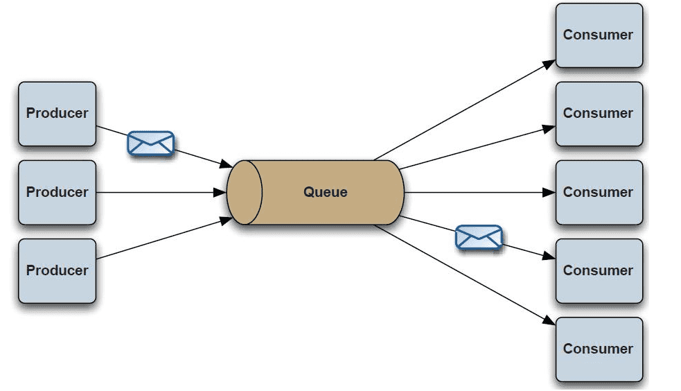

### 1.概括

消息队列已经逐渐成为企业IT系统内部通信的核心手段。它具有低耦合、可靠投递、广播、流量控制、最终一致性等一系列功能，成为异步RPC的主要手段之一。当今市面上有很多主流的消息中间件，如老牌的ActiveMQ、RabbitMQ，炙手可热的Kafka，阿里巴巴自主开发RocketMQ等

### 2.消息中间件的组成

#### 1.Broker

消息服务器，作为server提供消息核心服务

#### 2.Producer

消息生产者，业务的发起方，负责生产消息传输给broker

#### 3.Consumer

消息消费者，业务的处理方，负责从broker获取消息并进行业务逻辑处理

#### 4.Topic

主题，发布订阅模式下的消息统一汇集地，不同生产者向topic发送消息，由MQ服务器分发到不同的订阅者，实现消息的 广播

#### 5.Queue

队列，PTP模式下，特定生产者向特定queue发送消息，消费者订阅特定的queue完成指定消息的接收

#### 6.Message

消息体，根据不同通信协议定义的固定格式进行编码的数据包，来封装业务数据，实现消息的传输

### 3.消息中间件模式分类

#### 1.点对点

PTP点对点:使用queue作为通信载体 

说明： 
消息生产者生产消息发送到queue中，然后消息消费者从queue中取出并且消费消息。 
消息被消费以后，queue中不再存储，所以消息消费者不可能消费到已经被消费的消息。 Queue支持存在多个消费者，但是对一个消息而言，只会有一个消费者可以消费。

#### 2.发布/订阅

Pub/Sub发布订阅（广播）：使用topic作为通信载体 

说明： 
消息生产者（发布）将消息发布到topic中，同时有多个消息消费者（订阅）消费该消息。和点对点方式不同，发布到topic的消息会被所有订阅者消费。

queue实现了负载均衡，将producer生产的消息发送到消息队列中，由多个消费者消费。但一个消息只能被一个消费者接受，当没有消费者可用时，这个消息会被保存直到有一个可用的消费者。 
topic实现了发布和订阅，当你发布一个消息，所有订阅这个topic的服务都能得到这个消息，所以从1到N个订阅者都能得到一个消息的拷贝。

### 4.消息中间件的优势

#### 1.系统解耦

交互系统之间没有直接的调用关系，只是通过消息传输，故系统侵入性不强，耦合度低。

#### 2.提高系统响应时间

例如原来的一套逻辑，完成支付可能涉及先修改订单状态、计算会员积分、通知物流配送几个逻辑才能完成；通过MQ架构设计，就可将紧急重要（需要立刻响应）的业务放到该调用方法中，响应要求不高的使用消息队列，放到MQ队列中，供消费者处理。

#### 3.为大数据处理架构提供服务

通过消息作为整合，大数据的背景下，消息队列还与实时处理架构整合，为数据处理提供性能支持。

#### 4.Java消息服务——JMS

Java消息服务（Java Message Service，JMS）应用程序接口是一个Java平台中关于面向消息中间件（MOM）的API，用于在两个应用程序之间，或分布式系统中发送消息，进行异步通信。 
JMS中的P2P和Pub/Sub消息模式：点对点（point to point， queue）与发布订阅（publish/subscribe，topic）最初是由JMS定义的。这两种模式主要区别或解决的问题就是发送到队列的消息能否重复消费(多订阅)。

### 5.消息中间件应用场景

#### 1.异步通信

有些业务不想也不需要立即处理消息。消息队列提供了异步处理机制，允许用户把一个消息放入队列，但并不立即处理它。想向队列中放入多少消息就放多少，然后在需要的时候再去处理它们。

#### 2. 解耦

降低工程间的强依赖程度，针对异构系统进行适配。在项目启动之初来预测将来项目会碰到什么需求，是极其困难的。通过消息系统在处理过程中间插入了一个隐含的、基于数据的接口层，两边的处理过程都要实现这一接口，当应用发生变化时，可以独立的扩展或修改两边的处理过程，只要确保它们遵守同样的接口约束。

#### 3.冗余

有些情况下，处理数据的过程会失败。除非数据被持久化，否则将造成丢失。消息队列把数据进行持久化直到它们已经被完全处理，通过这一方式规避了数据丢失风险。许多消息队列所采用的”插入-获取-删除”范式中，在把一个消息从队列中删除之前，需要你的处理系统明确的指出该消息已经被处理完毕，从而确保你的数据被安全的保存直到你使用完毕。

#### 4.扩展性

因为消息队列解耦了你的处理过程，所以增大消息入队和处理的频率是很容易的，只要另外增加处理过程即可。不需要改变代码、不需要调节参数。便于分布式扩容。

#### 5.过载保护

在访问量剧增的情况下，应用仍然需要继续发挥作用，但是这样的突发流量无法提取预知；如果以为了能处理这类瞬间峰值访问为标准来投入资源随时待命无疑是巨大的浪费。使用消息队列能够使关键组件顶住突发的访问压力，而不会因为突发的超负荷的请求而完全崩溃。

#### 6.可恢复性

系统的一部分组件失效时，不会影响到整个系统。消息队列降低了进程间的耦合度，所以即使一个处理消息的进程挂掉，加入队列中的消息仍然可以在系统恢复后被处理。

#### 7. 顺序保证

在大多使用场景下，数据处理的顺序都很重要。大部分消息队列本来就是排序的，并且能保证数据会按照特定的顺序来处理。

#### 8.缓冲

在任何重要的系统中，都会有需要不同的处理时间的元素。消息队列通过一个缓冲层来帮助任务最高效率的执行，该缓冲有助于控制和优化数据流经过系统的速度。以调节系统响应时间。

#### 9.数据流处理

分布式系统产生的海量数据流，如：业务日志、监控数据、用户行为等，针对这些数据流进行实时或批量采集汇总，然后进行大数据分析是当前互联网的必备技术，通过消息队列完成此类数据收集是最好的选择。

### 6.消息中间件常用协议

AMQP协议、MQTT协议、XMPP协议、其它基于TCP/IP自定义协议。

### 7.常见消息中间件MQ介绍

RocketMQ、RabbitMQ、ActiveMQ、Redis、Kafka、ZeroMQ

#### 1.kafka 

Kafka 是由 Apache 软件基金会开发和维护的一个分布式流处理平台和消息队列系统。它是一个高性能、可扩展和持久化的消息传递系统，被广泛用于构建实时数据流应用程序和微服务架构。

Kafka 的主要特点包括：

1. 高吞吐量：Kafka 可以处理非常高的消息吞吐量，每秒可以处理数百万条消息。
2. 可扩展性：Kafka 可以通过分区和分布式集群来实现横向扩展，以适应大规模的数据处理需求。
3. 持久化存储：Kafka 将消息持久化到磁盘，可以将消息保存一段时间，以便后续处理或回溯。
4. 多订阅者模型：Kafka 允许多个消费者以不同的速率和顺序订阅主题，实现灵活的发布-订阅模型。
5. 分布式处理：Kafka 支持分布式处理和流式处理，可以在多个节点上同时进行消息的生产和消费。
6. 消息保证：Kafka 提供了可配置的消息传递保证，可以确保消息的传递和处理可靠性。

Kafka 的核心概念包括：

- Topic（主题）：消息的逻辑容器，每个消息都属于一个特定的主题。
- Partition（分区）：主题可以分为多个分区，每个分区都是一个有序的消息队列。
- Producer（生产者）：负责将消息发布到 Kafka 集群的应用程序。
- Consumer（消费者）：从 Kafka 集群中订阅和消费消息的应用程序。
- Broker（代理）：Kafka 集群中的一个节点，负责存储和处理消息。
- ZooKeeper：Kafka 使用 ZooKeeper 来管理集群的状态和配置信息。

Kafka 提供了多种编程语言的客户端库，包括 Java、Python、Go、Node.js 等，使开发者可以方便地与 Kafka 集群进行交互。

Kafka 的应用场景广泛，包括日志收集、实时数据处理、消息队列、事件驱动架构等。

https://www.cnblogs.com/insane-Mr-Li/p/10684536.html

