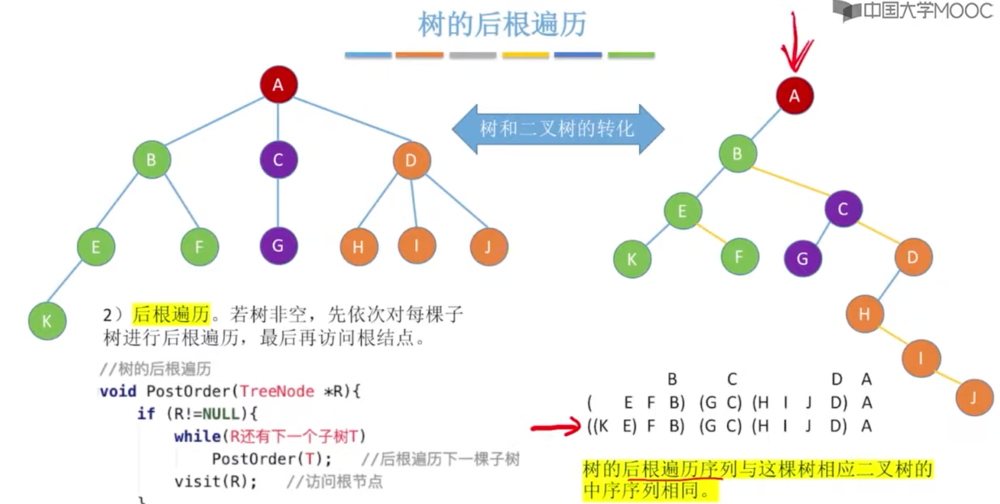
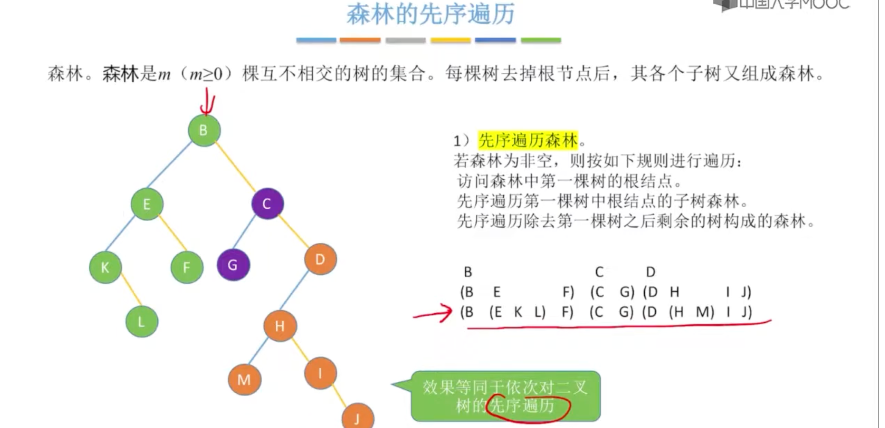
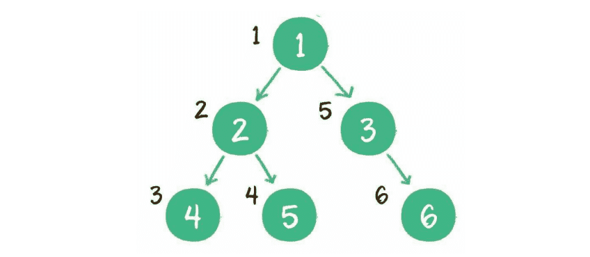
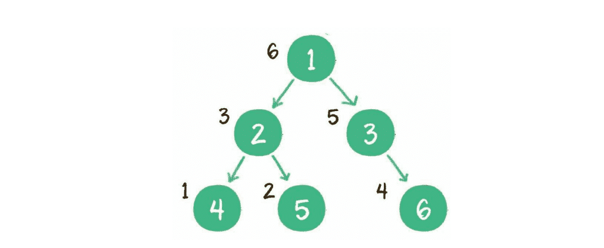

### 1.树的定义

树（tree） 是n （n>= 0）个节点的有限集。当n=0时，称为空树。

特点：

1. 有且仅有一个特定的称为根的节点。
2. 当n>=1时，其余节点可分为m（m>0）个互不相交的有限集，每个集合本身又是一个树，并称为根的子树。

> 一个节点只有一个前驱，n个后继

#### 1.树的先根遍历

#### 2.树的后根遍历

#### 3.树的层序遍历

#### 4.森林的先序遍历

#### 5.森林的中序遍历

### 2.二叉树

二叉树 binary tree 是树的一种特殊形式。这种树的每个节点最多有2个孩子节点。

二叉树还有两种特殊形式：

#### 1.满二叉树

所有非子节点都在存在左右孩子，并且所有叶子节点都在同一层级上。

#### 2.完全二叉树

二叉树编号从1到12的12个节点，和前面满二叉树编号从1到12的节点位置完全对应，则成为完全二叉树。

#### 3.二叉查找树 

binary search tree 又名二叉排序树、二叉搜索树

如果左子树不为空，则左子树上所有节点的值均小于根节点的值
如果右子树不为空，则右子树上所有节点的值均大于根节点的值
左、右子树也都是二叉查找树

### 3.二叉树的物理存储结构表达

#### 1.链式存储结构

#### 2.数组存储结构

假设一个父节点的下标是parent, 那么它的左孩子节点下标就是2xparent+1，右孩子节点下标就是2xparent+2。反过来知孩子节点可求父节点下标

### 4.二叉树的遍历

##### 1.深度优先遍历 

###### 1.前序遍历

二叉树的前序遍历，输出顺序是根节点、左子树、右子树。 

###### 2.中序遍历

二叉树的中序遍历，输出顺序是左子树、根节点、右子树。 

> 前驱节点：一棵二叉树进行中序遍历，遍历后的顺序，当前节点的前一个节点为该节点的前驱节点
>
> 后继节点：对一棵二叉树进行中序遍历，遍历后的顺序，当前节点的后一个节点为该节点的后继节点

###### 3.后序遍历

二叉树的后序遍历，输出顺序是左子树、右子树、根节点。

##### 2.广度优先遍历

层序遍历

