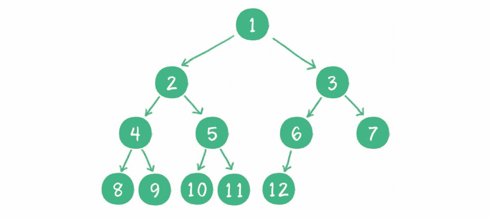
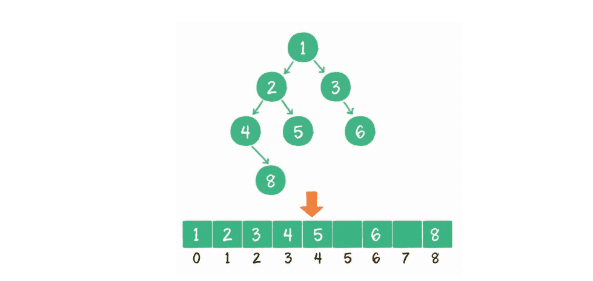

### 1.树的定义

树（tree） 是n （n>= 0）个节点的有限集。当n=0时，称为空树。

特点：

1. 有且仅有一个特定的称为根的节点。
2. 当n>=1时，其余节点可分为m（m>0）个互不相交的有限集，每个集合本身又是一个树，并称为根的子树。

### 2.二叉树

二叉树 binary tree 是树的一种特殊形式。这种树的每个节点最多有2个孩子节点。

二叉树还有两种特殊形式：

1. 满二叉树

   所有非子节点都在存在左右孩子，并且所有叶子节点都在同一层级上。

2. 完全二叉树

   二叉树编号从1到12的12个节点，和前面满二叉树编号从1到12的节点位置完全对应，则成为完全二叉树。

   

### 3.二叉树的物理存储结构表达

#### 1.链式存储结构

#### 2.数组存储结构

