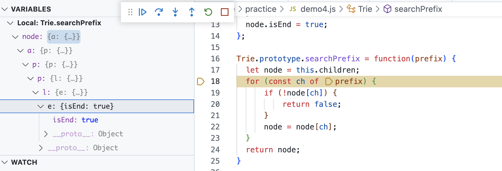

**Trie（发音类似 "try"）**或者说 前缀树 是一种树形数据结构，用于高效地存储和检索字符串数据集中的键。这一数据结构有相当多的应用情景，例如自动补完和拼写检查。

#### [676. 实现一个魔法字典](https://leetcode.cn/problems/implement-magic-dictionary/)

#### [208. 实现 Trie (前缀树)](https://leetcode.cn/problems/implement-trie-prefix-tree/)

**[Trie](https://baike.baidu.com/item/字典树/9825209?fr=aladdin)**（发音类似 "try"）或者说 **前缀树** 是一种树形数据结构，用于高效地存储和检索字符串数据集中的键。这一数据结构有相当多的应用情景，例如自动补完和拼写检查。

请你实现 Trie 类：

- `Trie()` 初始化前缀树对象。
- `void insert(String word)` 向前缀树中插入字符串 `word` 。
- `boolean search(String word)` 如果字符串 `word` 在前缀树中，返回 `true`（即，在检索之前已经插入）；否则，返回 `false` 。
- `boolean startsWith(String prefix)` 如果之前已经插入的字符串 `word` 的前缀之一为 `prefix` ，返回 `true` ；否则，返回 `false` 。

```javascript

var Trie = function() {
    this.children = {};
};

Trie.prototype.insert = function(word) {
    let node = this.children;
    for (const ch of word) {
        if (!node[ch]) {
            node[ch] = {};
        }
        node = node[ch];
    }
    node.isEnd = true; // 字符是否完结 见下图
};

Trie.prototype.searchPrefix = function(prefix) {
    let node = this.children;
    for (const ch of prefix) {
        if (!node[ch]) {
            return false;
        }
        node = node[ch];
    }
    return node;
}

Trie.prototype.search = function(word) {
    const node = this.searchPrefix(word);
    return node !== undefined && node.isEnd !== undefined;
};

Trie.prototype.startsWith = function(prefix) {
    return this.searchPrefix(prefix);
};
```



#### [14. 最长公共前缀](https://leetcode.cn/problems/longest-common-prefix/)

编写一个函数来查找字符串数组中的最长公共前缀。

如果不存在公共前缀，返回空字符串 `""`。

```javascript
var longestCommonPrefix = function(strs) {
    let tree = {}
    let treeDict = tree
    let ans = ''
    for(let i=0; i<strs.length; i++){
        treeDict = tree
        if(strs[i] === ''){
          return ''
        }else{
            for(let j=0; j<strs[i].length; j++){
                if( !treeDict[strs[i][j]]){
                    treeDict[strs[i][j]] = {}
                }
                treeDict =  treeDict[strs[i][j]]
            }
            treeDict.isEnd = true
        }
       
    }

    while(Object.keys(tree).length === 1 && Object.keys(tree)[0] !== 'isEnd'){
        ans+= Object.keys(tree)[0]
        tree = tree[Object.keys(tree)[0]]
    }

    return ans
  
};
```

