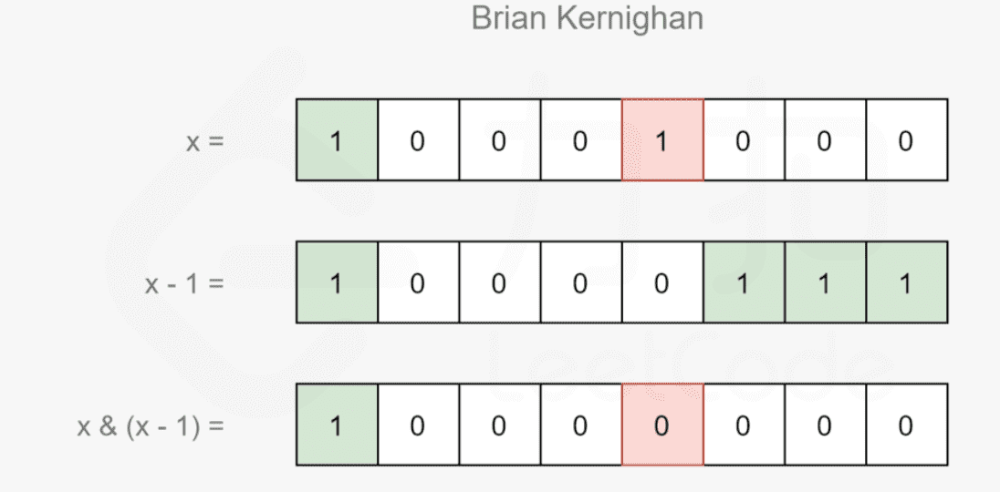

### 1.Brian Kernighan 算法

**记 f(x) 表示 x 和 x-1 进行与运算所得的结果（即 f(x)=x & (x−1)），那么f(x) 恰为 x 删去其二进制表示中最右侧的 1 的结果。**



1. #### [比特位计数](https://leetcode.cn/problems/counting-bits/)

```javascript
var countBits = function(n) {
    const bits = new Array(n + 1).fill(0);
    for (let i = 0; i <= n; i++) {
        bits[i] = countOnes(i);
    }
    return bits
};

const countOnes = (x) => {
    let ones = 0;
    while (x > 0) {
        x &= (x - 1);
        ones++;
    }
    return ones;
}

```


1. #### [461. 汉明距离](https://leetcode.cn/problems/hamming-distance/)

```javascript
var hammingDistance = function(x, y) {
    let ans = 0
    let m = x^y
    while(m > 0){
        m &= m-1
        ans++
    }
    return ans 
};
```


