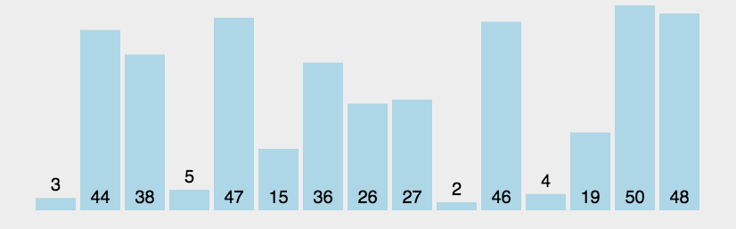

# 冒泡排序

#### 一、算法原理

- 比较相邻的元素AB，如A>B,则交换

- 第一轮两两相互比较选出最大值，下一轮除掉最后一个。

- 重复上述步骤

  动画演示

  

#### 二、代码实现

```javascript
// 冒泡排序 
function bubbleSort(arr) {
  let temp
  for(let i=0; i< arr.length-1; i++){ // 比较数组长度-1 轮
    for(let j=0; j< arr.length-1-i;j++){ // 每轮比较排除上一轮已选出来的元素
      if(arr[j] > arr[j+1]){   // 比较相邻元素，递增排序如果A>B 则交互。递减排序则A<B交互。
        temp = arr[j]
        arr[j] = arr[j+1]
        arr[j+1] = temp
      }
    }
  }
  return arr
}

// 改进后的冒泡排序
function bubbleSort2(arr) {
    console.time('改进后冒泡排序耗时');
    var i = arr.length-1;  //初始时,最后位置保持不变
    while ( i> 0) {
        var pos= 0; //每趟开始时,无记录交换
        for (var j= 0; j< i; j++){
            if (arr[j]> arr[j+1]) {
                pos= j; //记录交换的位置
                var tmp = arr[j]; 
                 arr[j]=arr[j+1];
                 arr[j+1]=tmp;
            }
        }
        i= pos; //为下一趟排序作准备
     }
     console.timeEnd('改进后冒泡排序耗时');
     return arr;
}

// let arr = [1,4,2,1000,20,400]
let arr=[3,44,38,5,47,15,36,26,27,2,46,4,19,50,48];
let reuslt = bubbleSort2(arr)
console.log(reuslt)
```

#### 三、算法复杂度

- 时间复杂度（平均） ：最坏O(n²)、最好O(n)
- 空间复杂度：O(1)

