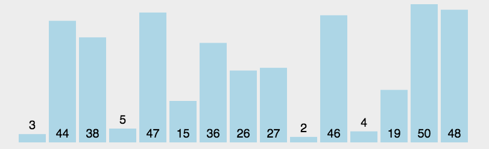

### 选择排序

#### 一、算法原理

- 从序列中找到最小（大）元素，放在首位。

- 从剩余元素中，继续找到最小（大）元素，放在第二位。

- 重复以上步骤

  动画演示

  

  

#### 二、代码实现

```javascript
// 版本一
function selectionSort(arr) {
  let temp,len = arr.length-1
  for(let i=0; i < len; i++){
    for(let j=i+1; j<= len; j++){
      if(arr[i] >  arr[j]){
        temp = arr[i]
        arr[i] = arr[j]
        arr[j] = temp
      }
    }
  }
  return arr
} 

// 改进版本,记录最小值下标，循环完一轮之后在交换，较少交换频次
function selectionSort(arr) {
  let temp,len = arr.length-1
  for(let i=0; i < len; i++){
    let minIndex = i
    for(let j=i+1; j<= len; j++){
      if (arr[minIndex] >  arr[j]){
        minIndex = j
      }
    }
    temp = arr[minIndex]
    arr[minIndex] = arr[i]
    arr[i] = temp
  }
  return arr
} 

var arr=[3,44,38,5,47,15,36,26,27,2,46,4,19,50,48];

let reuslt = selectionSort(arr)
console.log(reuslt)
```

### 三、空间复杂度

- 时间复杂度：O(n²)
- 空间复杂度：O(1)