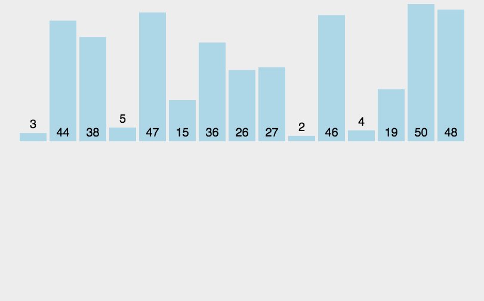

### 插入排序

#### 一、算法原理

- 通过构建有序序列，对于未排序数据，在已排序序列中从后向前扫描，找到相应位置并插入。

  动画演示：

  

#### 二、代码实现

```javascript
// 版本一直接版本
function insertionSort(arr) {
  let result = []
  for(let i=0; i< arr.length; i++){
    if( i === 0 ){
      result.push(arr[0])
      continue
    }
    for (let j = result.length - 1; j >= 0; j--){
      if (arr[i] >= result[j]){
        result.splice(j+1,0,arr[i])
        break
      }
    }
  }
  return result
} 

// 版本二 采用 in-place排序（即只需用到O(1)的额外空间的排序）

function insertionSort(arr) {
  let prev, current
  for (let i = 1; i < arr.length; i++) {
      prev = i-1
      current = arr[i]
    while (prev >= 0 && arr[prev] > current){
      arr[prev + 1] = arr[prev]
      prev -- 
    }
    arr[prev+1] = current
  }
  return arr
} 
```

##### 三、算法复杂度

- 时间复杂度：最坏O(n²)、最好O(n)
- 空间复杂度：O(1)

