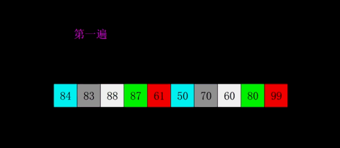

#### 希尔排序

希尔排序是插入排序的升级版本

#### 一、算法原理

- 希尔排序是把记录按下标的一定增量分组，对每组使用直接插入排序算法排序；随着增量逐渐减少，每组包含的关键词越来越多，当增量减至1时，整个文件恰被分成一组，算法便终止。

  动图演示

  

#### 二、代码实现

```javascript
//希尔排序 针对有序序列在插入时采用交换法
function shellSort(arr) {
      let len = arr.length
      //增量gap，并逐步缩小增量
      for (let gap = Math.floor(len / 2); gap > 0; gap = Math.floor(gap / 2)) {
        //从第gap个元素，逐个对其所在组进行直接插入排序操作
        for (let i = gap; i < len; i++) {
          let j = i;  
          while (j - gap >= 0 && arr[j] < arr[j - gap]) {
            let temp
            temp = arr[j]
            arr[j] = arr[j - gap]
            arr[j - gap] = temp
            j -= gap
          }
        }
      }
      return arr
}
//希尔排序 针对有序序列在插入时采用移动法。

function shellSort(arr) {

  let len = arr.length
  for (let gap = Math.floor(len / 2); gap > 0; gap = Math.floor(gap / 2)) {
    for (let i = gap; i < len; i++) {
      let j = i;
      let current = arr[j]
      while (j - gap >= 0 && current < arr[j - gap]) {
        arr[j] = arr[j - gap]
        j -= gap
      }
      arr[j] = current
    }
  }
  return arr
}
var arr=[3,44,38,5,47,15,36,26,27,2,46,4,19,50,48];
console.log(arr)
let reuslt = shellSort(arr)
console.log(reuslt)
```

> ```javascript
> // 交换函数也可以这么写
> function swap(arr,a,b){
>   	arr[a] = arr[a] + arr[b]
>   	arr[b] = arr[a] - arr[b]
>   	arr[a] = arr[a] - arr[b]
> }
> ```
>
> 

#### 三、算法复杂度

- 时间复杂度：最快 O(nlog2n) 、最坏O(n)

- 空间复杂度：O(1)

