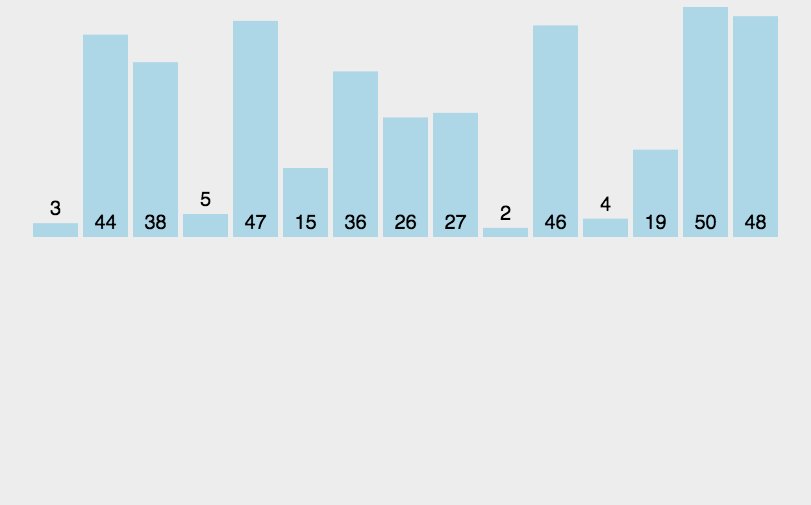

### 归并排序

#### 一、算法原理

- 归并排序是建立在归并操作上的一种有效的排序算法。采用分治法（Divide and Conquer）思想。将已有序的子序列合并，得到完全有序的序列；即先使每个子序列有序，再使子序列段间有序。若将两个有序表合并成一个有序表，称为2-路归并。

  动画演示：

  

#### 二、代码实现

```javascript
function merge(left, right){
  let reuslt = []
  while (left.length>0&&right.length>0) {
    if(left[0] <= right[0]){
      reuslt.push(left.shift())
    }else{
      reuslt.push(right.shift())
    }
  }
  return reuslt.concat(left, right)
}

function mergeSort(arr){
  if(arr.length === 1) return arr
  let len = Math.floor(arr.length/2)
  let left = arr.slice(0,len)
  let right = arr.slice(len)
  return merge(mergeSort(left), mergeSort(right))
}
let arr = [3, 44, 38, 5, 47, 15, 36, 26, 27, 2, 46, 4, 19, 50, 48];
let reuslt = mergeSort(arr)
console.log(reuslt)
```

#### 三、算法复杂度

- 时间复杂度：O(N㏒2N)
- 空间复杂度：O(n)

