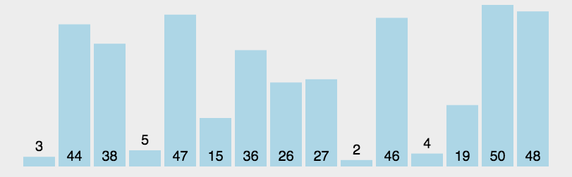

### 快速排序

#### 一、算法思想

- 通过一趟排序将待排记录分隔成独立的两部分，其中一部分记录的关键字均比另一部分的关键字小，则可分别对这两部分记录继续进行排序，以达到整个序列有序。

  算法动画：

  

#### 二、代码实现

```javascript
function quickSort(arr){
  if(arr.length === 0) return []
  
  let greater = []
  let lesser = []
  let pivot = arr[0]
  for(let i=1; i<arr.length; i++){
    if ( arr[i] <= pivot){
      lesser.push(arr[i])
    }else{
      greater.push(arr[i])
    }
  }
  return quickSort(lesser).concat(pivot,quickSort(greater))
}

let arr = [3, 44, 38, 5, 47, 15, 36, 26, 27, 2, 46, 4, 19, 50, 48];
let reuslt = quickSort(arr)
console.log(reuslt)
```

#### 三、算法复杂度

- 时间复杂度：最好O(n²)、最坏O(n㏒2n)
- 空间复杂度：O(n㏒2n)