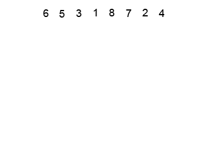
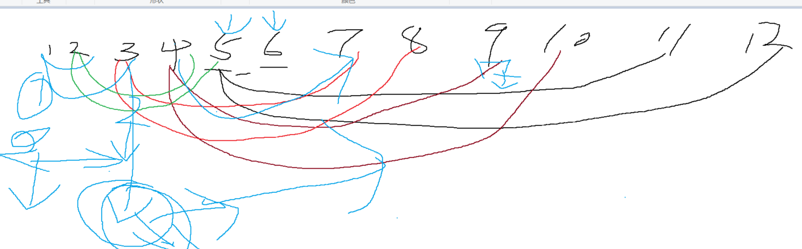

### 堆排序

#### 一、算法思想

- 将待排序序列构造成一个大顶堆，此时，整个序列的最大值就是堆顶的根节点。将其与末尾元素进行交换，此时末尾就为最大值。然后将剩余n-1个元素重新构造成一个堆，这样会得到n个元素的次小值。如此反复执行，便能得到一个有序序列了

  > 

  动画演示：

  

#### 二、算法实现

```javascript
function buildMaxHeap(arr) {
  // 创建最大二叉堆
  let last = Math.floor(arr.length / 2)
  for (let i = last; i >= 0; i--) {  // 从下往上调整二叉堆
    heapAdjust(arr, i, arr.length)
  }
}

function heapAdjust(arr, i, len) { // len 限制堆的大小
  // 堆调整
  let largest = i
  let left = 2 * i + 1 // 左节点
  let right = 2 * i + 2 // 右节点

  if (arr[left] > arr[largest] && left < len) {
    largest = left
  }
  if (arr[right] > arr[largest] && right < len) {
    largest = right
  }
  if (largest === i) return
  swap(arr, largest, i) 
  heapAdjust(arr, largest, len)  // 交换之后，largest位置堆调整
}
function heapSort(arr) {
  buildMaxHeap(arr)
  for (let i = arr.length - 1; i > 0; i--) {
    swap(arr,0, i);
    heapAdjust(arr,0, i);  // i 限制堆的小
  }
  return arr
}

function swap(arr, i, j) {
  arr[i] = arr[i] + arr[j]
  arr[j] = arr[i] - arr[j]
  arr[i] = arr[i] - arr[j]
}

let arr = [3, 44, 38, 5, 47, 15, 36, 26, 27, 2, 46, 4, 19, 50, 48];
let reuslt = heapSort(arr)
console.log(reuslt)
```

三、算法复杂度

- 时间复杂度：O(n㏒2n)
- 空间复杂度：O(1)

> 二叉堆是完全二元树或者是近似完全二元树，按照数据的排列方式可以分为两种：最大堆和最小堆。
> 最大堆：父结点的键值总是大于或等于任何一个子节点的键值；最小堆：父结点的键值总是小于或等于任何一个子节点的键值

