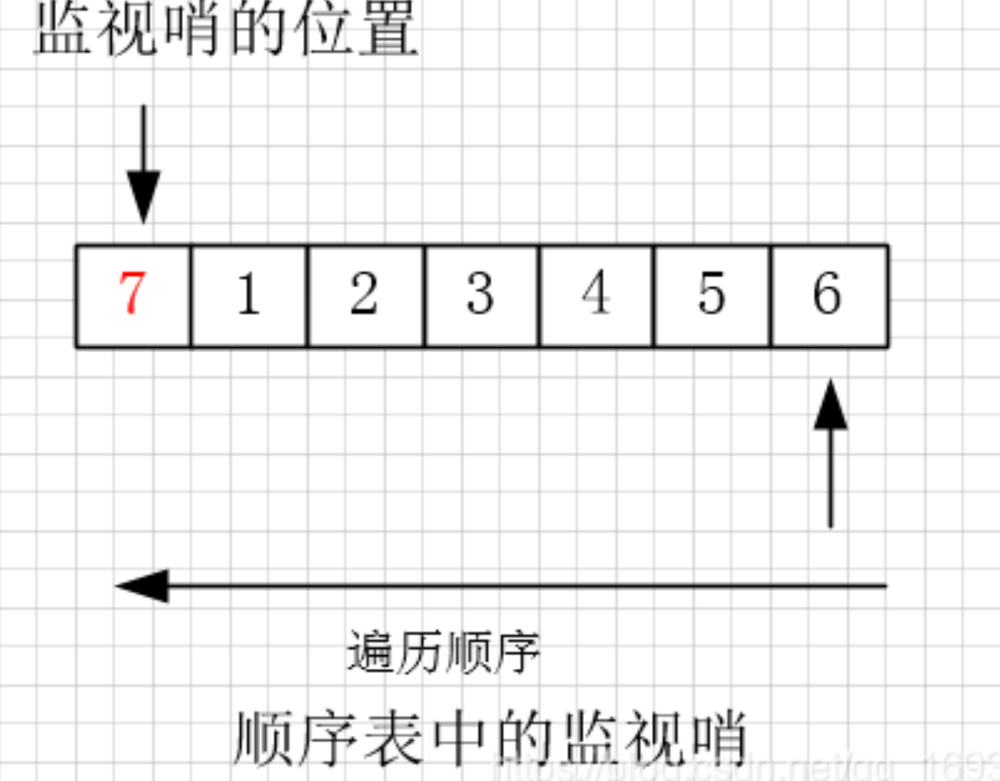

顺序查找的查找过程为：从表中的最后一个数据元素开始，逐个同记录的关键字做比较，如果匹配成功，则查找成功；反之，如果直到表中第一个关键字查找完也没有成功匹配，则查找失败 同时，在程序中初始化创建查找表时，由于是顺序存储，所以将所有的数据元素存储在数组中，但是把第一个位置留给了用户用于查找的关键字。例如，在顺序表{1,2,3,4,5,6}中查找数据元素值为 7 的元素，则添加后的顺序表为：



图1 顺序表的一端添加用户用于搜索的关键字，称作“监视哨”。 图 1 中监视哨的位置也可放在数据元素 6 的后面（这种情况下，整个查找的顺序应有逆向查找改为顺序查找）。 放置好监视哨之后，顺序表遍历从没有监视哨的一端依次进行，如果查找表中有用户需要的数据，则程序输出该位置；反之，程序会运行至监视哨，此时匹配成功，程序停止运行，但是结果是查找失败。 代码实现：

```JavaScript
var find = function(k) {
    let table = [1,2,3,4,5,6]

    // 方法一：
    // for(let i=0; i<table.length; i++){
    //     if(table[i] === k){
    //         return i
    //     }
    // }
    // return -1

    // 方法二：

    // let len = table.length

    // while(len >=0 && table[len] !== k){
    //     len--
    // }
    // return len

    // 方法三：监视哨

    table.push(k)
    let len=0

    while(table !==k){
        len++
    }

    if(len === table.length -1){
        return 0
    }else{
        return linedList
    }
    
};
```

