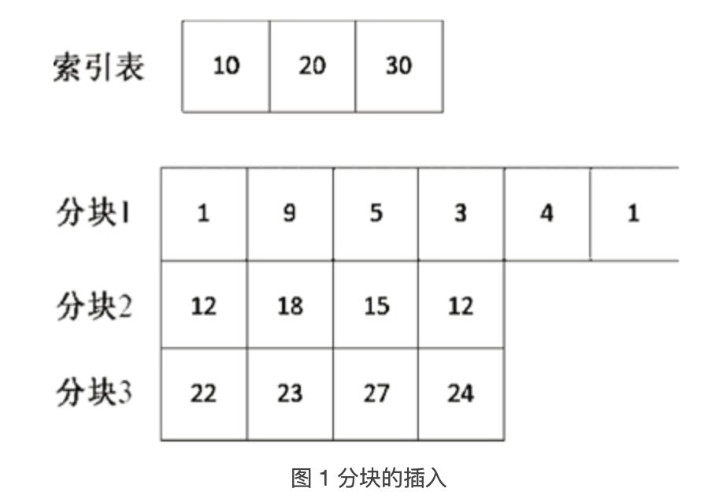

### 分块查找

分块查找是结合二分查找和[顺序查找](http://data.biancheng.net/view/335.html)的一种改进方法

#### 分块查找的原理及实现

分块查找要求把一个数据分为若干块，每一块里面的元素可以是无序的，但是块与块之间的元素需要是有序的。对于一个非递减的数列来说，第i块中的每个元素一定比第i-1块中的任意元素大。同时，分块查找需要一个索引表，用来限定每一块的范围。在增加、删除、查找元素时都需要用到。

